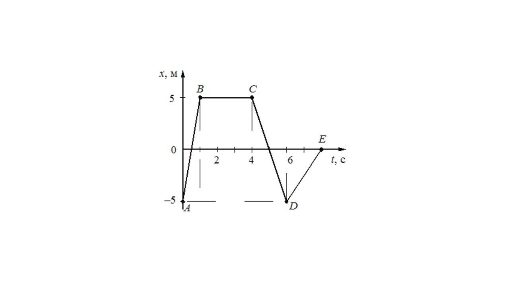
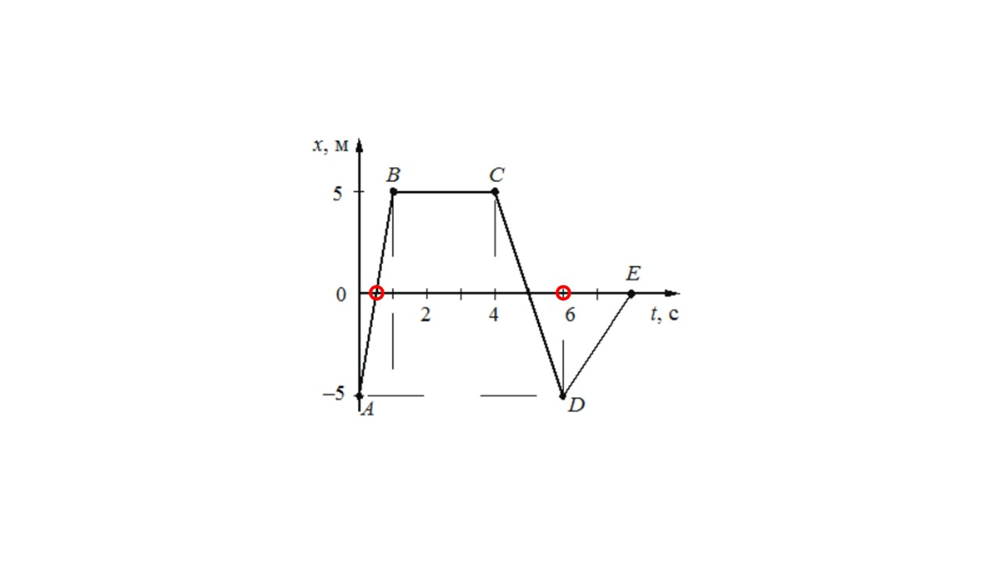
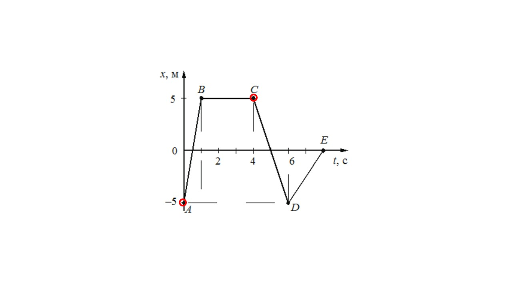
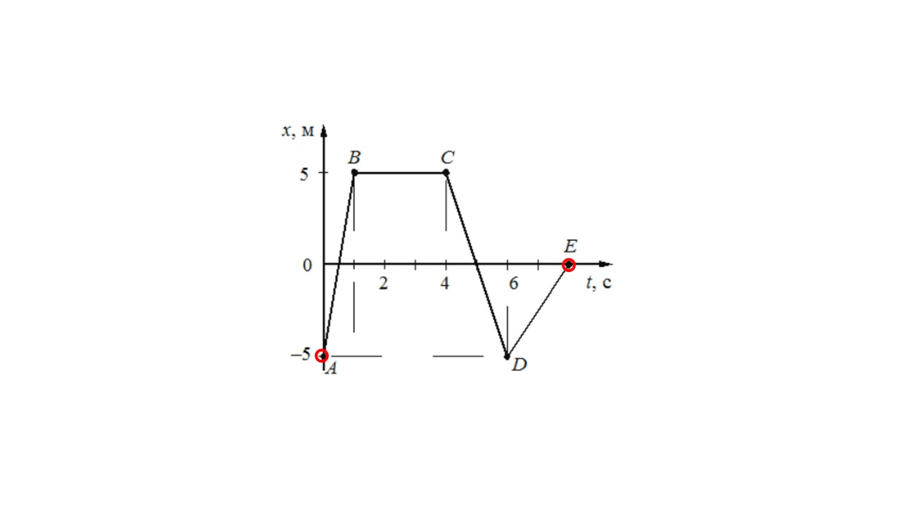
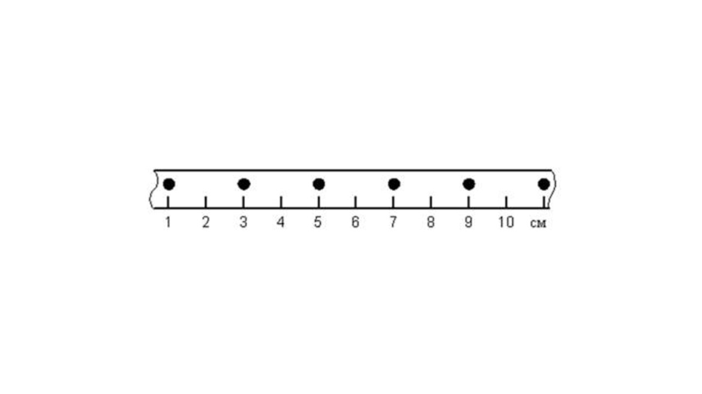
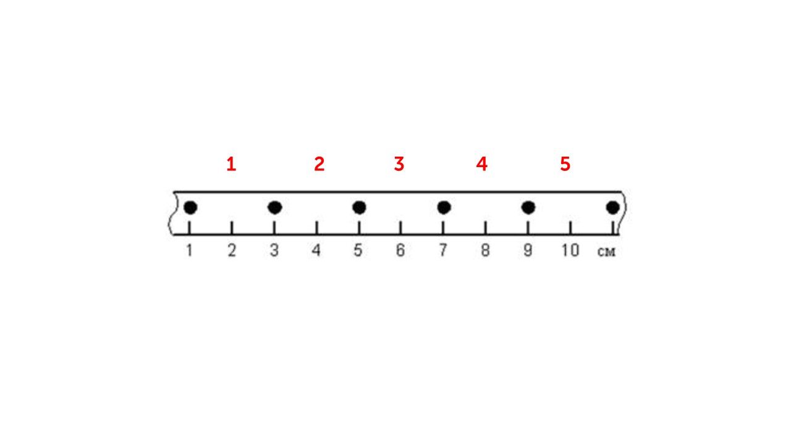

#### **Задание 1**

Автобус везёт пассажиров по прямой дороге со скоростью 10 м/c. Пассажир равномерно идёт по салону автобуса со скоростью 1 м/c относительно автобуса, двигаясь от задней двери к кабине водителя. Чему равен модуль скорости пассажира относительно дороги?

**Решение:**

**Vавтобуса** = 10 м/с

**Vпассажира** = 1 м/с

Так как пассажир находится в автобусе, то он имеет его скорость (10 м/с), но пассажир и сам двигается с скоростью 1 м/с **в том же направлении**, что и автобус (*двигаясь от задней двери к кабине водителя*). Поэтому относительная скорость пассажира равна сумме его скорости и скорости автобуса

Vотн = Vавтобуса + Vпассажира = 10 + 1 = 11 м/с

**Ответ: 11**

#### **Задание 2**

На рисунке представлен график зависимости координаты от времени для тела, движущегося вдоль оси _Ох_. Чему равен модуль перемещения тела за время от 0 до 6 с?

**Решение:**

Формула для нахождения перемещения

**S = x - x0**

Отметим где находится тело в 0-ую и 6-ую секунду

На оси x находится координата тела, относительно нее отметим начальное и конечное положение тела

**x0 = 0**

**x = 0**

Найдем S

**S = 0**

**Ответ: 0**

#### **Задание 3**

Автобус везёт пассажиров по прямой дороге со скоростью 10 м/c. Пассажир равномерно идёт по салону автобуса со скоростью 1 м/c относительно автобуса, двигаясь от кабины водителя к задней двери. Чему равен модуль скорости пассажира относительно дороги?

**Решение:**

**Vавтобуса** = 10 м/с

**Vпассажира** = 1 м/с

Так как пассажир находится в автобусе, то он имеет его скорость (10 м/с), но пассажир и сам двигается с скоростью 1 м/с в **противоположном** направлении относительно автобуса (*двигаясь от кабины водителя к задней двери*). Поэтому относительная скорость пассажира равна разности его скорости и скорости автобуса

**Vотн = Vавтобуса - Vпассажира = 10 - 1 = 9 м/с**

**Ответ: 9**

#### **Задание 4**

На рисунке представлен график зависимости координаты от времени для тела, движущегося вдоль оси _Ох_. Чему равен модуль перемещения тела за время от 0 до 4 с?

**Решение:**

Формула для нахождения перемещения

**S = x - x0**

Отметим где находится тело в 0-ую и 4-ую секунду

На оси x находится координата тела, относительно нее отметим начальное и конечное положение тела

**x0 = -5**

**x = 5**

Найдем S

**S = 5 - (-5) = 5 + 5 = 10 м

**Ответ: 10**

#### **Задание 5**

Металлический шарик движется по демонстрационному столу учителя и за 0,5 мин. проходит путь, равный 150 см. Чему равна средняя скорость шарика?

**Решение:**

**t = 0,5 мин = 30 с**

**S = 150 см = 1,5 м**

Подставим в формулу скорости данные и получим ответ

**υ = S / t = 1,5 / 30 = 0,05 м/с**

**Ответ: 0,05**

#### **Задание 6**

На рисунке представлен график зависимости координаты от времени для тела, движущегося вдоль оси _Ох_. Чему равен модуль перемещения тела за время от 0 до 8 с?

Формула для нахождения перемещения

**S = x - x0**

Отметим где находится тело в 0-ую и 8-ую секунду

На оси x находится координата тела, относительно нее отметим начальное и конечное положение тела

**x0 = -5**

**x = 0**

Найдем S

**S = 0 - (-5) = 0 + 5 = 5 м

**Ответ: 5**

#### **Задание 7**

Пешеход, двигаясь по шоссе, прошёл 1200 м за 20 мин. Чему равна средняя скорость пешехода?

**Решение:**

**t = 20 мин = 1200 с**

**S = 1200 м**

Подставим в формулу скорости данные и получим ответ

**υ = S / t = 1200 / 1200 = 1 м/с**

**Ответ: 1**

#### **Задание 8**

На рисунке точками показаны положения движущегося по линейке тела, причём положения тела отмечались через каждые 2 с. С какой средней скоростью двигалось тело на участке от 1 до 11 см?

**Решение:**

По рисунку видим, что тело двигалось 10 секунд, так как прошло пять участков по 2 секунды (**t = 10 c**)

За десять секунд тело прошло (**x0 = 1, x = 11**)

**S = x - x0 = 11 - 1 = 10 см**

Найдем скорость 

**υ = S / t = 10 / 10 = 1 см/с**

**Ответ: 1**

#### **Задание 9**

![[z7.png]]

**Решение:**

Разберем каждое утверждение:

**1) С наибольшей средней скоростью на участке от 0 до 10 см двигалось тело 2❌**

Скорость тела 1: υ = S / t = 10 / 10 = 1 см/с - считаем по этой формуле так как за каждую секунду тело проходит одинаковое расстояние 

Скорость тела 2: υ = S / t = 10 / 5 = 2 см/с - считаем по этой формуле так как за каждую секунду тело проходит одинаковое расстояние 

Скорость тела 3: υ = $\frac{(1 + 1 + 2 + 2 + 2 + 1 + 1)}{(1 + 1 + 1 + 1 +1)}$ = 2 см/ с - считаем по этой формуле так как тело за каждую секунду проходит разное расстояние

Скорость тела 4: υ = $\frac{(4 + 2 + 4)}{(1 + 1 + 1)}$ ≈ 3,3 см/с

Отсюда понимаем, что первое утверждение неверно 

**2) Средняя скорость движения тела 4  на участке от 0 до 10 см равна 4 м/с❌**

Мы уже посчитали среднюю скорость тела 4 (≈ 3,3 см/с). Также можем понять что утверждение неверно, так как в нем написано, что скорость 4 м/с, а все расстояние всего 10 см

**3) Средняя скорость движения тела 3 на участке от 0 до 6 см равна 1,5 см/с✅**

Ищем среднюю скорость

υ = $\frac{(1 + 1 + 2 + 2)}{(1 + 1 + 1 + 1)}$ = $\frac{(6)}{(4)}$ = 1,5 см/с

Все верно

**4) С наименьшей средней скоростью на участке от 0 до 10 см двигалось тело 1✅**

Все верно у тела 1 самая маленькая скорость (1 см/с)

**5) За первые 3 с движения наибольший путь прошло тело 2❌**

Путь тела 1 за 3 секунды: 3 см

Путь тела 2 за 3 секунды: 6 см

Путь тела 3 за 3 секунды: 4 см

Путь тела 4 за 3 секунды: 10 см

Тело 2 прошло не наибольший путь (это сделало тело 4)

**Ответ: 34**
#### **Задание 10**

![[z8.png]]

Разберем каждое утверждение:

**1) С наименьшей средней скоростью на участке от 0 до 10 см двигалось тело 1✅**

Скорость тела 1: υ = S / t = 10 / 10 = 1 см/с - считаем по этой формуле так как за каждую секунду тело проходит одинаковое расстояние 

Скорость тела 2: υ = S / t = 10 / 5 = 2 см/с - считаем по этой формуле так как за каждую секунду тело проходит одинаковое расстояние 

Скорость тела 3: υ = $\frac{(1 + 1 + 2 + 2 + 2 + 1 + 1)}{(1 + 1 + 1 + 1 +1)}$ = 2 см/ с - считаем по этой формуле так как тело за каждую секунду проходит разное расстояние

Скорость тела 4: υ = $\frac{(4 + 2 + 4)}{(1 + 1 + 1)}$ ≈ 3,3 см/с

Отсюда понимаем, что первое утверждение верно

**2) Средняя скорость движения тела 3  на участке от 0 до 10 см равна 1,5 м/с❌**

Нет - это не верно. Можем понять что утверждение неверно, так как в нем написано, что скорость 1,5 м/с, а все расстояние всего 10 см

**3) Средняя скорость движения тела 2  на участке от 0 до 6 см равна 3 см/с❌**

Найдем среднюю скорость

υ = $\frac{(2 + 2 + 2)}{(1 + 1 + 1)}$ = 2 см/с

Утверждение ложно

**4) За первые три секунды движения тело 3 прошло путь 4 см✅**

Да все верно. За 1 секунду тело прошло 1 см, за 2-ую 1 см, за 3-ю 2 см - всего 4 см

**5) За 3 с от начала движения наибольший путь прошло тело 2❌**

Путь тела 1 за 3 секунды: 3 см

Путь тела 2 за 3 секунды: 6 см

Путь тела 3 за 3 секунды: 4 см

Путь тела 4 за 3 секунды: 10 см

Тело 2 прошло не наибольший путь (это сделало тело 4)

**Ответ: 14**