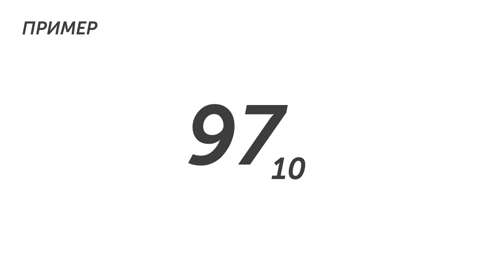
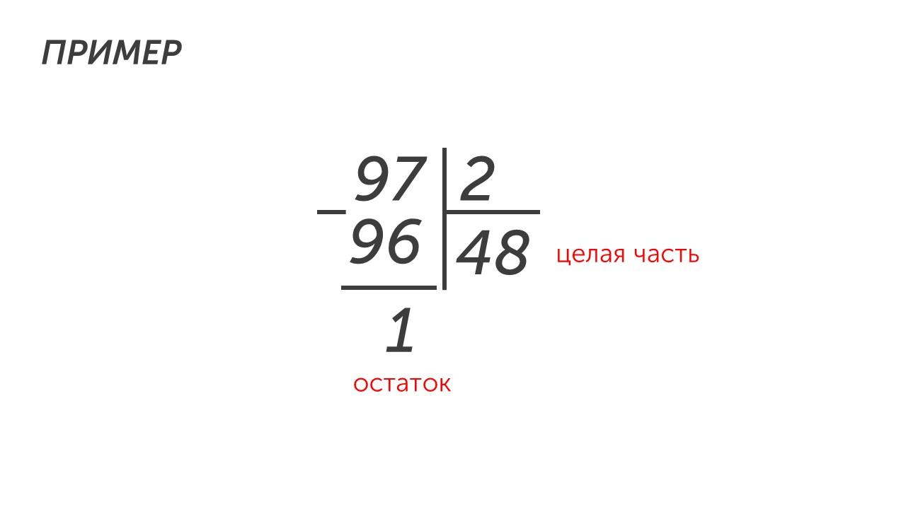
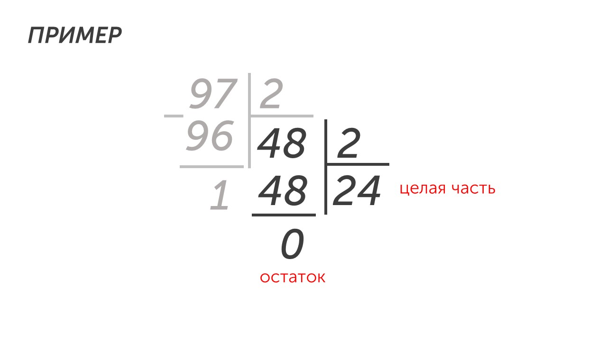
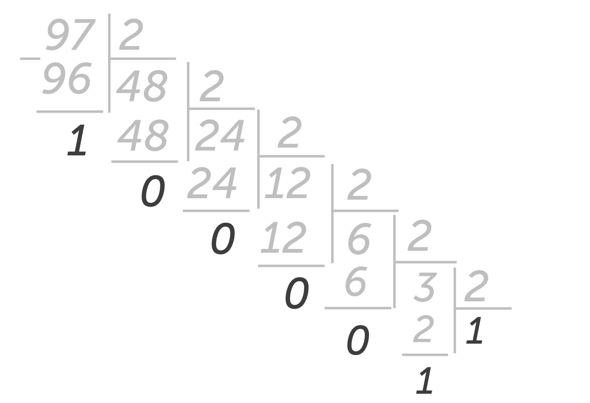
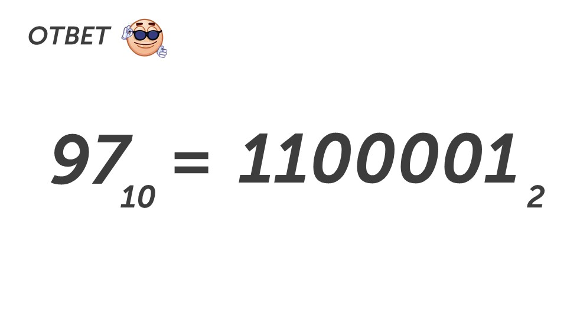

Давай приступим к переводу чисел. Есть два типа переводов:

**Из десятичной системы в любую систему**

**Из любой системы в десятичную**

Начнем разбираться как переводить десятичное число в любую систему счисления🤓

### Из десятичной системы в любую

Например у нас есть число 97 в десятичной системе:

Маленькая цифра 10 - это основание, оно создано для удобства, чтобы было понятно в какой системе счисления число. 

А теперь давай преобразуем число 97 в десятичной системе в двоичную систему. Для этого прочти правило:

> [!important] Правило
> 
> **Для перевода из 10-ой системы счисления в любую другую, необходимо разделить исходное число (у нас это 97), на основание системы счисления (в нашем случае это 2, так как двоичная система) с остатком. Ответ записывается с конца в начало (как это покажу чуть ниже)**

Значит нам нужно делить 97 на 2. Предлагаю делить столбиком:

97 нацело на 2 не делится, поэтому берем ближайшее к 97 число, которое делится на 2 - это 96. Делим его на 2, получается 48 (записываем 48 в целую часть). Вычитаем из 97 число 96 и получаем 1 (записываем в остаток). Теперь снова делим целую часть на 2:

Теперь у нас целая часть 24, а остаток 0. Таким же образом продолжаем делить число, пока целая не станет меньше 2: 

ФУХ😮‍💨

Все разделили. Пора получить ответ:

> [!important] Правило
> 
> **Чтобы получить ответ при переводе десятичного числа в другую систему счисления, необходимо записать последнюю целую часть и остатки в обратном порядке**

Давай сделаем это. Пишем последнюю целую часть (1) и остатки начиная с последнего (100001). 

В ответ получим число **1100001** в двоичной системе счисления:

Таким же образом можно переводить и в другие системы счисления, но делить нужно не на 2, а на основание системы счисления. Хотим перевести в восьмеричную - делим на 8, в пятеричную - делим на 5, в шестнадцатеричную - делим на 16 и т.д. А теперь давай разберемся, как переводить из любой системы в десятичную. 

### Из любой в десятичную

