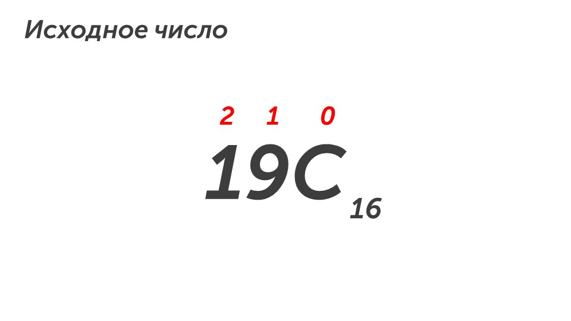
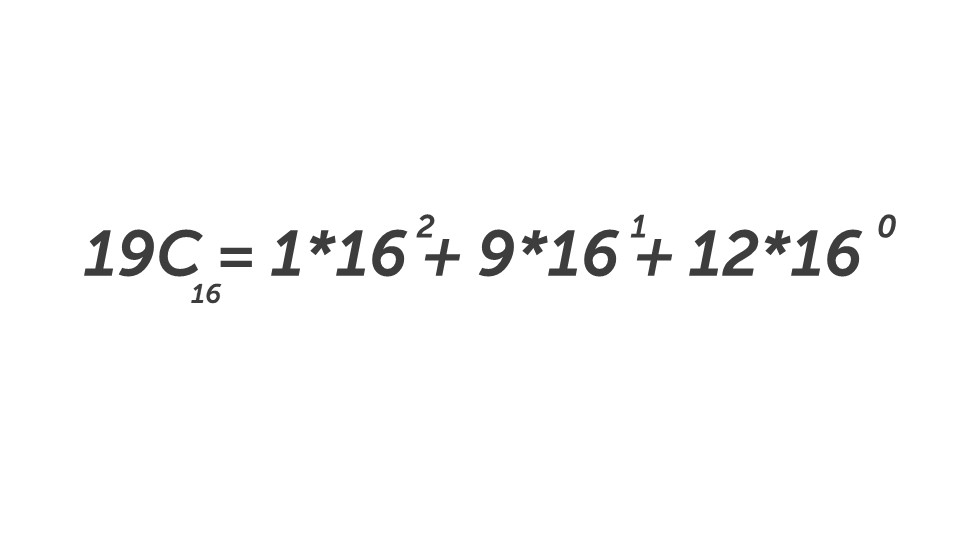
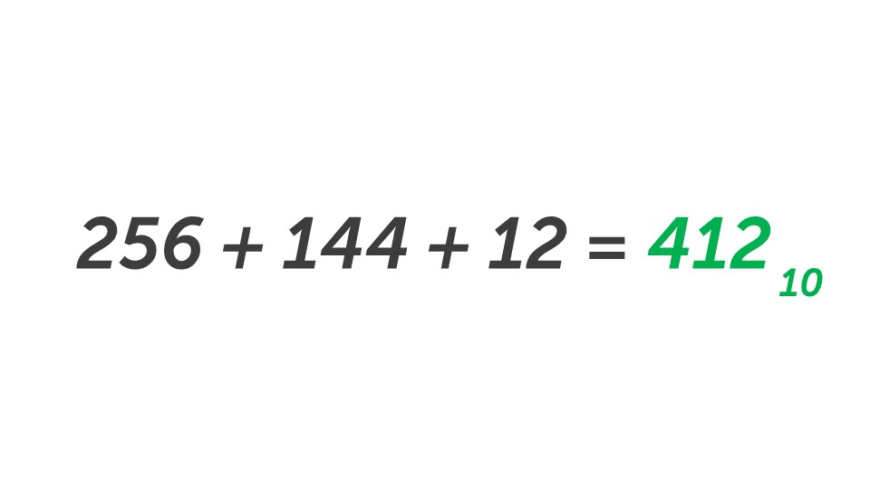

В этом типе заданий нужно переводить число из десятичной системы счисления в любую другую или наоборот. Прочитаем задание:

> [!note] Задача
> 
> Переведите шестнадцатеричное число **19C** в десятичную систему счисления. В ответ запишите только число, без основания.

**Шаг 1 - читаем условие.** По условию задачи нам нужно перевести шестнадцатеричное число в десятичное. Для этого будем использовать метод разрядов.

**Шаг 2 - начинаем перевод.** Расставим разряды над числом:

> [!warning] Важно
> 
> **В шестнадцатеричной системе счисления используются цифры от 0 до 9 и буквы заменяющие цифры А - 10,  В - 11, С -12, D - 13, E - 14 и F - 15. Поэтому разряд мы ставим над буквой, не разбивая ее на цифры**

Умножим цифры на основание в степени разряда:

Осталось только перемножить и сложить:

**Шаг 3 - запишем ответ.** В ответ запиши число **412** без основания системы счисления.

Первый тип десятого задания пройден🔥

Он считается самым простым, для нас это слишком просто, поэтому айда решать второй тип заданий (он тоже простой, но в нем нужно больше считать): [[Тип 2 - поиск наименьшего, среднего и максимального числа|Разобрать второй тип задания🔧]]
