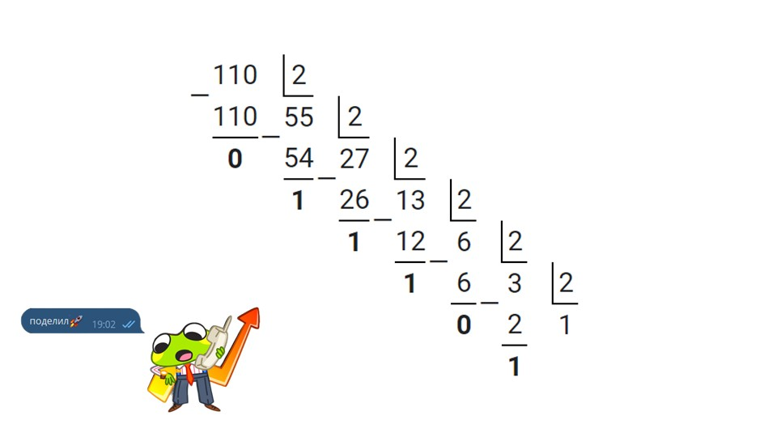
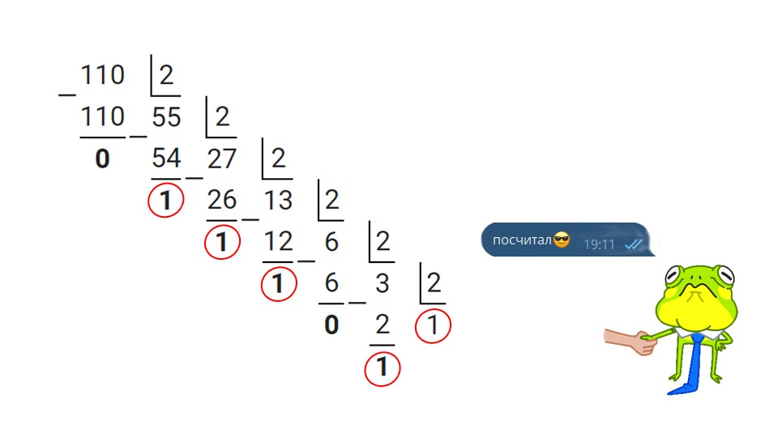

Переходим к последнему типу десятого задания. Давай прочтем задание:

> [!note] Задача
> 
> Переведите число 110 из десятичной системы счисления в двоичную систему счисления. Сколько единиц содержит полученное число? В ответе укажите одно число – количество единиц.

**Шаг 1 - прочтем задание.** По условию нам нужно перевести число 11010 в двоичную систему счисления. В ответ нужно написать количество единиц полученного двоичного числа. Давай сделаем это.

**Шаг 2 - переводим число.** Для перевода числа из десятичной системы в двоичную, нужно поделить число на 2 остатком. В ответ выписать последнюю целую часть и все остатки начиная с последнего:

**Шаг 3 - определяем что нужно выписать в ответ.** По условию задачи нам нужно выписать количество единиц в двоичном числе 11011102. Отметим их на рисунке:

**Шаг 4 - запишем ответ.** В бланк ответов запишем число 5. Задача решена.

А теперь переходи на эту страничку, там тебя кое-что ждет: [[../Ты прошел первую часть🎉|Перейти🎁]]
