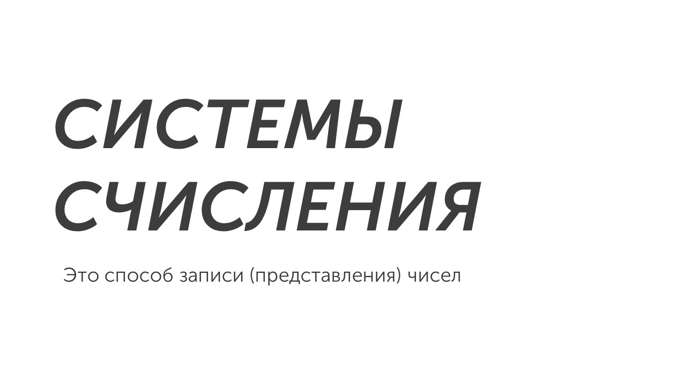
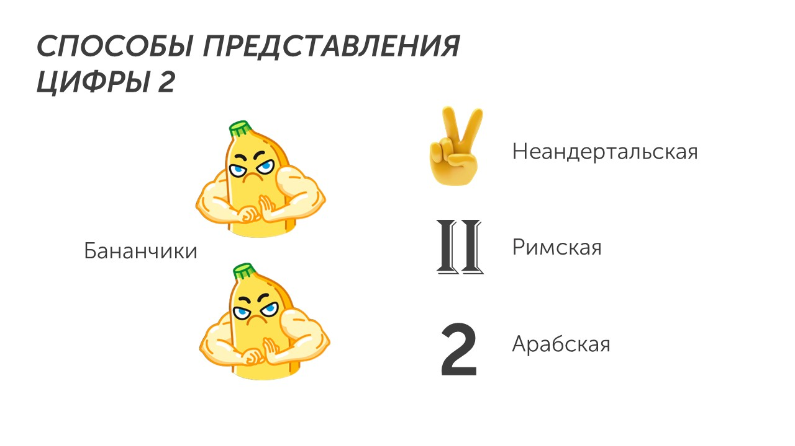
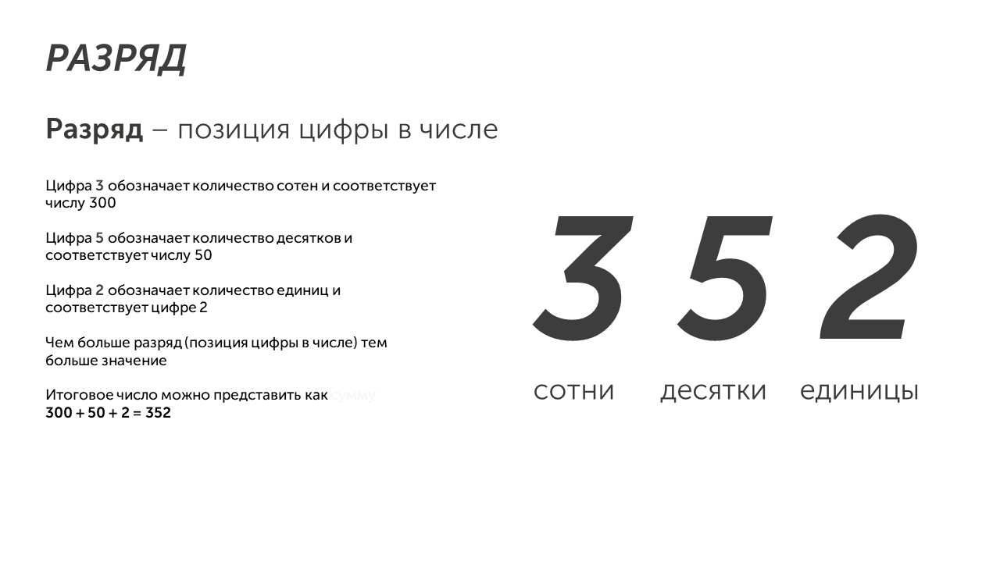

Salve 🙋

Это на латыни значит привет. Сегодня мы с тобой изучим последнее задание из первой части ОГЭ, а потом начнем работать на компьютере. Десятое задание посвящено системам счисления.

Как это работает? Например у нас есть два банана. Раньше когда по земле ходили неандертальцы показывали два банана пальцами, когда появился Рим, два банана стали показываться так ||, а потом в пятом веке арабы придумали цифру 2, который мы пользуемся и сейчас:

Системы счисления делятся на два типа: позиционные и непозиционные. Позиционные системы счисления - это системы, в которых **значение каждой цифры в числе зависит от её позиции (разряда)**

Непозиционные системы счисления самые древние в мире, в них каждая цифра числа имеет величину не зависящую от ее позиции разряда.

С появлением компьютеров появились другие способы представления чисел. Давай разберемся какие системы счисления появились:

**Десятичная система счисления** — это позиционная система счисления с основанием 10 (что такое основание расскажу ниже). Для записи чисел используются десять цифр: от 0 до 9. Десятичная система используется при счете людьми чего либо: бананов, денег, примеров и т.п

**Двоичная система счисления** — это позиционная система счисления с основанием 2. В этой системе для записи используются цифры 0 и 1. Она применяется в компьютерах и мобильных телефонах, потому что техника воспринимает только два типа сигналов (вспоминай про биты и байты😉)

**Восьмеричная система счисления** — тоже позиционная система, но основание 8. В ней используются цифры от 0 до 7. Используется в языках программирования, операционных системах и других технологиях.

**Шестнадцатеричная система счисления** — это позиционная система с основанием 16. В ней используются цифры от 0 до 9 и буквы, но не бойся буквы просто обозначают цифры для удобства записи:

А - 10

B - 11

C - 12

D -13

E - 14

F - 15

Молодец👏

Мы с тобой узнали, что такое системы счисления. Пора научиться переводить числа из одной системы счисления в другую (это самое важное для 10-ого задания). Давай разбираться, как это делать: [[Перевод систем счисления|Идем на разборки😡]]
