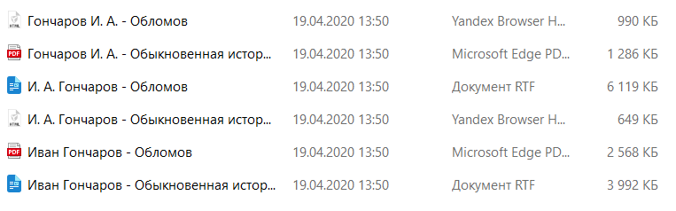
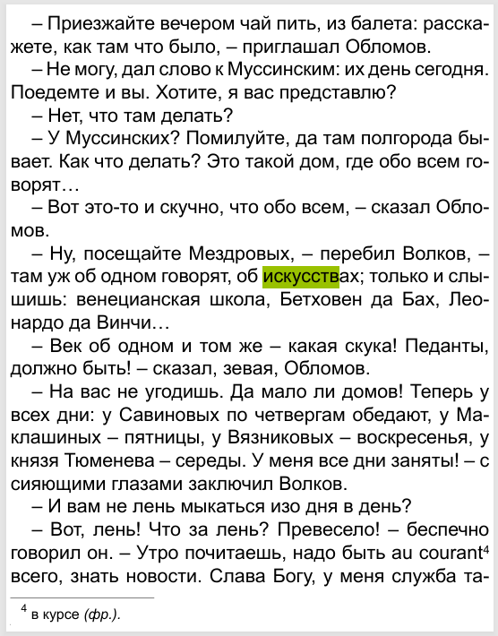

Давай прочитаем задачку🔖

> [!note] Задача
> 
>В эпизоде одного из произведений И.А. Гончарова, содержащегося в подкаталоге каталога **Проза**, персонаж по фамилии Волков сообщает о некой семье, в которой говорят только об искусстве. С помощью поисковых средств операционной системы и текстового редактора определите фамилию главы этой семьи.
>
>[Скачать файл](https://drive.google.com/file/d/1SmfR9qp-JgsLdT6flMiCZEwdBHfQk5Nf/view?usp=sharing)

**Шаг 0 - осознание.** На рабочем столе лежит архив, мы его распакуем. В распакованном архиве найдем каталог «Проза» в нем найдем подкаталог «Гончаров» и в этом подкаталоге будет несколько файлов. Среди этих файлов нужно найти тот, в котором упоминается персонаж по фамилии Волков и в этом файле найти фамилию главы семьи, в которой говорят только об искусстве. 

**Шаг 1 - распакуем архив.** На рабочем столе лежит архив, открываем его, нажимаем кнопку извлечь и выбираем место для сохранения на рабочий стол. В итоге получим два файла архив и папка из архива:

**Шаг 2 - найдем каталог для работы.** Откроем каталог «Проза» в нем будет несколько папок, среди них найдем папку «Гончаров» и откроем ее:

**Шаг 3 - введем слово для поиска.** Необходимо найти ключевые слова для поиска - *Волков, семья, искусстве*. Попробуем вводить слова и смотреть найдутся ли файлы с этим словом:

При вводе слова «Волков» выводится список файлов где присутствует это слово. 

**Шаг 4 - найдем ответ на вопрос.** Открываем найденный файл и вводим остальные ключевые слова для поиска фамилии главы семьи, в которой говорят об искусствах.

>[!success] Подсказка
>
>**Вводите слова не целиком, потому что окончания слов в тексте бывают разными**

Введем слово **искусств** - без окончания, чтобы нашлось больше результатов:

>– Ну, посещайте Мездровых, – перебил Волков, там уж об одном говорят, об искусствах; только и слышишь: венецианская школа, Бетховен да Бах, Леонардо да Винчи…

Отсюда мы и найдем фамилию главы семьи, которая говорит об искусствах - **Мездров**. В бланк ответов запишем Мездров.

>[!warning] Важно
>
>**Если не удается найти нужный файл через средства поиска, то нужно заходить в каждый файл и при помощи команды Ctrl + F искать внутри файла**

11-ое задание позади💪

Чтобы легко его решить нужно просто быть внимательным, понимать что требуется записать в ответ. Если не можешь найти ответ сразу, то отложи это задание на конец, чтобы не тратить много времени.

Давай перейдем к следующему заданию: [[../../Задание 12/Маски поиска|Новое задание🔥]]

