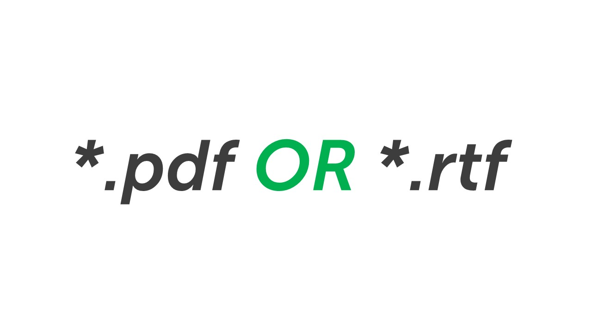
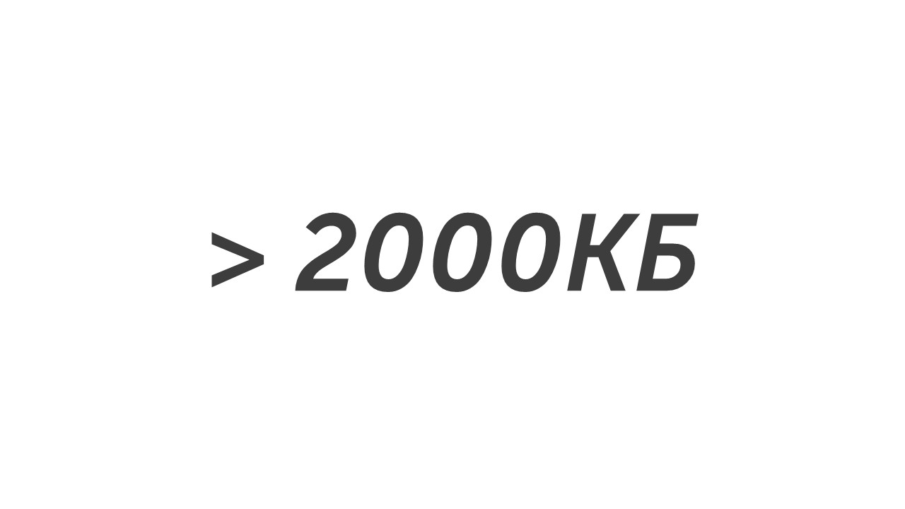
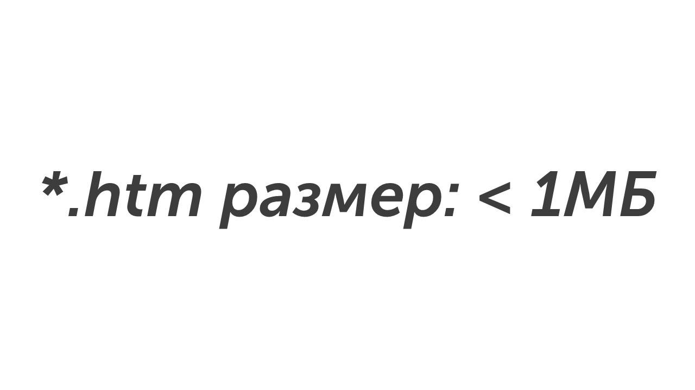
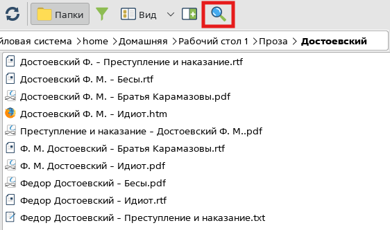
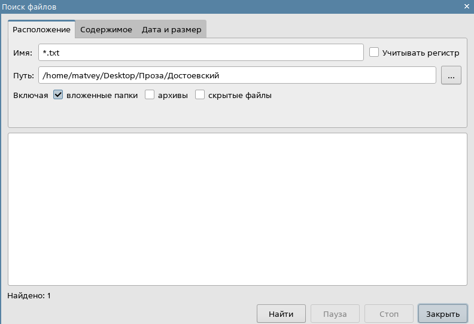
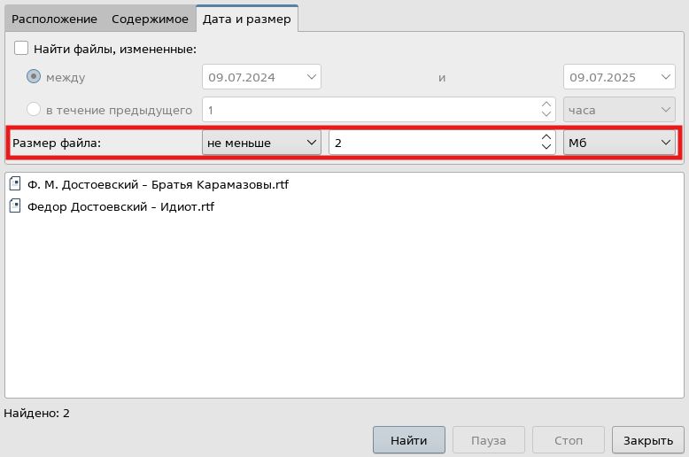

Сегодня мы начнем изучать 12 задание, оно посвящено маскам поиска файлов. Давай узнаем что это такое🔍

>[!success] Определение
>
>**Маска поиска файлов — это шаблон, который используется для фильтрации результатов поиска в операционных системах. Она содержит буквы, цифры и специальные символы, которые расширяют возможности обычного поиска.**

Для того чтобы использовать маску поиска нужно зайти в строку поиска в проводнике (Ctrl + F). Маска выглядит так:

Например нам нужно найти файлы с расширением .txt, для этого в строку поиска нужно ввести такую маску:

Звездочка показывает, что в имени файла могут быть любые символы. Также можно делать строгую маску поиска, например нам нужно найти только файлы с расширением .doc, для этого нужно взять маску в кавычки:

Если нам нужно найти файлы с расширением .png, название которых начинается с буквы «А»:

Эта маска означает, что в начале имени файл стоит буква «А», а потом любое количество символов. Также одновременно можно искать файлы с разными расширениями, для этого нужно применить ключевое слово «OR»:

Такая маска будет искать файлы с расширением .pdf и .rtf. Еще при помощи масок можно искать файлы по размеру. Например нам нужно найти файлы размером больше 2000 КБ, для этого используется такая маска:

Можно комбинировать поиск по расширению и размеру файла. Например если нужно найти файлы с расширением .htm и размером меньше 1МБ. Для этого используем такую маску:

На Linux маски поиска работают также для их применения нужно нажать поиска:

В открывшемся окне в строчке «Имя» нужно ввести маску поиска и нажать кнопку «Найти», результаты поиска появятся в нижнем левом углу:

>[!warning] Важно
>
>**В Linux в строку поиска можно вводить только название файла и расширение и нельзя использовать ключевые слова (OR, размер)**

Для поиска файлов по размеру нужно зайти во вкладку «Дата и размер» и выбрать размер искомого файла. Например, если нужно найти файлы больше (не меньше) 2 МБ нужно ввести такие настройки:

Также как и в Windows можно комбинировать поиск по расширению и размеру файла. Для этого во вкладке «Расположение» нужно выбрать маску для расширения, а во вкладке «Дата и размер» выбрать размер. 

Поздравляю 😎

Теперь ты знаешь всю БАЗУ для решения 12-ого задания, давай чуть-чуть отдохнем и перейдем к решению заданий: [[Разбор заданий/Тип 1 - количество файлов с определенным расширением|Вперед🚀]]
