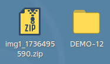
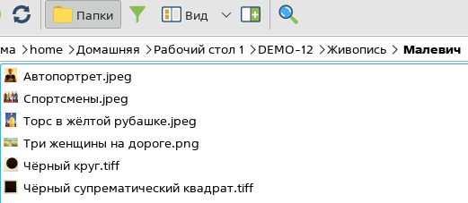
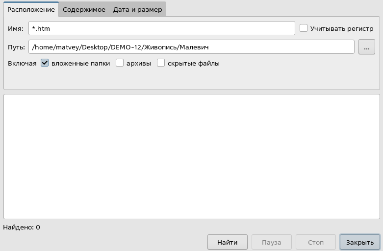
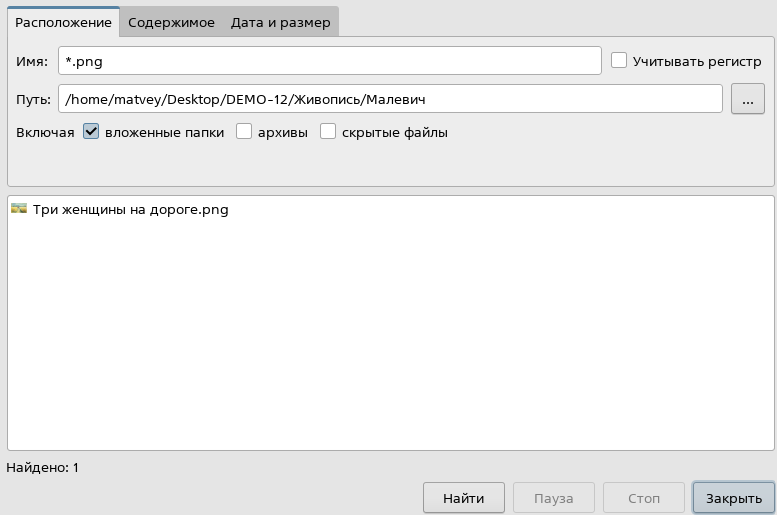
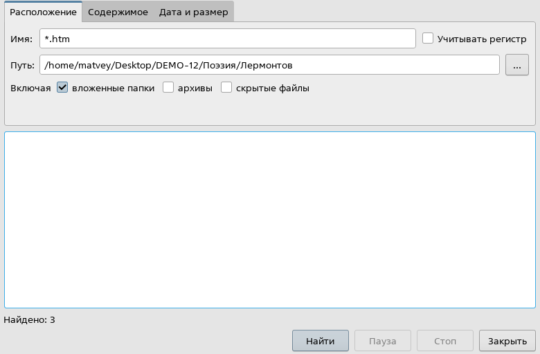
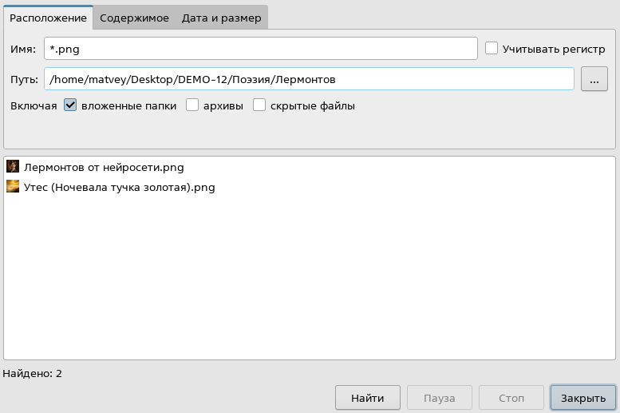
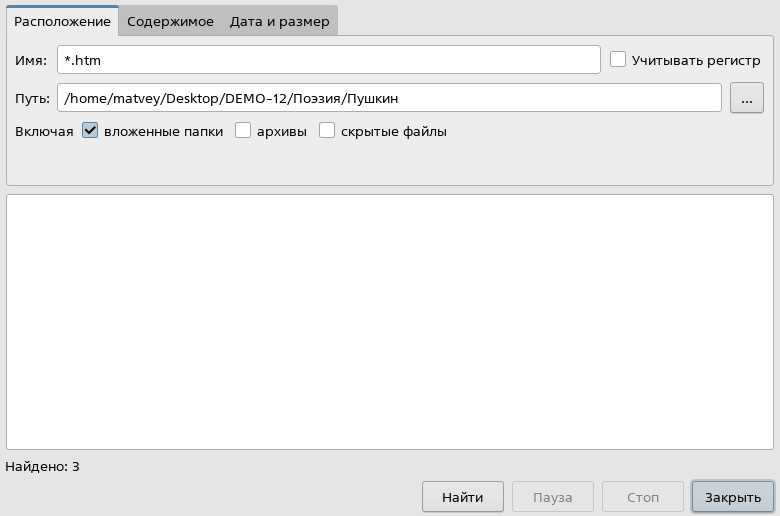

Давай прочитаем задание🔍

> [!note] Задача
> 
> Сколько всего файлов с расширениями .htm и .png содержится в подкаталоге **Малевич** каталога **DEMO-12/Живопись**, а также в подкаталогах **Лермонтов** и **Пушкин** каталога **DEMO-12/Поэзия**? В ответе укажите только число.
> 
> [Скачать файл⬇️](https://drive.google.com/file/d/1dK99EgH-nDvvwsIskLVHNLkIf6LvX3xv/view?usp=sharing)

**Шаг 1 - определим что нужно найти.** Нам нужно найти файлы с расширением .htm и .png по следующим путям:

**DEMO-12/Живопись/Малевич**

**DEMO-12/Поэзия/Лермонтов**

**DEMO-12/Поэзия/Пушкин**

То есть нужно зайти в папки Малевич, Лермонтов, Пушкин посчитать сколько файлов с расширениями .htm и .png в каждой папке и найти их количество.

**Шаг 2 - разархивируем папку.** Нажимаем ПКМ на архив, выбираем «Распаковать в» и место для распаковки рабочий стол, дальше будем работать с папкой DEMO-12:

**Шаг 3 - ищем файлы с необходимыми расширениями.** Заходим по пути **DEMO-12/Живопись/Малевич**. Там будут следующие файлы:

Зайдем в значок поиска и введем в строчку «Имя» маску для поиска файлом с расширением .htm:

Теперь будем искать расширение .png:

В **DEMO-12/Живопись/Малевич** файлов htm - 0, png - 1. Далее откроем **DEMO-12/Поэзия/Лермонтов** и начнем поиск файлов .htm:

Ищем расширение .png:

В **DEMO-12/Поэзия/Лермонтов** файлов htm - 3, png - 2. Переходим к **DEMO-12/Поэзия/Пушкин** и ищем файлы .htm:

Найдем расширение .png:

В **DEMO-12/Поэзия/Пушкин** файлов htm - 3, png - 0. Перейдем к расчету ответа.

**Шаг 3 - считаем файлы.** Во всех папках всего 6 файлов с расширением htm и 3 с расширением png. Всего 9 файлов.

**Шаг 4 - ответ.**  В бланк ответов запишем число 9. 

>[!tip] Совет
>
>**Не считай количество файлов вручную, так больше шансов получить ошибку. Записывай промежуточные результаты количества файлов.**

Супер 🎉

Еще одно задание позади. А сейчас мы перейдем к заданию, которое принесет сразу 2 балла, это создание презентаций: 