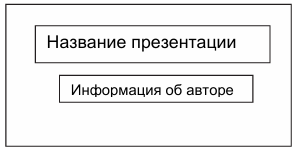
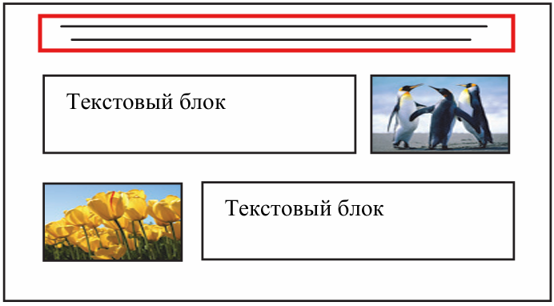

Давай прочитаем критерии к 13-му заданию📖

> [!example] Критерии
> 
> **1. Ровно три слайда без анимации.**
> **2. Размер 16:9, ориентация слайда альбомная**
> **3. Структура слайдов соответствует макету**
> **4. Размер шрифта для названия презентации на титульном слайде – 40 пунктов**
> **5. Размер подзаголовка на титульном слайде и заголовков слайдов – 24 пункта**
> **6. Размер подзаголовков на втором и третьем слайдах и для основного текста – 20 пунктов**

В бланке с заданиями у тебя будет макет, по которому нужно сделать презентацию. Макет будет выглядеть так:

Название презентации - это заголовок (размер 40 пунктов), Информация об авторе - это подзаголовок на титульном слайде - размер 24 пункта:

Красным выделен заголовок обычного слайда, его размер 24 пункта. Текстовый блок - это текст, который мы добавим в презентацию (размер 20 пунктов):

> [!important] Важно
> 
> **Когда добавляешь изображения меняй их размер только за уголок**

🥊Пора потренироваться

Ты знаешь как создавать презентация, помнишь про все критерии и теперь можешь легко решить задание: [[Разбор заданий/Тип 1 - стандартная презентация|Легко☝️]]

