Привет 🙋

Вот мы и добрались до 13-ого задания, как ты помнишь, оно принесет нам сразу 2 балла. У нас есть два варианта выполнения этого задания:

**Написать текст** или **Создать презентацию**

Я предлагаю работать над созданием презентации, потому что это проще, меньше критериев и труднее допустить ошибку. Давай разбираться🕵️‍♀️

### Что такое презентация?

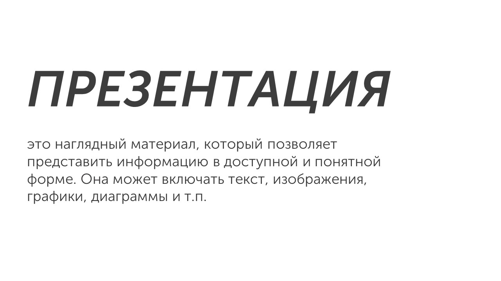

Презентации можно создавать самостоятельно при помощи программ Microsoft PowerPoint, Google Slides, Keynote, Canva или с помощью нейросетей, например Gamma AI. Но на экзамене используется программа LibreOffice Impress:

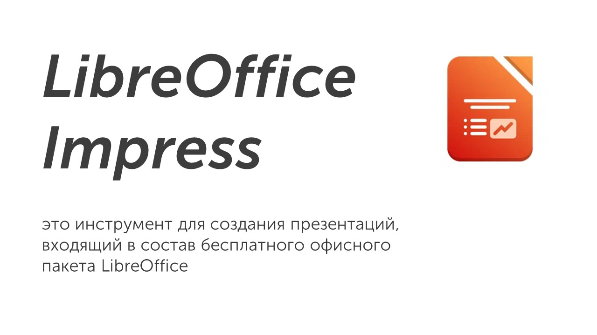

А теперь давай научимся создавать презентации в этой программе🤙

### Создание презентаций - работа с текстом🖋

При открытии LibreOffice Impress нас встречает начальный экран:

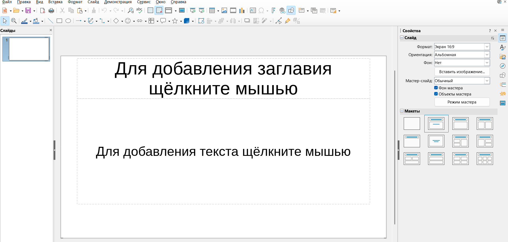

Для того чтобы отчистить слайд от текста, можно либо нажать на область с текстом ЛКМ, потом нажать ПКМ и выбрать в открывшемся списке пункт «Вырезать» либо во вкладе «Макеты» в правом нижнем углу, нажать на пустой макет:

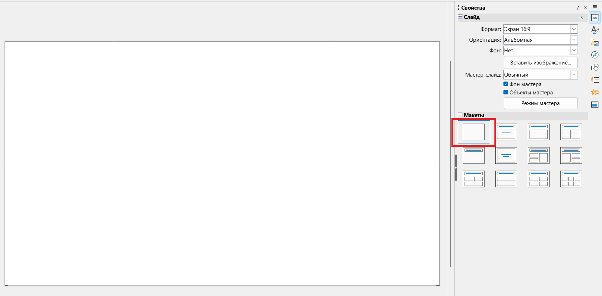

Для того чтобы ввести текст, нужно в верхнем меню выбрать текстовый блок:

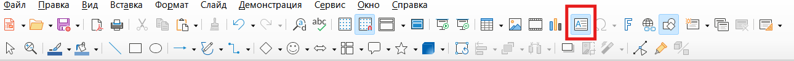

Потом нажать ЛКМ по слайду и ввести текст:

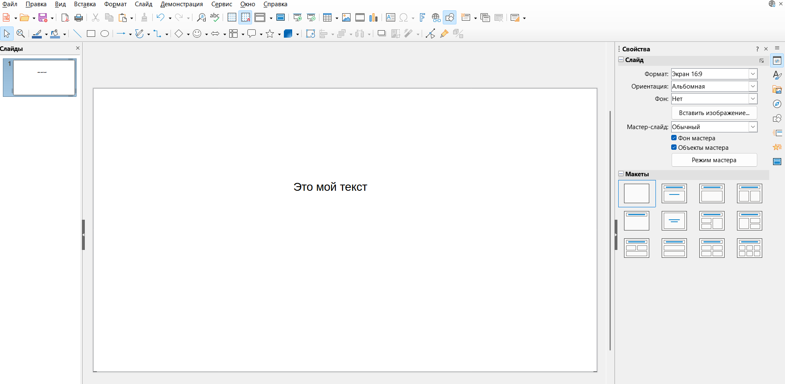

Текст можно редактировать текст, для этого нужно нажать на границу текста и в открывшейся справа вкладке «Символы» можно редактировать размер текста и выбирать шрифт:

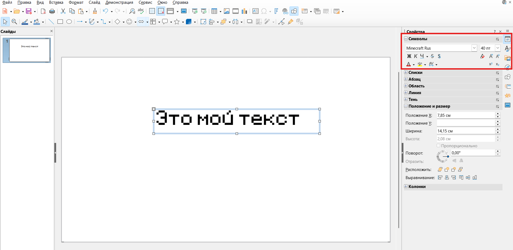

Если при изменении размера текста, он меняет расположение, то это можно отредактировать, растянув границу возле текста.

Было:

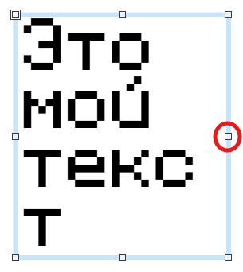

Стало:

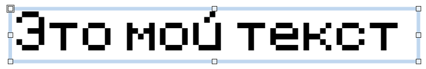

Текст на слайде можно выравнивать, для этого нажимаем на текст и в правой части экрана раскрываем вкладку «Положение и размер». В ней выбираем «Выравнивание» и чаще всего нужно будет использовать выравнивание по центру:

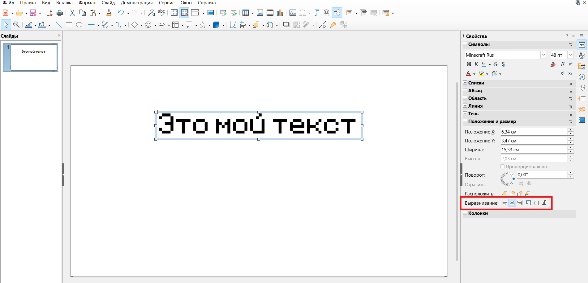

### Создание презентаций - добавление нового слайда➕

Для того чтобы создать новый слайд, нужно нажать в левой части экрана ПКМ и в открывшемся меню выбрать вкладку «Создать слайд» либо нажать комбинацию клавиш «Ctrl + M»:

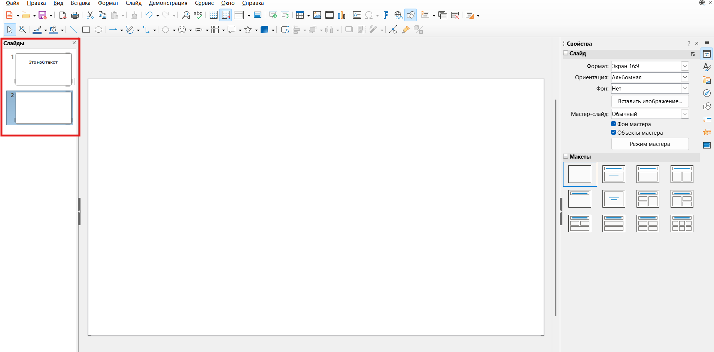

### Создание презентаций - работа с изображениями🖼

Для добавления изображения в верхнем меню выбираем «Вставка», потом выбираем изображение и путь к этому изображению:

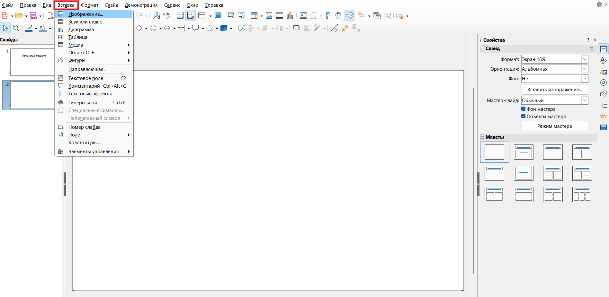

> [!warning] Важно
> 
> **При изменении размера изображения обязательно менять его за угловую точку и не за какую другую**

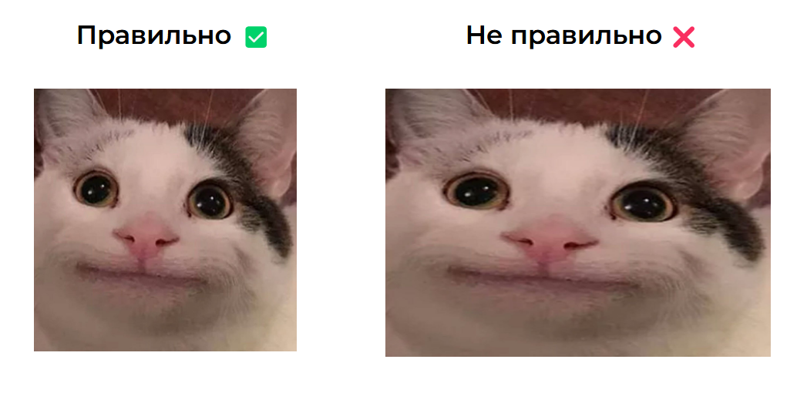

Если менять изображение не за уголок, то оно будет искажаться, а это считается ошибкой на экзамене.

Все📌

Теперь ты знаешь почти все для решения 13-ого задания, давай изучим критерии оценивания и решим задачу: [[Разбор заданий/Тип 1 - стандартная презентация|Давай]]
