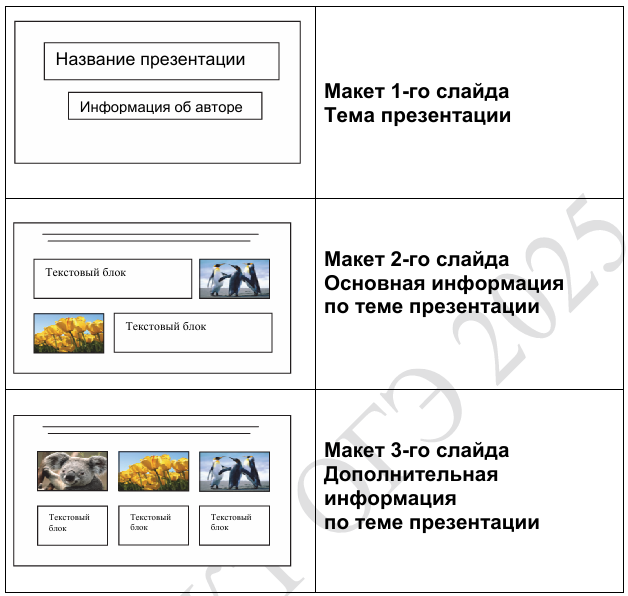
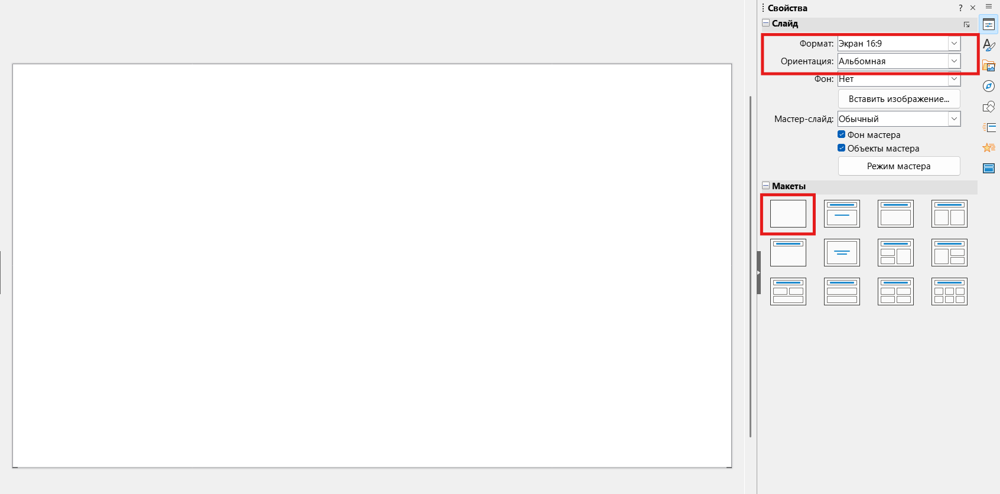
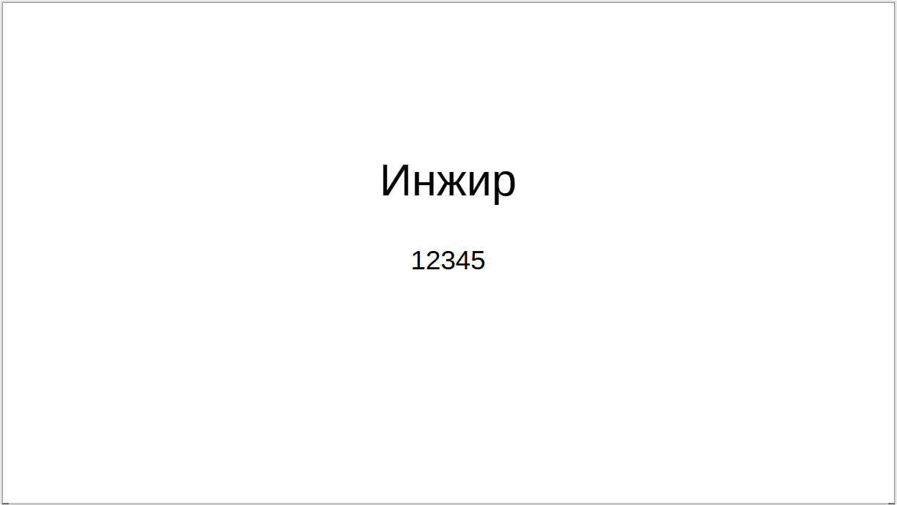
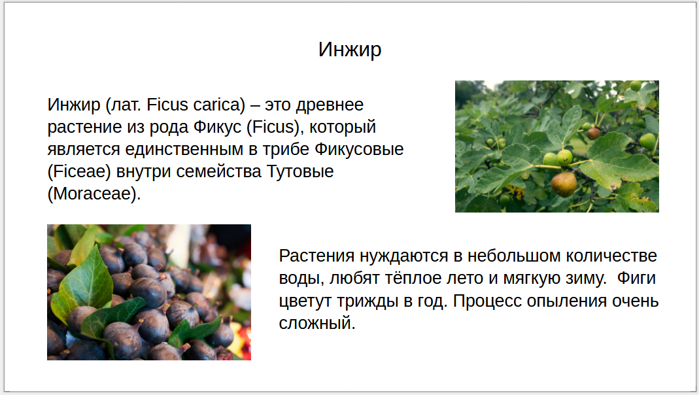
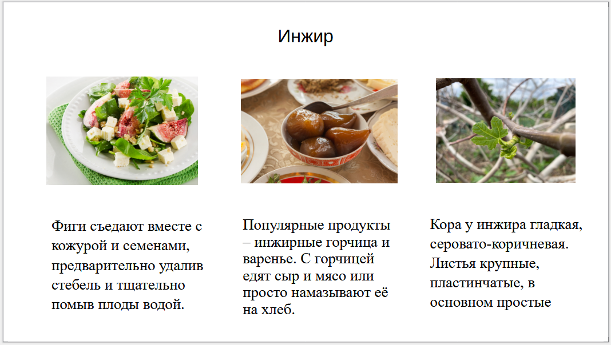

Как всегда начинаем с прочтения задания🧐

> [!note] Задача
> 
>Используя информацию и иллюстративный материал, содержащийся в каталоге ЗАДАНИЕ 13, создайте презентацию из трёх слайдов на тему «Инжир». В презентации должны содержаться краткие иллюстрированные сведения о растении и пример его использования в кулинарии. Все слайды должны быть выполнены в едином стиле, каждый слайд должен быть озаглавлен. Презентацию сохраните в файле, имя которого Вам сообщат организаторы экзамена. Файл ответа необходимо сохранить в одном из следующих форматов: .odp, .ppt, .pptx.
>
>[Скачать файл⬇️](https://drive.google.com/file/d/1L3dFhe7zDdttUlZNzH_Oy8JvfITjhJ4l/view?usp=sharing)

**Шаг 1 - разберем условие.** Нам необходимо создать презентацию из трех слайдов на тему «Инжир». В презентации должны быть сведения о  растении и пример его использования в кулинарии.

**Шаг 2 - настроим размер слайда.** Откроем LibreOffice Impress, отчистим слайд от всего и настроим размер с ориентацией:

**Шаг 3 - создадим титульный слайд.** На титульном слайде должен быть заголовок (40 пунктов) и подзаголовок (24 пункта). Заголовок (название презентации) должен соответствовать заявленной теме и будет называться «Инжир», а подзаголовок (информация об авторе) это номер твоего КИМ (выглядит вот так: 12345):

> [!important] Важно
> 
> **Все надписи должны быть написаны одним шрифтом1️⃣**
> 
> **Не забывай про размеры текста📏**
> 
> **Надписи не должны пересекаться ❌**
> 
> **Выравнивайте заголовок и подзаголовки по центру**

**Шаг 4 - сделаем второй слайд.** На нем будет заголовок (размер 24 пункта), два текстовых блока (размер 20 пунктов) и две картинки. Текст берем из текстового файла приложенному к заданию, заголовок также «Инжир»:

**Шаг 5 - последний слайд.** На нем также заголовок, три картинки и три блока текста:

**Шаг 6 - сохраним файл.** В верхнем левом углу экрана нажимаем «Файл» выбираем «Сохранить файл» и сохраняем его в свою папку на рабочий стол.

> [!warning] Предупреждение
> 
> **Весь текст должен быть написан одним шрифтом**
> 
> **Размер текста должен соответствовать его типу**
> 
> **Ничего не должно пересекаться**
> 
> **Изображения не должны искажаться**

🏆Победа

13-ое задание решено, теперь потренируй его и будем переходить к следующему заданию