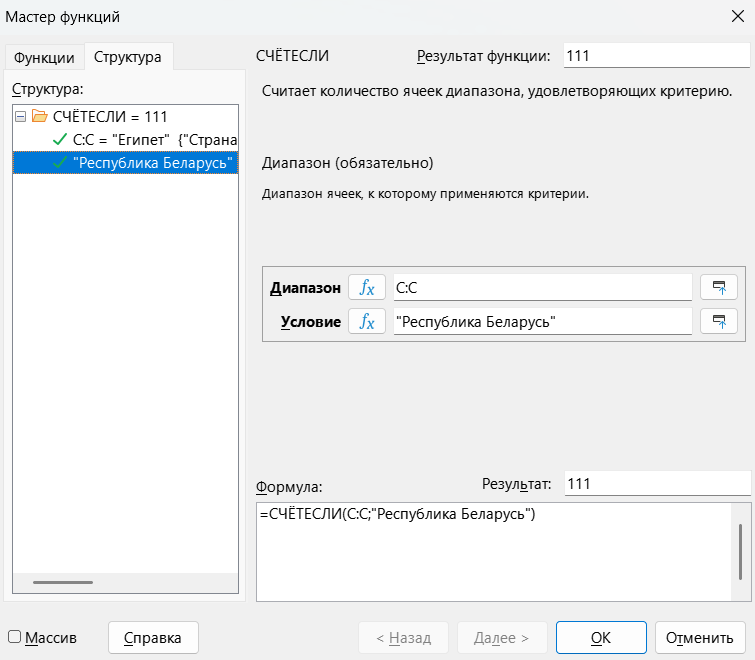
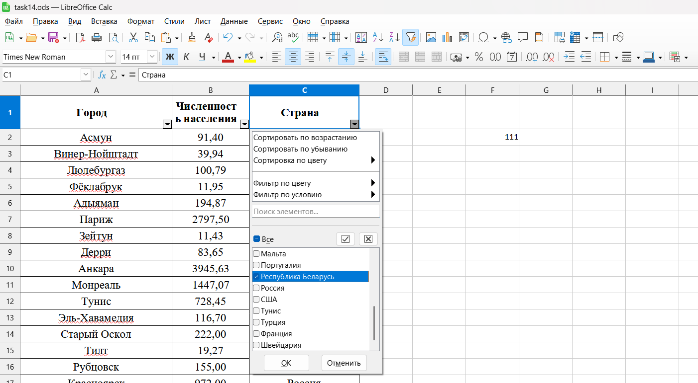
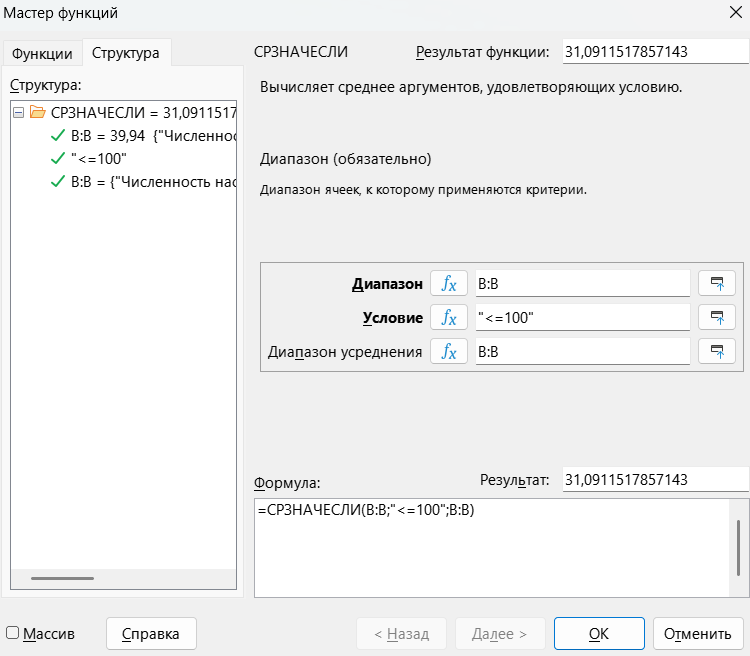
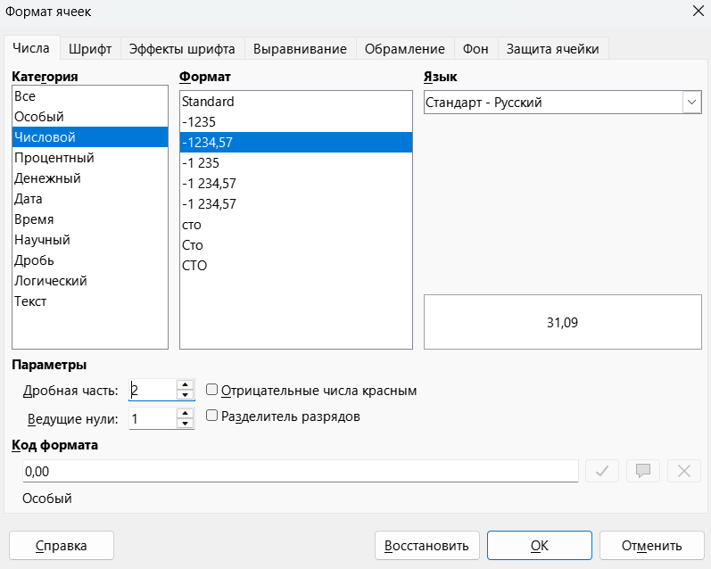
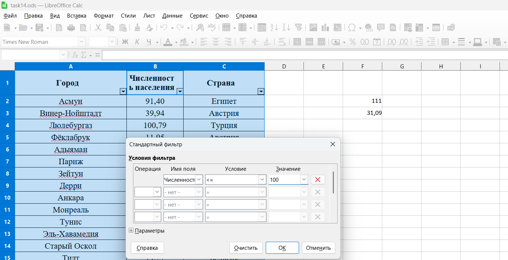
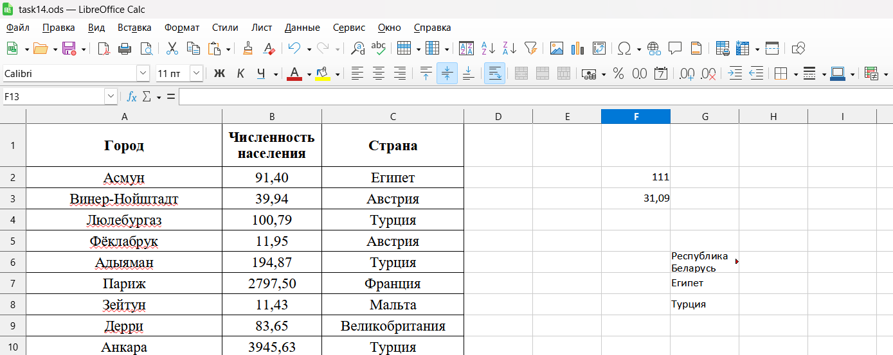
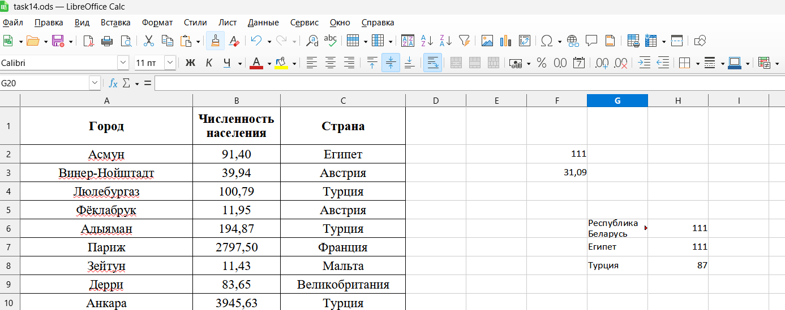
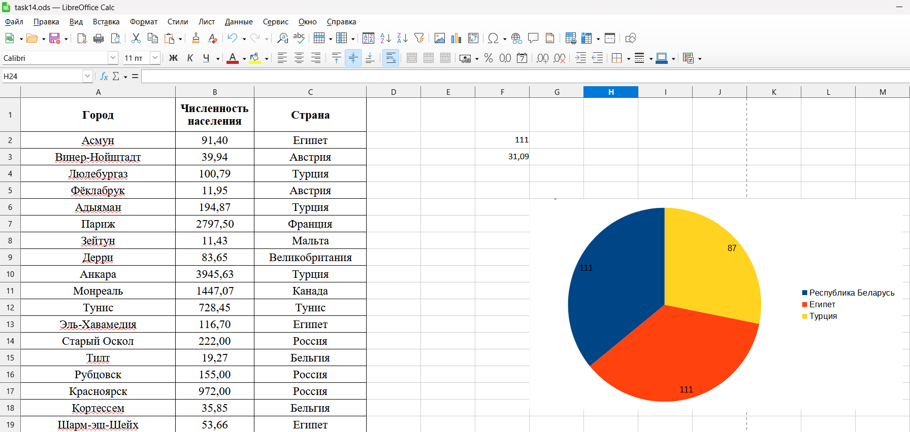

Прочтем задание 📖

> [!note] Задача
> 
> В электронную таблицу занесли данные о численности населения городов разных стран. Ниже приведены первые пять строк таблицы.

|     | A              | B                     | С       |
| :-- | :------------- | :-------------------- | ------- |
| 1   | Город          | Численность населения | Страна  |
| 2   | Асмун          | 91,40                 | Египет  |
| 3   | Винер-Нойштадт | 39,94                 | Австрия |
| 4   | Люлебургаз     | 100,79                | Турция  |
| 5   | Фёклабрук      | 11,95                 | Австрия |

> [!note] Продолжение задачи
> 
> В столбце A указано название города; в столбце B – численность населения (тыс. человек); в столбце C – название страны.
> 
>Всего в электронную таблицу были занесены данные по 1000 городов. Порядок записей в таблице произвольный. Откройте файл с данной электронной таблицей (расположение файла Вам сообщат организаторы экзамена). На основании данных, содержащихся в этой таблице, выполните задания.
>
>1) Сколько городов Республики Беларусь представлено в таблице? Ответ запишите в ячейку F2.
>2) Какова средняя численность населения городов, в которых количество жителей не превышает 100 тыс. человек? Ответ на этот вопрос с точностью не менее двух знаков после запятой (в тыс. человек) запишите в ячейку F3 таблицы.
>3) Постройте круговую диаграмму, отображающую соотношение количества городов Республики Беларусь, Египта и Турции, представленных в таблице. Левый верхний угол диаграммы разместите вблизи ячейки G6. В поле диаграммы должны присутствовать легенда (обозначение, какой сектор диаграммы соответствует каким данным) и числовые значения данных, по которым построена диаграмма.
>   
>Полученную таблицу необходимо сохранить под именем, указанным организаторами экзамена
>
>[Скачать файл](https://drive.google.com/file/d/1-3nNAHbnESWi1f-nm-Wv6eIT2tnpg1QY/view?usp=sharing)

**Шаг 1.1 - первая задача.** В первой задачи нам нужно посчитать сколько городов Республики Беларусь представлено в таблице. Это довольно просто, если нам нужно что-то посчитать, то используем формулу СЧЁТ, а если посчитать с условием, то СЧЁТЕСЛИ.

Нажимаем в на ячейку F2 и заходим в «Мастер функций» и выбираем функцию СЧЁТЕСЛИ и заполняем поля:

**Диапазон** - выбираем целиком столбец «Страна» (С:С)

**Условие** - в кавычках пишем "Республика Беларусь"

В ответ получаем 111:

**Шаг 1.2 - первая задача.** Эту задачку можно решить при помощи фильтров. Подключаем автофильтр и открываем его в столбике «Страна». Нажимаем кнопочку «Все», чтобы галочка убралась от всех названий стран и ставим галочку возле "Республика Беларусь" и нажимаем ОК. 

Теперь нажимаем на отфильтрованный столбик «Численность населения» и в нижнем правом углу видим Количество = 111 (Нажимаем именно на столбик и числами, потому что функция Количество применяется только для чисел)

Нажми Ctrl + Z и выключи автофильтр, чтобы продолжить решение заданий.

**Шаг 2.1 - вторая задача.** Нужно посчитать среднюю численность населения городов, в которых жителей не больше 100 тысяч. 

Нажимаем в на ячейку F3 и заходим в «Мастер функций» и выбираем функцию СРЗНАЧЕСЛИ и заполняем поля:

**Диапазон** - выбираем столбик «Численность населения» (В:В)

**Условие** - в кавычках пишем "<=100"

**Диапазон усреднения** - выбираем столбик «Численность населения» (В:В)

По условию задачи ответ нужно записать с точностью не менее двух знаков после запятой. Для этого нажимаем ПКМ на ячейку F2 и во вкладке «Параметры» в дробной части ставим 2 знака:

В ответ запишем 31,09

**Шаг 2.2 - вторая задача.** Подключим «Автофильтр» и зайдем в «Фильтр по условию» - «Стандартный фильтр» в столбике «Численность населения». Настроим фильтр как на рисунке ниже:

Нажимаем на кнопку ОК, выделяем столбик «Численность населения» и в нижнем правом углу видим: Среднее значение 31,09

**Шаг 3 - третья задача.** Нужно построить диаграмму, в которой будет отображено количество городов в Республики Беларусь, Египта и Турции. 

Для этого в ячейке G6 пишем Республика Беларусь, а в ячейках ниже Египет и Турция:

Теперь при помощи формулы СЧЁТЕСЛИ или автофильтра считаем количество городов во всех странах (как в задании 1):

Создадим диаграмму, добавим подпись данных:

Задание готово +3 балла.

Перейдем к решению следующего типа: [[Тип 2 - даты|🚑Вперед]]

