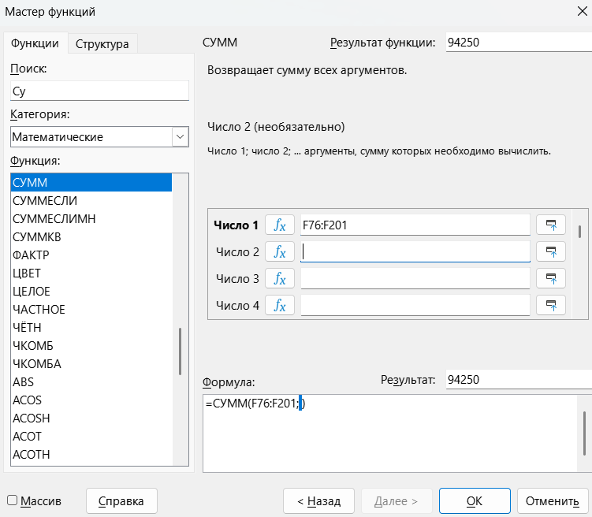

Дальше будем рассматривать не все три задания целиком, а только отдельные интересные задания. Давай поглядим на задание 👀

> [!note] Задача
> 
>В электронную таблицу занесли информацию о грузоперевозках, совершённых некоторым автопредприятием с 1 по 9 октября. Ниже приведены первые пять строк таблицы.

|     | A         | B                     | C                    | D              | E                  | F               |
| --- | --------- | --------------------- | -------------------- | -------------- | ------------------ | --------------- |
| 1   | **Дата**  | **Пункт отправления** | **Пункт назначения** | **Расстояние** | **Расход бензина** | **Масса груза** |
| 2   | 1 октября | Липки                 | Березки              | 432            | 63                 | 770             |
| 3   | 1 октября | Орехово               | Дубки                | 121            | 17                 | 670             |
| 4   | 1 октября | Осинки                | Вязово               | 333            | 47                 | 830             |
| 5   | 1 октября | Липки                 | Вязово               | 384            | 54                 | 730             |

> [!note] Продолжение задачи
> 
> 1) Какова суммарная масса грузов перевезённых с 3 по 5 октября? Ответ на этот вопрос запишите в ячейку H2 таблицы.
>    
> [Скачать файл](https://drive.google.com/file/d/1kjREz5GKVPvPFZ-f9hBbdcKiu-YGtWCH/view?usp=sharing)

**Шаг 1 - решение.** Нам нужно посчитать суммарную массу груза с 3 по 5 октября. Для этого в столбце «Дата» найти ячейку с первой отправкой 3-го октября (А76) и последнюю отправку 5-го октября (А201). Заходим в ячейку H2, включаем «Мастер функции», для подсчета будем использовать формулу СУММ (работает с диапазоном Масса груза, столбик F):

Получаем ответ 94250

Перейдем к следующему типу: [[Тип 3 - дополнительный столбик|Топ-топ👌]]
