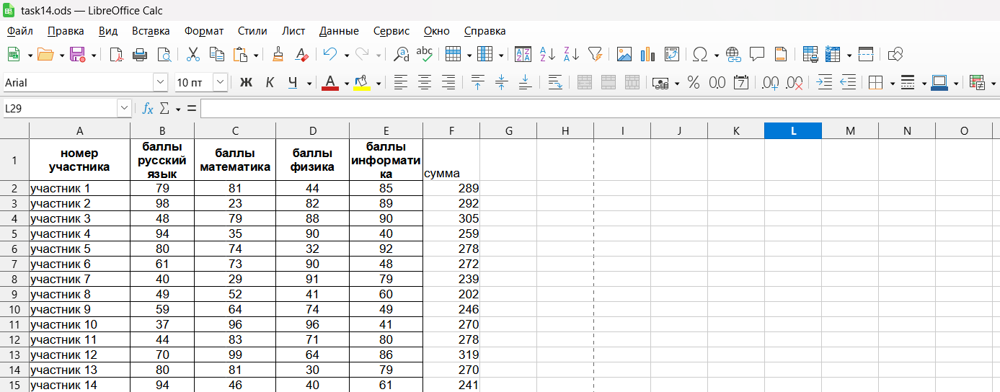
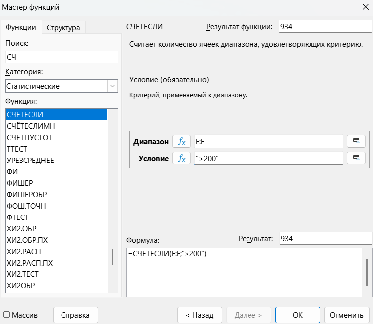

Давай прочитаем задание🛋

> [!note] Задача
> 
> В электронную таблицу занесли данные о результатах тестирования. Ниже приведены первые пять строк таблицы.

|     | A                   | **B**                  | **C**                | **D**            | **E**                 |
| --- | ------------------- | ---------------------- | -------------------- | ---------------- | --------------------- |
| 1   | **номер участника** | **баллы русский язык** | **баллы математика** | **баллы физика** | **баллы информатика** |
| 2   | участник 1          | 79                     | 81                   | 44               | 85                    |
| 3   | участник 2          | 98                     | 23                   | 82               | 89                    |
| 4   | участник 3          | 48                     | 79                   | 88               | 90                    |
| 5   | участник 4          | 94                     | 35                   | 90               | 40                    |

> [!note] Продолжение задачи
> 
> 1) Сколько участников тестирования получили по русскому языку, информатике, и математике в сумме более 200 баллов? Ответ на этот вопрос запишите в ячейку H2 таблицы.
>    
>    [Скачать файл](https://drive.google.com/file/d/1As5C7zkLr0PK9SGAc8BRa3FHZTWBMz8o/view?usp=sharing)

**Шаг 1 - решение.** Нам нужно найти количество учеников у которых в сумме по 4 предметам более 200 баллов. У нас нет столбика в котором будет сумма баллов по всем предметам. Давай те создадим его.

Подпишем ячейку F1 как сумма, а в ячейке F2 напишем такую формулу:

**=B2+C2+D2+E2**

Эта формула складывает баллы по 4 предметам участника 1. Теперь растянем эту формулу на всю таблицу, для этого нажмем два раза на синий квадратик в правом нижнем углу ячейки F2 и формула растянется на всю таблицу:

Далее заходим на ячейку H2 и заходим в «Мастер функций» и выбираем функцию СЧЁТЕСЛИ так как нужно посчитать количество с условием. Диапазон это столбик F, условие ">200":

В ответ получим число 934

Осталось посмотреть последний тип задания: [[Тип 4 - сложное условие|Посмотрим👀]]
