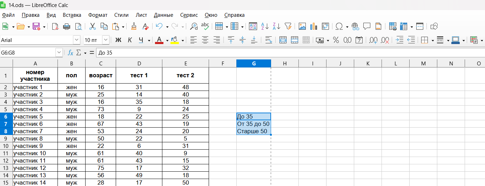
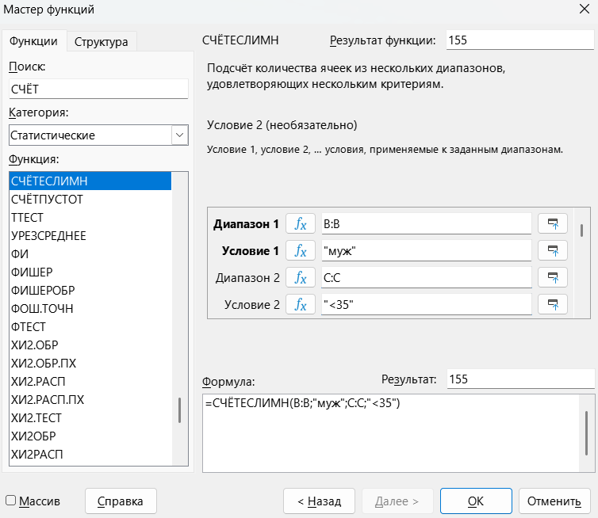
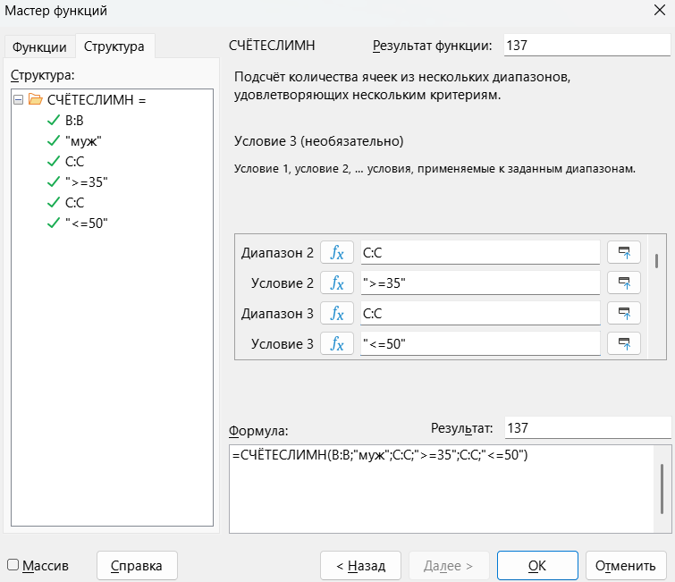
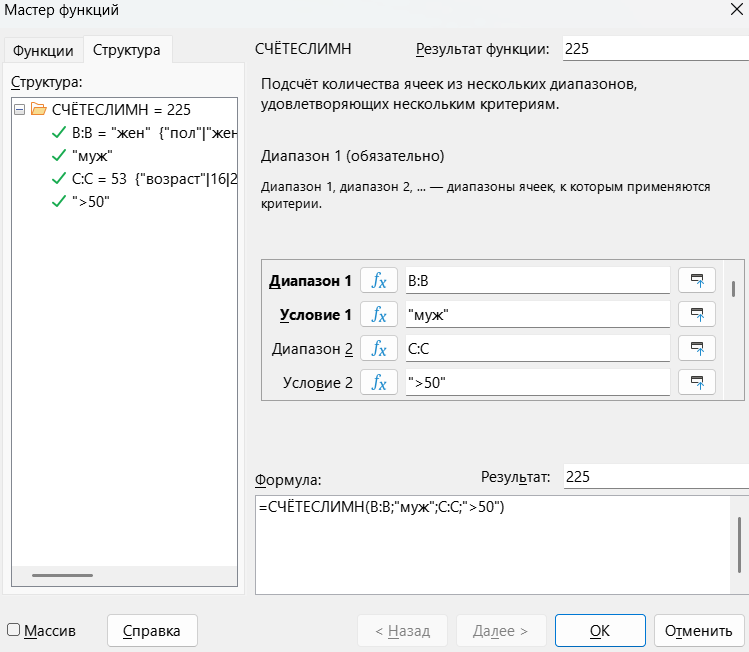
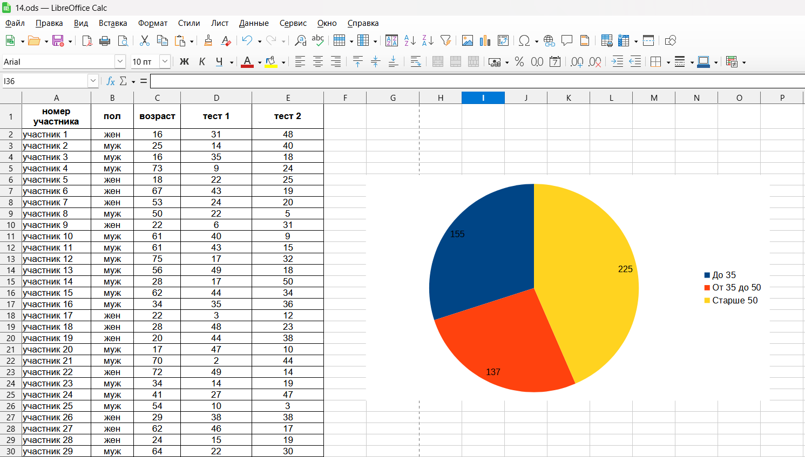

Прочитаем задание📖

> [!note] Задача
> 
>В электронную таблицу занесли данные о тестировании людей разного возраста.

|     |        **A**        |  **B**  |    **C**    |   **D**    |   **E**    |
| --- | :-----------------: | :-----: | :---------: | :--------: | :--------: |
| 1   | **номер участника** | **пол** | **возраст** | **тест 1** | **тест 2** |
| 2   |     участник 1      |   жен   |     16      |     31     |     48     |
| 3   |     участник 2      |   муж   |     25      |     14     |     40     |
| 4   |     участник 3      |   муж   |     16      |     35     |     18     |
| 5   |     участник 4      |   муж   |     73      |     9      |     24     |

> [!note] Продолжение задачи
> 
> 3) Постройте круговую диаграмму, отображающую соотношение числа участников тестирования мужского пола в возрасте до 35, от 35 до 50 включительно и старше 50 лет. Левый верхний угол диаграммы разместите вблизи ячейки G6. В поле диаграммы должны присутствовать легенда (обозначение, какой сектор диаграммы соответствует каким данным) и числовые значения данных, по которым построена диаграмма.
>    
>    [Скачать файл📌](https://drive.google.com/file/d/1lWCBrvgnlfjnE9JgKiHBmfwAkp_rjyc_/view?usp=sharing)

**Шаг 1 - решение.** По условию задачи нам нужно найти количество участников тестирования **мужского пола** в возрасте:

до 35 

от 35 до 50 включительно

старше 50

Для начала создадим название ячеек:

Зайдем в ячейку H6, откроем мастер функций и посчитаем количество участников мужского пола в возрасте до 35, для этого используем формулу СЧЁТЕСЛИМН.

**Диапазон 1** - столбик В (пол участника)

**Условие 1** - пол "муж"

**Диапазон 2** - столбик C (возраст участника)

**Условие 2** - возраст "<35"

Зайдем в ячейку H7 и также используем формулу СЧЁТЕСЛИМН.

**Диапазон 1** - столбик В (пол участника)

**Условие 1** - пол "муж"

**Диапазон 2** - столбик C (возраст участника)

**Условие 2** - возраст ">=35"

**Диапазон 3** - столбик C (возраст участника)

**Условие  3** - возраст "<=50"

Осталось посчитать сколько участников мужского пола старше 50, сделаем это аналогично первой задачке:

Почти закончили, выделяем созданную таблицу, создаем диаграмму и добавляем подпись данных:

