Salut 🖐

Сегодня приступим к изучению 14-ого задание. За это задание ты сможешь получить целых 3 балла. В нем три подпункта и за каждый правильно решенный пункт по 1 баллу.

Это задание выполняется в табличном редакторе LibreOfficeCalc:

Рабочее окно редактора выглядит так:

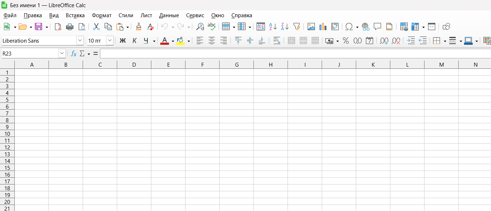

Давай разбираться как с ним работать

### Столбцы, ячейки и диапазоны

**Столбец в таблице** — это **вертикальная последовательность ячеек**, обычно обозначаемая буквами латинского алфавита. Для того чтобы выделить столбик нужно нажать два раза на букву обозначающую столбик и он целиком будет выделен:

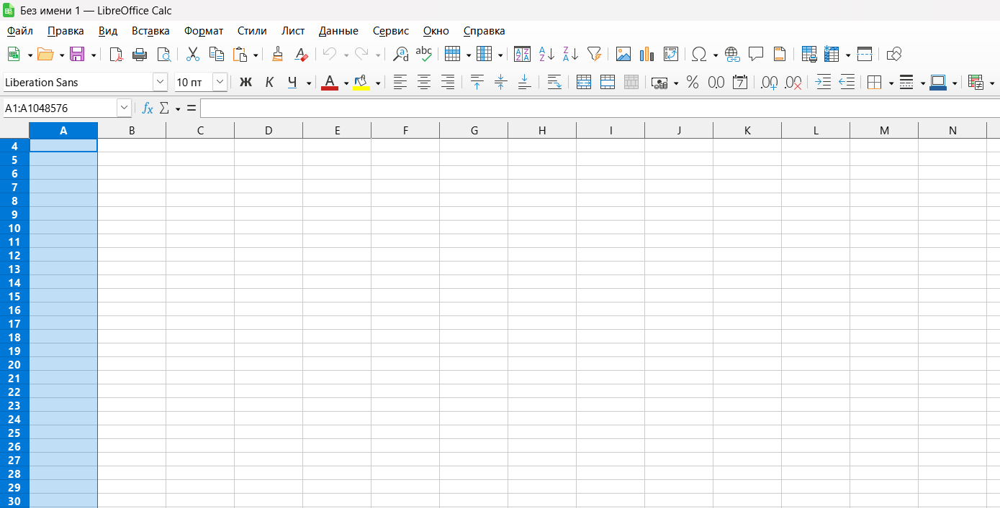

**Ячейка** - это квадратик образованный пересечением строки и столбца. У каждой ячейки уникальный номер образованный из названия столбца и номера ячейки. Номер выделенной ячейки показывается в левом верхнем углу экрана.

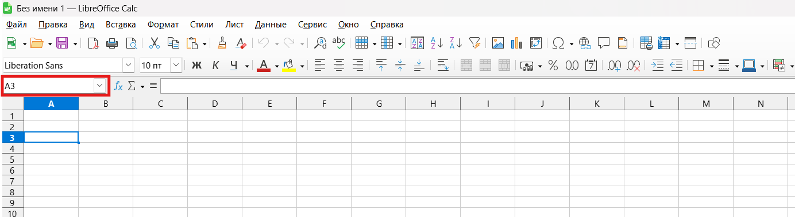

**Диапазон в электронной таблице** — это прямоугольная область листа, состоящая из нескольких ячеек. Номер диапазона состоит из начальной ячейки, двоеточия и конечной ячейки диапазона. 

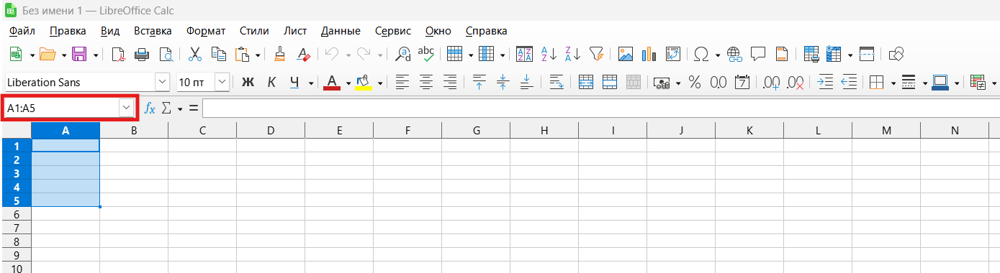

Теперь давай разберемся с важнейшей частью табличного редактора🔍

### Формулы

##### СЧЁТ

При помощи этой формулы можно считать количество ячеек.

> [!important] Важно
> 
> **Формула СЧЁТ можно применить только для ячеек с числовым значением**

Чтобы использовать формулы нужно нажать на ячейку рядом с которой мы будем считать количество в нашем случае это В1:

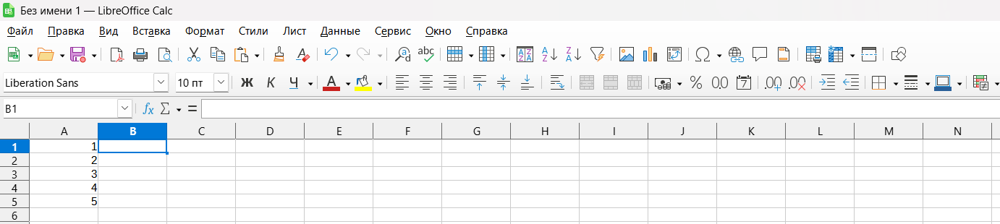

Далее нажимаем на значок «Мастера функций»:

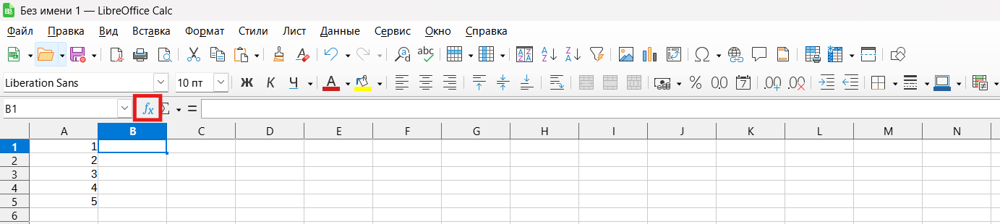

В открывшемся окне в строчке поиска вводим название формулы:

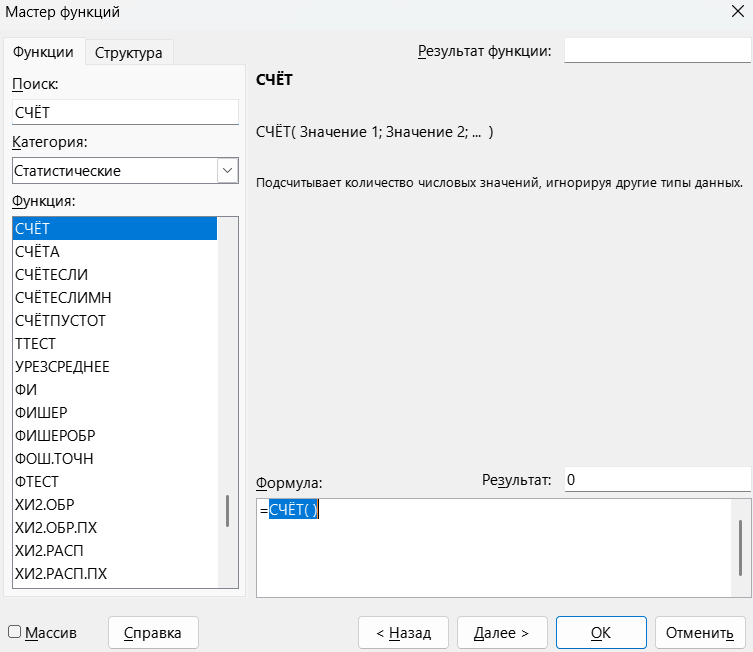

Теперь нажимаем кнопку «Далее» и в строчку «Значение 1» вводим диапазон, который мы хотим посчитать. Для этого можно вручную ввести диапазон (A1:A5) или просто нажать на столбик (А:А):

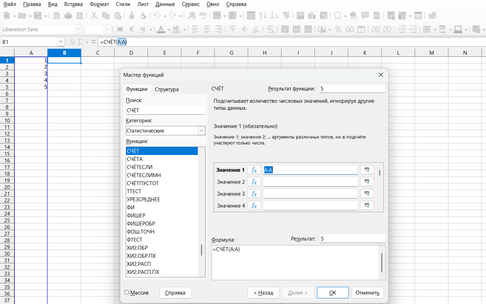

Для отображения результата нажимаем кнопку ОК и в ячейке B1 появится результат - количество выбранных ячеек:

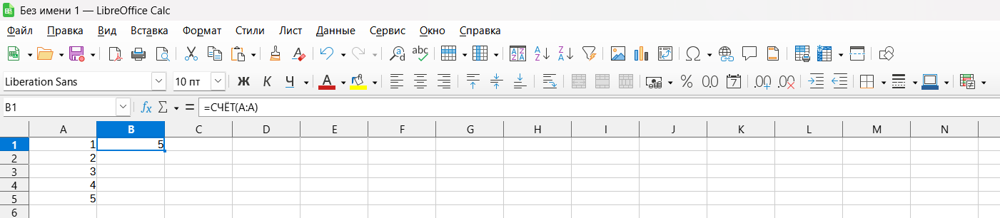

##### СУММ

Эта формула позволяет считать сумму данных из ячеек. К примеру нужно посчитать сумму ячеек А1 и А5. Для этого в «Мастере функций» выбираем формулу СУММ и в поле «Число 1» вводим А1 (можно просто нажать на эту ячейку), а в поле «Число 2» вводим А5:

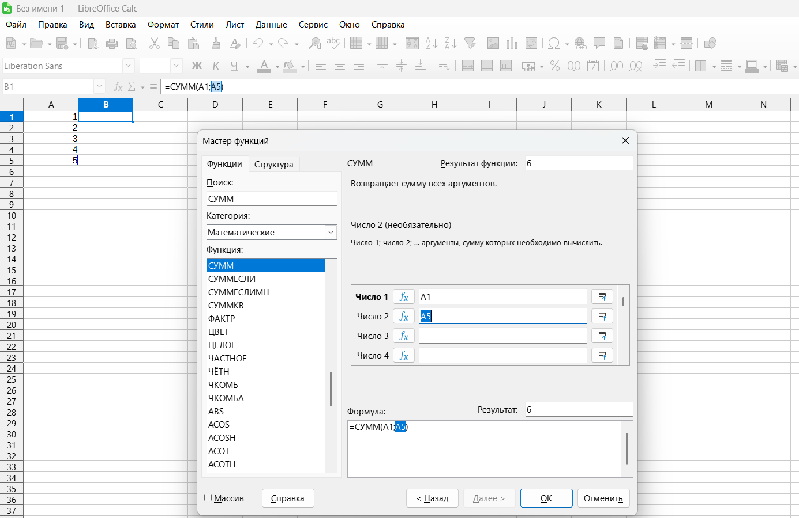

Если нужно сумму диапазона, то в поле «Число 1» нужно ввести диапазон.

#####  СРЗНАЧ

Эта формула применяется для расчета среднего значения в диапазоне. Как ты знаешь среднее значение считается как сумма цифр деленое на на их количество Заходим в «Мастер функций» выбираем формулу СРЗНАЧ. В поле «Число 1» вводим диапазон А:А:

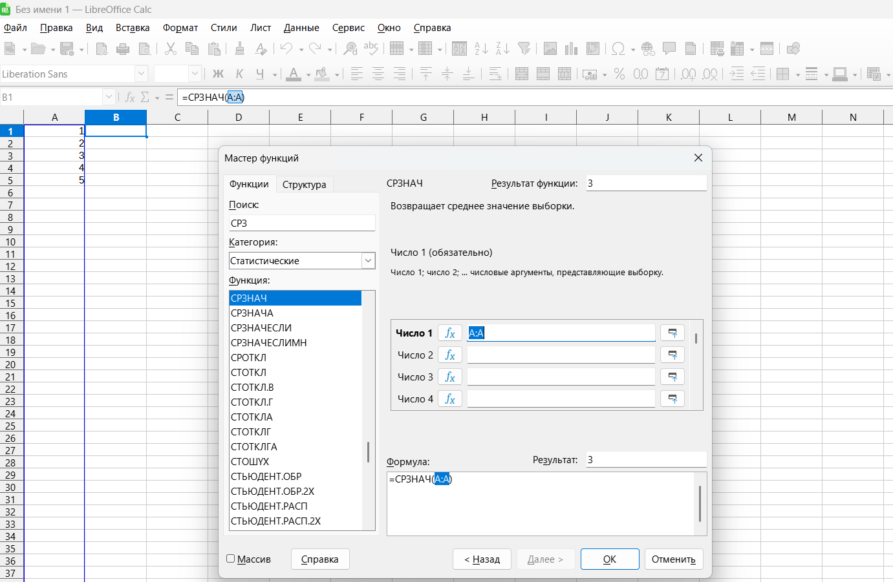

##### МАКС и МИН

При помощи этих формул можно находить самое большое и самое маленькое значение в диапазоне. Ввод формул стандартный. При поиске максимального числа получим ответ 5:

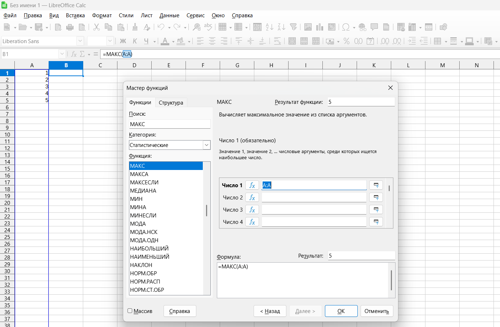

При поиске минимального числа получим ответ 1:

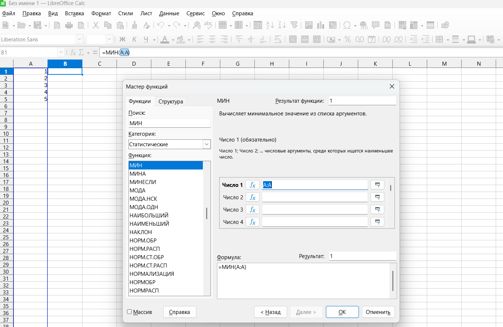

##### ЕСЛИ и ЕСЛИМН

Формулы можно усовершенствовать, чтобы они выполнялись при определенном условии. Для этого нужно добавить после стандартной формулы надпись ЕСЛИ (для одного условия) или ЕСЛИМН (для двух и более условий). Давай попробуем применить эти формулы. 

К примеру нам нужно найти сумму чисел, которые больше 3. Для этого используем формулу СУММЕСЛИ, введем ее в «Мастер функций». В открывшемся окне заполним поля.

**Диапазон** - в это поле вводим диапазон для которого будет применяться условие (А:А)

**Условие** - наше условие (больше 3)

**Диапазон суммирования** - здесь вводим диапазон в котором мы будем складывать числа (А:А)

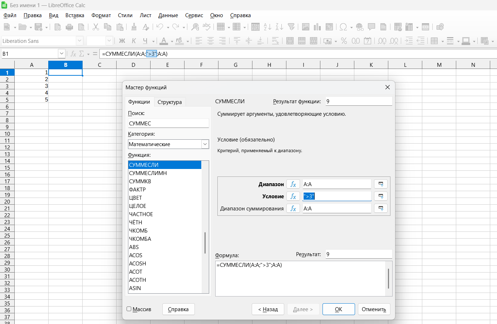

В результате получим сумму чисел, которые больше 3.

> [!important] Важно
> 
> **Условие всегда нужно писать в кавычках ("условие")**

Теперь давай используем формулу ЕСЛИМН. Например, нам нужно найти количество цифр, которые больше 3, но меньше 7. Для этого используем формулу СЧЁТЕСЛИМН, введем ее в «Мастер функций». В открывшемся окне заполним поля.

**Диапазон 1** - в этом поле вводим диапазон в котором будем считать числа (А:А)

**Условие 1** - сюда введем первое условие (>3)

**Диапазон 2** - в этом поле вводим диапазон в котором будем считать числа (А:А)

**Условие 2** - сюда введем второе условие (<7)

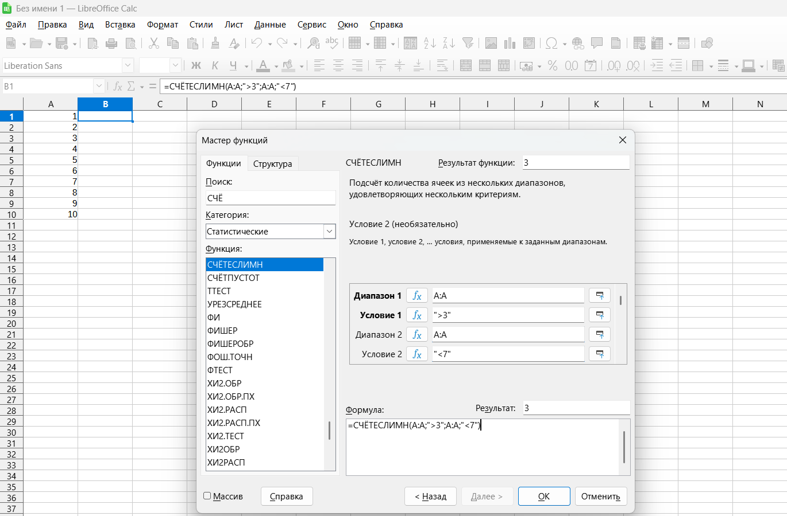

В ответ выведется количество чисел, которые больше 3 и меньше 7

### Фильтры

**Фильтрация данных** - это процесс, который позволяет показывать только данные подходящие по условию, а не подходящие скрывает. Для применения фильтров используется «Автофильтр». Чтобы его использовать нужно выделить столбики с которыми будем работать и нажмем кнопку «Автофильтр»:

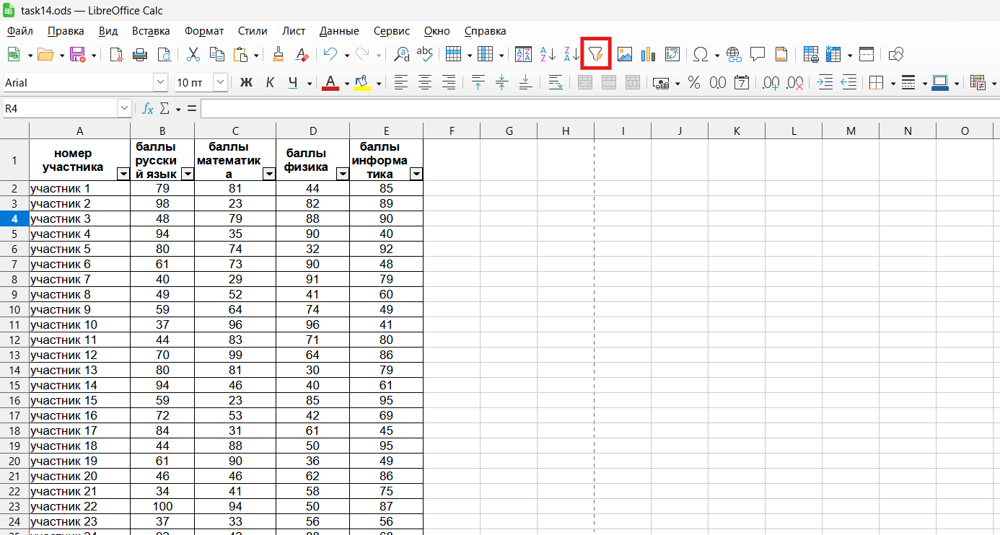

Теперь в нижнем левом углу названия столбика появляется стрелочка - это и есть наш фильтр. Нажимаем на нее и открывается окно:

В нем есть ряд кнопочек, расскажу про них:

**Сортировать по возрастанию** - нажав на нее данные в столбике будут отсортированы от меньшего к большему (аналог функции МИН)

**Сортировать по убыванию** - нажав на нее данные в столбике будут отсортированы от большему к меньшему (аналог функции МАКС)

**Цифры внизу** - это данные в столбике. Если поставить галочку рядом с ними, они будут отображаться, если убрать, то данные исчезнуть

Теперь давай рассмотрим вкладку фильтр по условию. Нажимаем на нее и выбираем «Стандартный фильтр»

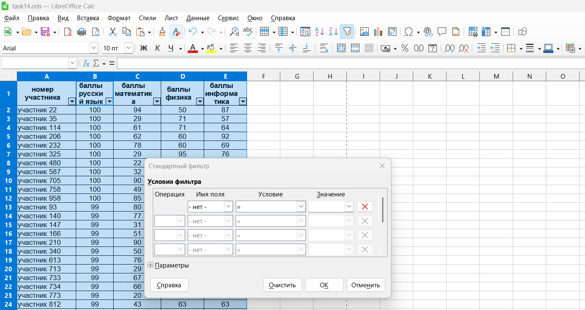

Стандартный фильтр - это аналог функций ЕСЛИ и ЕСЛИМН. Разберем что нужно вводить в поля:

**Имя поля** - сюда нужно ввести название столбика в котором мы будем искать нужные данные 

**Условие** - в это поле вводим условие (больше, меньше, равно и т.п)

**Значение** - здесь вводим значение по которому будем фильтровать данные

**Операция** - если нам нужно ввести два или более условий то вводим в это поле «И» и заполняем поля «Имя поля», «Условие» и «Значение»

После применения фильтров можно считать сумму, количество, среднее, минимально и максимальное значение. Для этого нужно выделить отфильтрованный столбик и в правом нижнем углу нажать правой кнопкой мыши по полю «Формула» и выбрать необходимую формулу:

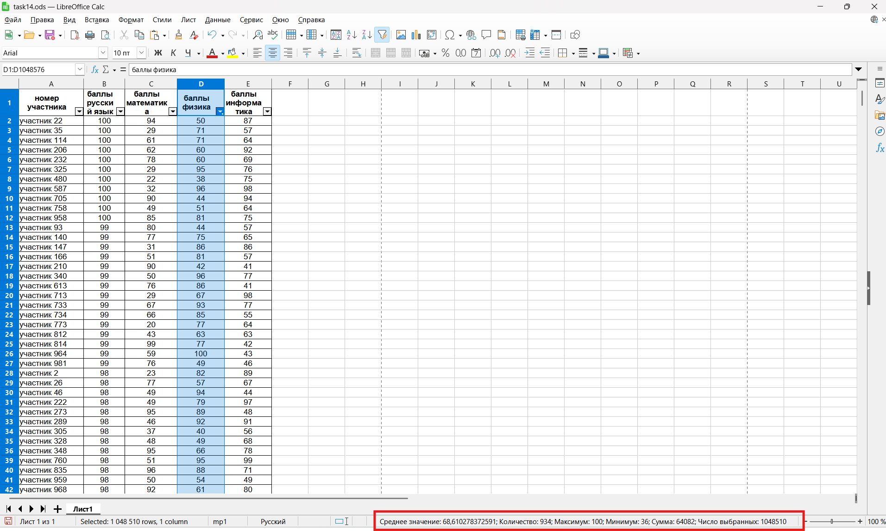

### Диаграмма

С помощью диаграммы можно графически представлять данные. Для ее создания нужно создать поля с названием и рядом с ними написать их значение. В нашем примере поля будут назваться «Мемы», «Эдиты» и «Клипы». После создание мини-таблицы ее необходимо выделить и нажать кнопку «Вставить диаграмму»:

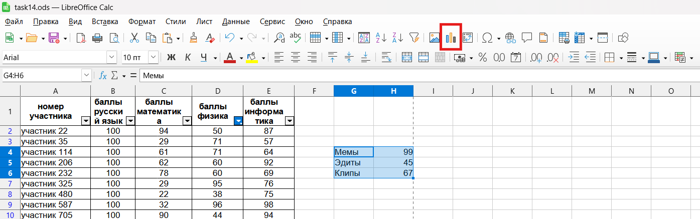

После нажатия на кнопку выбираем тип диаграммы «Круговая» и нажимаем ОК:

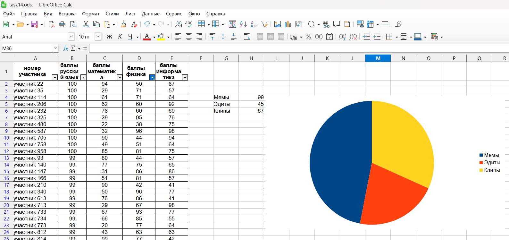

В итоге у нас получается диаграмма, которая отображает соотношение «Мемов», «Эдитов» и «Клипов». Теперь осталось переместить диаграмму влево для этого нажимаем на белую область и перетягиваем диаграмму за границу. Также добавим подпись данных, для этого нажимаем ПКМ на саму диаграмму и выбираем поле «Подпись данных»

> [!important] Важно
> 
> **Если нет поля «Подпись данных» то нажми на диаграмму несколько раз левой кнопкой мыши и поле появится**

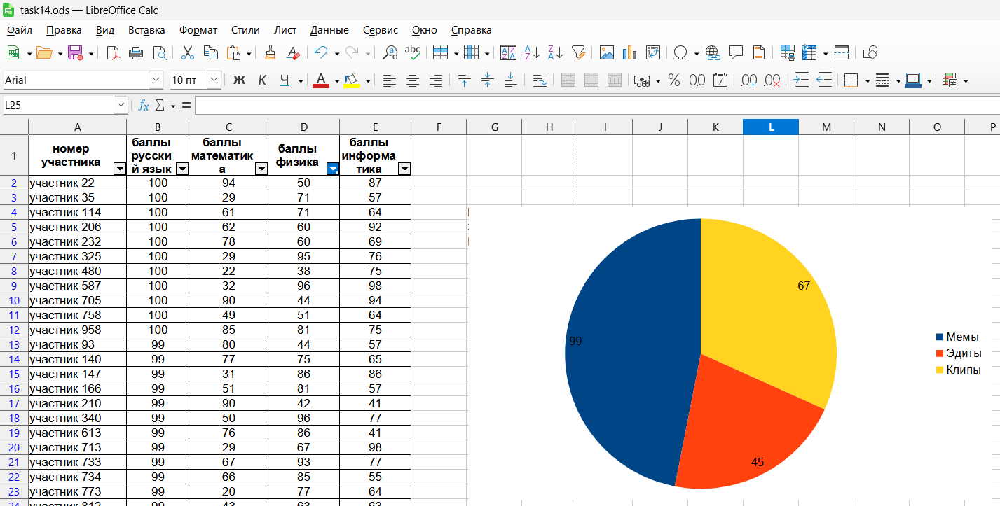

Супер🔥

Теперь ты знаешь все для решения 14-ого задания, погнали порешаем
