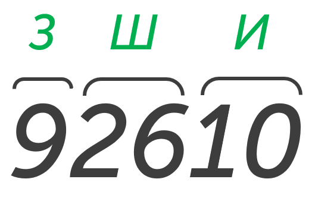
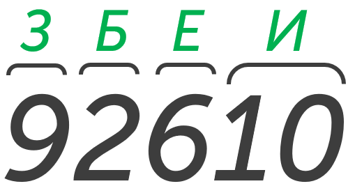
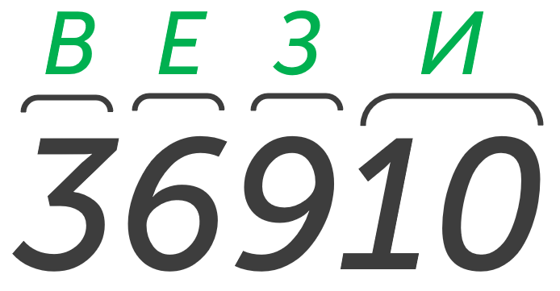

Начнем с самого простого типа заданий, давай прочитаем задачу:

> [!note] Задача
>
Ваня шифрует русские слова, записывая вместо каждой буквы её номер   в алфавите (без пробелов). Номера букв даны в таблице:
>

> [!note] Таблица

| **А** |  1  | **Й** | 11  | **У** | 21  | **Э** | 31  |
| :---: | :-: | :---: | :-: | :---: | :-: | :---: | :-: |
| **Б** |  2  | **К** | 12  | **Ф** | 22  | **Ю** | 32  |
| **В** |  3  | **Л** | 13  | **Х** | 23  | **Я** | 33  |
| **Г** |  4  | **М** | 14  | **Ц** | 24  |       |     |
| **Д** |  5  | **Н** | 15  | **Ч** | 25  |       |     |
| **Е** |  6  | **О** | 16  | **Ш** | 26  |       |     |
| **Ё** |  7  | **П** | 17  | **Щ** | 27  |       |     |
| **Ж** |  8  | **Р** | 18  | **Ъ** | 28  |       |     |
| **З** |  9  | **С** | 19  | **Ы** | 29  |       |     |
| **И** | 10  | **Т** | 20  | **Ь** | 30  |       |     |
> [!note] Продолжение задачи
> Некоторые шифровки можно расшифровать несколькими способами. Например, 311333 может означать «ВАЛЯ», может –– «ЭЛЯ», а может –– «ВААВВВ».
> 
> Даны четыре шифровки:
> 
> 92610
> 36910
> 13131
> 23456
> 
> Только одна из них расшифровывается единственным способом. Найдите её и расшифруйте. Получившееся слово запишите в качестве ответа.

Суть задачи проста. В таблице каждой букве соответствует цифра (А - 1; Б - 2 ... Я -33) и даны несколько шифровок и только одна из них расшифровывается одним способом - нам нужно ее найти.  

**Шаг 1 - проверяем первую запись:** 92610
Первый вариант расшифровки:

Второй вариант расшифровки:

Так как мы нашли уже 2 варианта расшифровки эта запись нам не подходит. Идем дальше.

**Шаг 2 - проверяем все шифровки:** Проверяем каждую шифровку также как в 1 шаге. В итоге получим такую картину: ~~92610~~, 36910, ~~13131~~, ~~23456~~ подойдет только 2 запись, потому что она имеет только один вариант расшифровки:

**Шаг 3 - Прочитаем вопрос и запишем ответ:** В задаче просят: *Найдите запись, которая шифруется единственным способом и расшифруйте. Получившееся слово запишите в качестве ответа.* В ответ напишем **ВЕЗИ**.

>[!warning] Предупреждение
>1. Ответ необязательно будет осмысленным словом;
>2. Надо обращать внимание на условие (написано ли там: символы не повторяются/символы повторяются);
>3. Есть задачи только с одной последовательностью символов;
>4. Читать что требуют в ответе (слово целиком, количество букв, повторяющиеся буквы)

💪Победа

Ты уже почти Агент 007, осталось пройти второй тип задачи и надеть крутой костюм: [[Тип 2 - шифр из символов|Погнали]]
