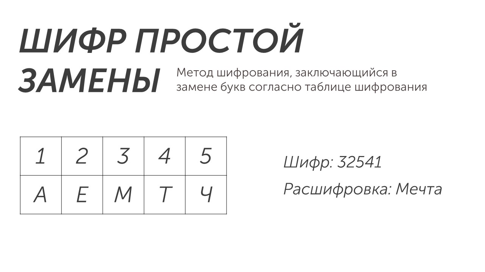

Существует множество различных шифров со странными названиями: AES, DES, схема Эль-Гамаля и другие. Все эти шифры основаны на сложных математических формулах и циклах замен и подстановок. Но мы будем работать с шифром простой замены:

Это самый древний и простой шифр. В нем каждую букву алфавита заменяют на символ, получая таблицу шифрования.

Буква А кодируется 1, буква Е кодируется 2 и так далее. Теперь давайте расшифруем зашифрованное сообщение: 32541. Цифра 3 - это буква М, цифра 2 - это буква Е и так далее. Расшифруем сообщение и получим слово **мечта**.

Это все необходимые знания для решения задачи номер 2. Теперь давай перейдем к разбору типов задач: [[Разбор заданий/Тип 1 - шифр из цифр|кликай сюда]]
