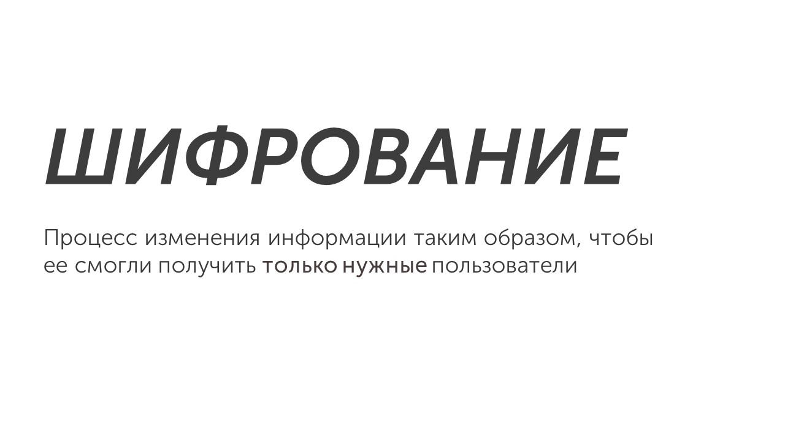
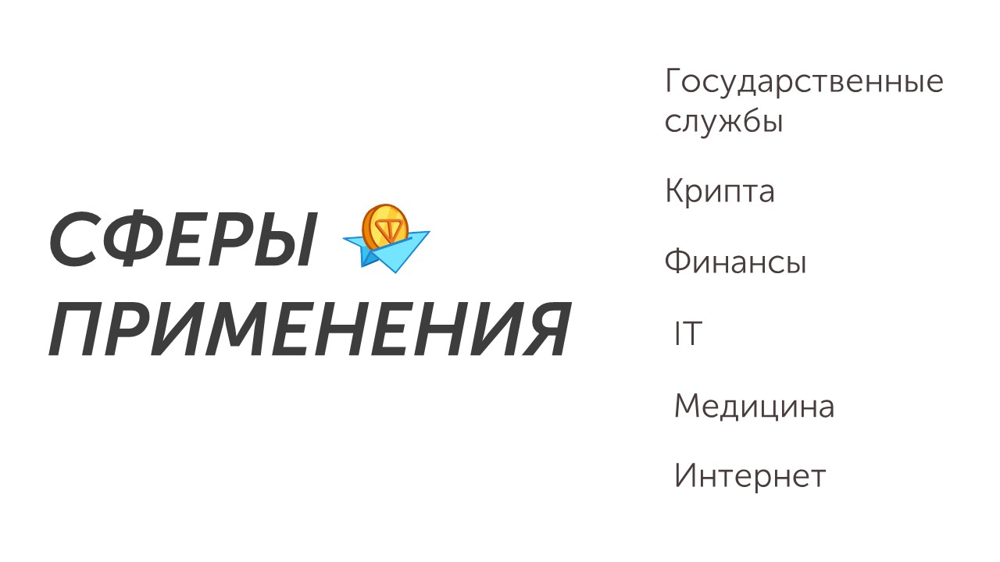

✋Привет

Надеюсь, ты отдохнул и готов изучать информатику дальше. Сегодня мы изучим одно из самых простых заданий в экзамене. Наша новая тема - шифрование:

Шифрование появилось еще в Древнем Египте. Главная задача шифрования - это сокрытие информации от посторонних лиц. Раньше фараоны, Древние греки и римляне шифровали информацию на папирусе, коже и глиняных табличках. Сейчас большинство информации зашифровано: данные вашего аккаунта в telegram/steam/instagram и т.п, номер банковской карты. Шифрование применяется во множестве сфер:

А теперь давай узнаем, какие шифры существуют: [[Шифр простой замены|Lets go]]
