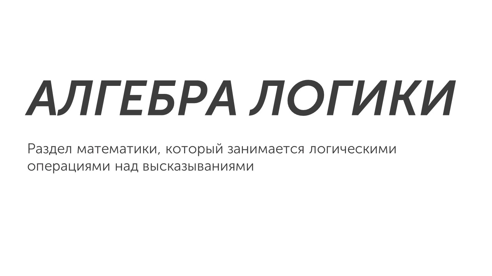
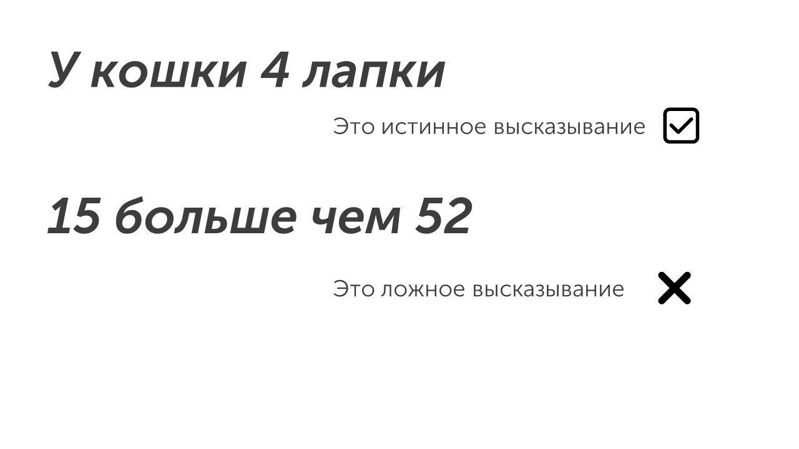

И снова здравствуй 🤝

Сегодня мы начнем изучать алгебру, а именно алгебру логики:

Давай разберемся что такое высказывание и логическая операция. В алгебре логики **высказывание — это повествовательное предложение, о котором можно сказать, истинно оно или ложно**. Истинное высказывание - это правда, а ложное высказывание - ложь. Примеры высказываний на рисунке ниже:

Мы будем работать с числовыми высказываниями (Пример: 2 < 10) и для этого нам понадобятся логические операции (аналоги сложению, умножению в алгебре логики). Начнем с операции отрицания: [[Инверсия - Отрицание|Кликай🐹]]

