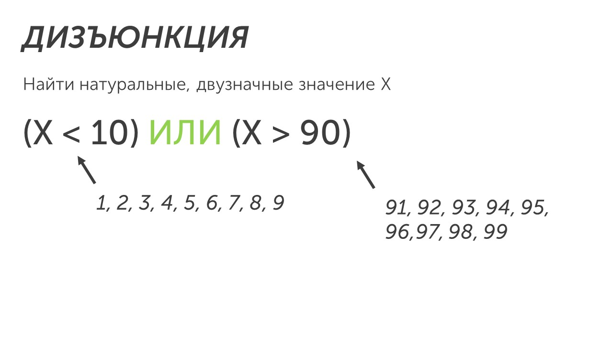

**Дизъюнкция** — логическая операция, объединяющая два или более высказывания с помощью союза «ИЛИ».  Другое название дизъюнкции — логическое сложение. Обозначается она: **OR, ИЛИ,  ∨**. 

В ОГЭ используется обозначение ИЛИ. Рассмотрим примеры использования логического сложения:

Логическое сложение тоже простая логическая операция. Она заключается в выборе ответа, который подходит для всех условий.

>[!tip] Важно запомнить
>Как работает дизъюнкция?
>
>У нас есть высказывание **(X < 10) ИЛИ (X > 90)** и нам нужно найти натуральные (числа от 1 до бесконечности) двузначные значения X. По первой скобке нам подойдут значения от 0 до 9, а по второй скобке от 90 до 99. А так как между скобками стоит ИЛИ нам подойдут значения из первой и из второй скобки.
>
>В ответе запишем: 1, 2, 3, 4, 5, 6, 7, 8, 9, 91, 92, 93, 94, 95, 96, 97, 98, 99 

 Теперь пора перейти к последней логической операции - Конъюнкции: [[Конъюнкция - Логическое умножение|ЛетсГоу🚀]]
 
 
 
