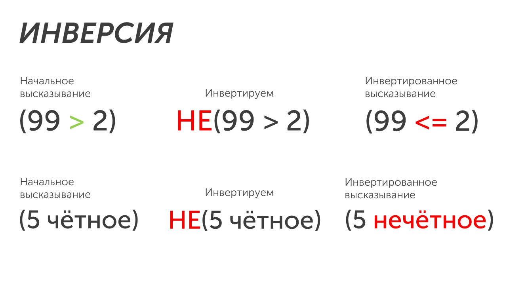

**Логическое отрицание (инверсия)** - это логическая операция, которая делает истинное высказывание - ложным, а ложное - истинным🔄

У инверсии есть несколько обозначений: **NOT, НЕ, ¬**.  В ОГЭ применяется это обозначение: **НЕ**.

Давай рассмотрим несколько примеров применения инверсии:

Инверсия - самая простоя из логических операций. Она просто меняет результат на противоположный: было четное - стало нечетное, было равно - стало не равно. 

>[!tip] Важно запомнить
>Как инверсия работает со знаками сравнения. Всего есть три знака: больше (>), меньше (<) и равно (=), также их можно комбинировать: меньше или равно (<=). И когда мы отрицаем знак, мы должны написать все остальные:
>**Исходное высказsвание:** (15 > 4) 
>**Инвертируем его:** НЕ(15 > 4). Есть три знака: **< = >**. Зачеркиваем знак, который инвертируем **< = ~~>~~** и в инвертированном высказывании пишем 2 оставшихся знака
>**Инвертированное высказывание:** (15 <= 4)

Мы с тобой разобрали как работаем первая логическая операция, а теперь давай познакомимся с логическим сложением: [[Дизъюнкция - Логическое сложение|Перейти🥾]]

