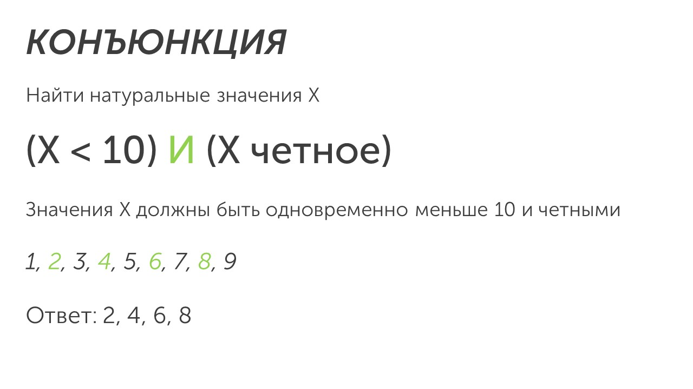

**Конъюнкция** (логическое умножение, логическое «И») — логическая операция, с помощью которой два или более высказывания объединяются в новое сложное высказывание. Обозначается она: **AND, И, ∧**

В ОГЭ используется обозначение И. Разберем как работает конъюнкция на примере. 

Суть конъюнкции заключается в том чтобы условие из каждой скобки выполнялось одновременно. 

>[!tip] Важно запомнить
>Как работает конъюнкция?
>
>Есть выражение **(X < 10) И (X < четное)**, нам нужно найти натуральные (от 1 до бесконечности) значения X. 
>
>В ответ мы возьмем цифры, которые одновременно меньше 10 и четные.
>
>Начинаем подбирать значения подходящие по условиям: 2, 4, 6, 8. Все эти значения меньше 10 и четные.

Пора разобрать как решать типы третьего задания: [[Разбор заданий/Тип 1 - выражение истинно|Начнем🤓]]

