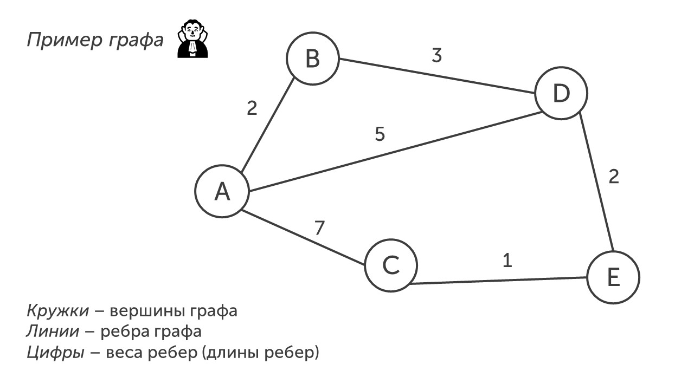

Снимаю перед вами шляпу, граф 🎩

Шучу, сегодня речь пойдет не о графах на лошадях и красивых костюмах, а об графах из информатики. Ниже прочитай определение: 

С помощью графа в четвертом задании показывают населенные пункты и дороги между ними и их расстояние. Вот так это выглядит:

Как я уже говорил - это довольно простое задание, так что идем покажу как его решать: [[Разбор заданий/Тип 1 - кратчайший путь|Топаем🗺]]

