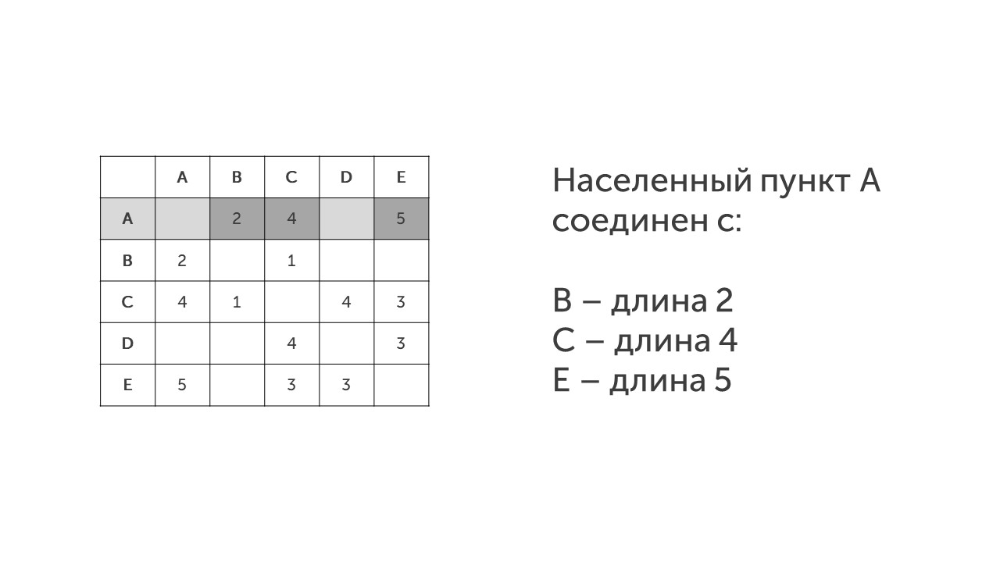
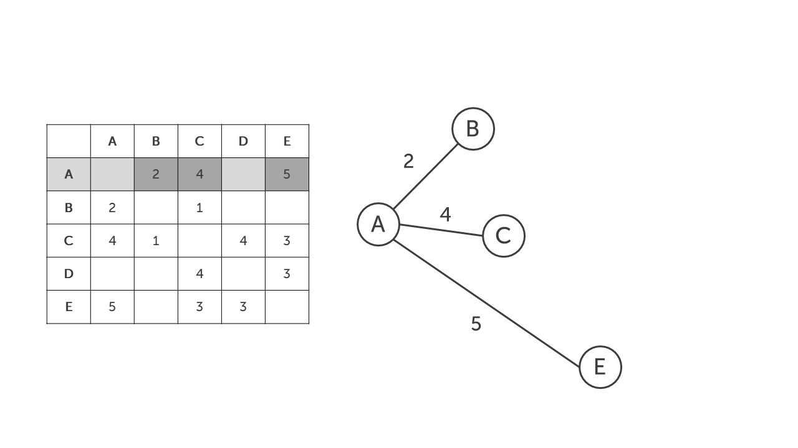
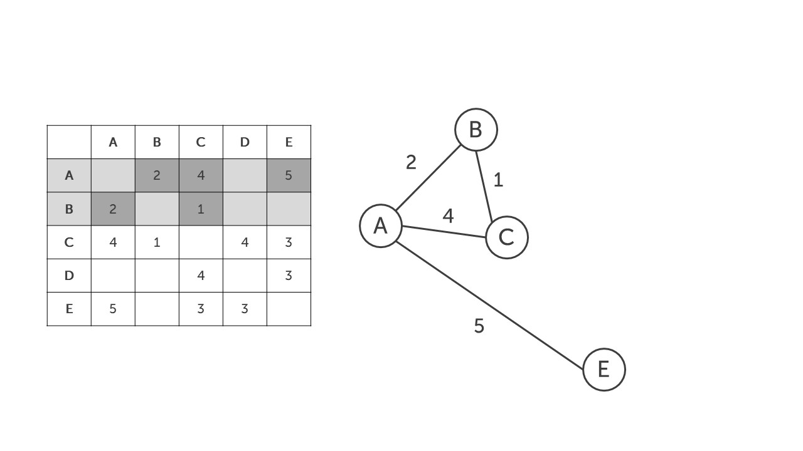
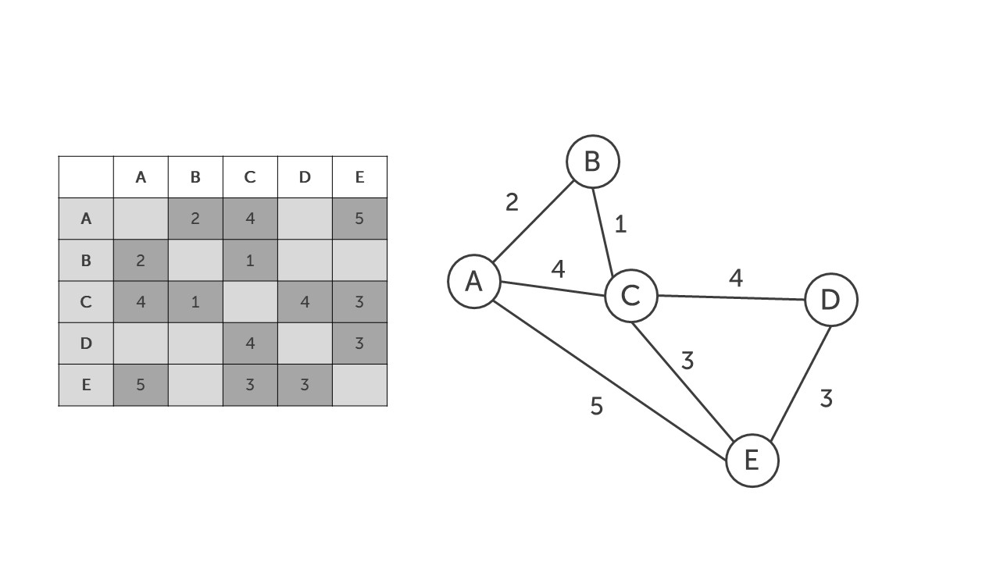
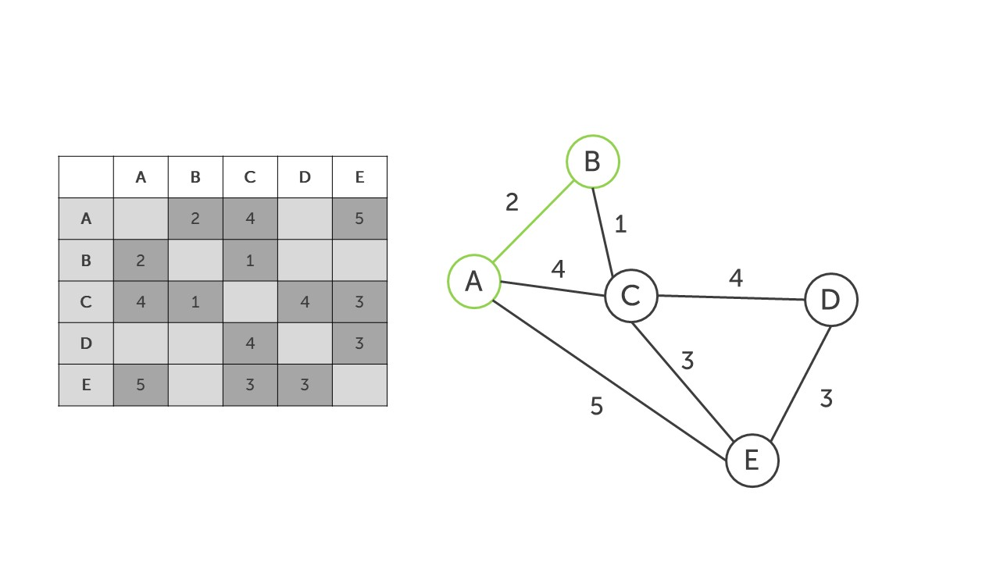
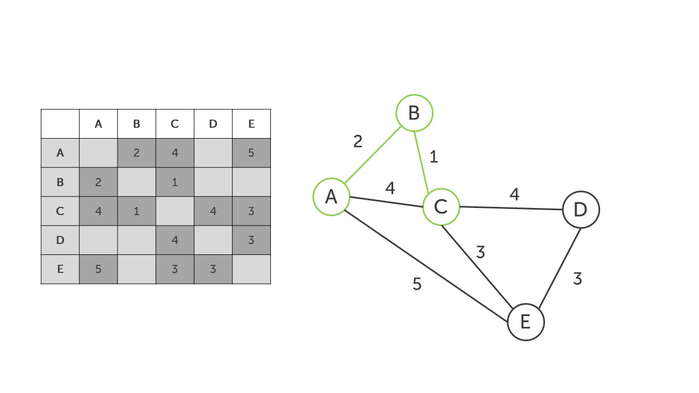
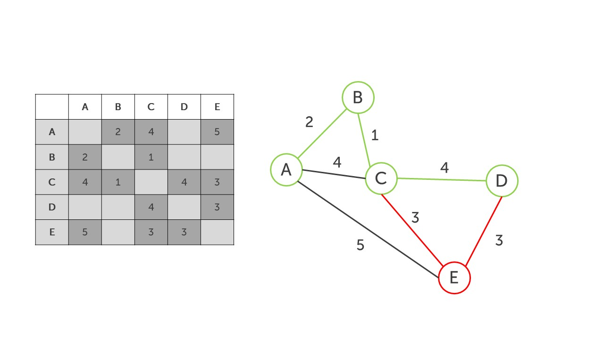

Чтобы решать 4 задание любой сложности, нужно быть внимательным и знать один лайфхак. Читаем задачку.

> [!note] Задача
> 

Между населёнными пунктами A, B, C, D, E построены дороги, протяжённость которых (в километрах) приведена в таблице.

|       |  A  |  B  |  C  | D   | E   |
| :---: | :-: | :-: | :-: | --- | --- |
| **А** |     |  2  |  4  |     | 5   |
| **B** |  2  |     |  1  |     |     |
| **C** |  4  |  1  |     | 4   | 3   |
| **D** |     |     |  4  |     | 3   |
| **E** |  5  |     |  3  | 3   |     |

Определите длину кратчайшего пути между пунктами A и D. Передвигаться можно только по дорогам, протяжённость которых указана в таблице. Каждый пункт можно посетить только один раз.

**Шаг 0 - как понимать эту таблицу**. Эта таблица показывает связь и расстояние между населенными пунктами.

Например из пункта А дороги ведут в пункт В (длина 2), в пункт С (длина 4) и в пункт E (длина 5). 

Это можно определить, проведя горизонтальную черту из пункта А: 

**Шаг 1 - прочитаем условие и вопрос.** Самое главное что мы должны вынести из условия и задачи: 

- Нельзя ходить по дорогам два раза

- Нужно самым коротким путем попасть из А в D

**Шаг 2 - строим граф.** Для этого внимательно рисуем вершины графа, ребра графов и их вес. Начнем с вершины А:

Переходим к пункту B, он по таблице соединен с пунктом А (уже отметили на графе) и с пунктом С (длина 1):

Также достроим весь граф: 

>[!tip] Совет
>Черти граф побольше, чтобы линии не путались и было понятно какая цифра к какой линии относится. И обязательно перепроверяй граф 🔍

**Шаг 3 - ищем кратчайший путь.** Нам нужно найти кратчайший путь между пунктами А и D. Это можно сделать перебором - выписать все пути и найти самый короткий, а можно при помощи лайфхака "идти по самым коротким путям". Давай попробуем. 

Начнем из города А и у нас 2 пути из него (В и С), пойдем по самому короткому (AB = 2):

Из пункта B пойдем в пункт С (АВС = 3):

Теперь мы стоим в пункте С и вроде нужно пойти в Е (СЕ = 3, а СD = 4). Но тут нужно смотреть наперед, если пойти CED, то в пункте D мы окажемся через 6 км, а если пойдем CD, то через 4 км. Поэтому выбираем CD:

**Шаг 4 - запишем ответ.** Путь ABCD наикратчайший из всех. Ответ 7.

ФУФ

Это было муторно, но мы справились. Давай закончим из графами и отдохнем: [[Тип 2 - кратчайший путь, проходящий через что-то|Отличный план💯]]
