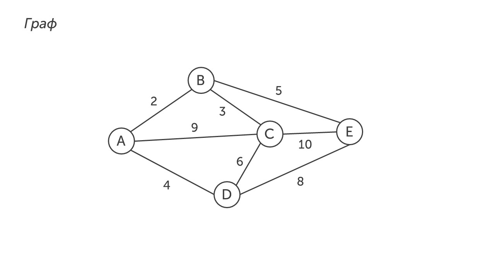
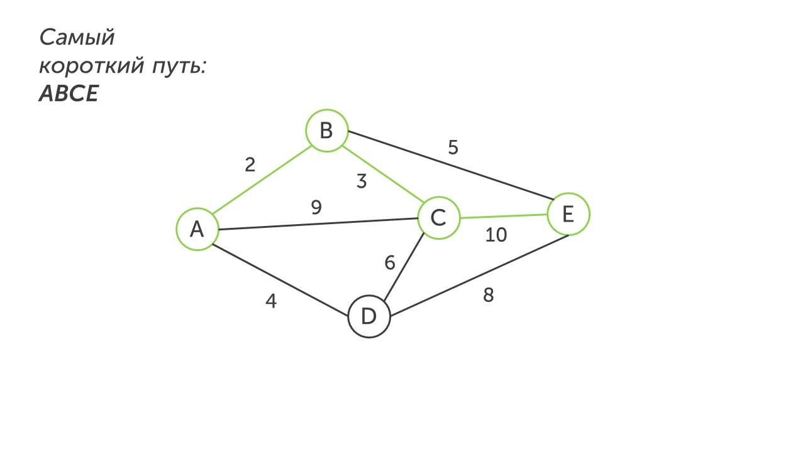

Перейдем ко второму типу четвертого задания. Давай прочитаем задание:

> [!note] Задача

Между населенными пунктами A, B, C, D, E построены дороги, протяженность которых в (километрах) приведена в таблице.

|       | A   | B   | C   | D   | E   |
| :---- | :-- | :-- | :-- | :-- | :-- |
| **А** |     | 2   | 9   | 4   |     |
| **B** | 2   |     | 3   |     | 5   |
| **C** | 9   | 3   |     | 6   | 10  |
| **D** | 4   |     | 6   |     | 8   |
| **E** |     | 5   | 10  | 8   |     |

Определите длину кратчайшего пути между пунктами A и E, проходящего через пункт С. Передвигаться можно только по дорогам, протяженность которых указана в таблице. Дважды передвигаться по любой из дорог нельзя.

**Шаг 1 - прочитаем условие и вопрос.** Самое главное что мы должны вынести из условия и задачи: 

- Нужно пройти кратчайшим путем из города А в город Е, проходя через город С

**Шаг 2 - строим граф.** Для этого внимательно рисуем вершины графа, ребра графов и их вес. 

**Шаг 3 - ищем кратчайший путь.** Начинаем из города А и помним, что обязательно нужно пройти в город С. Пройти до города С можно тремя путями:

- ABC - 5 км

- АС - 9 км

- ADC - 10 км

Мы пойдем самым коротким путем и попадем в город С. Из города С пройти в город Е будет быстрее напрямую, следующим путем:

**Шаг 4 - запишем ответ.** В бланк напишем длину самого короткого пути из города А в город Е, проходящего через город С: 15

>[!tip] Совет
>В этом задании главное правильно построить граф по таблице и внимательно найти кратчайший путь. Так что быть внимательным и читай вопрос с условием.

И на этом все🔚

Четвертое задание простое, так что с его помощью можно легко получить один балл или потерять его из-за невнимательности. А теперь давай перейдем к следующему заданию, которое посвящено алгоритмам: [[../../Задание 5/Алгоритмы|Вперед]]
