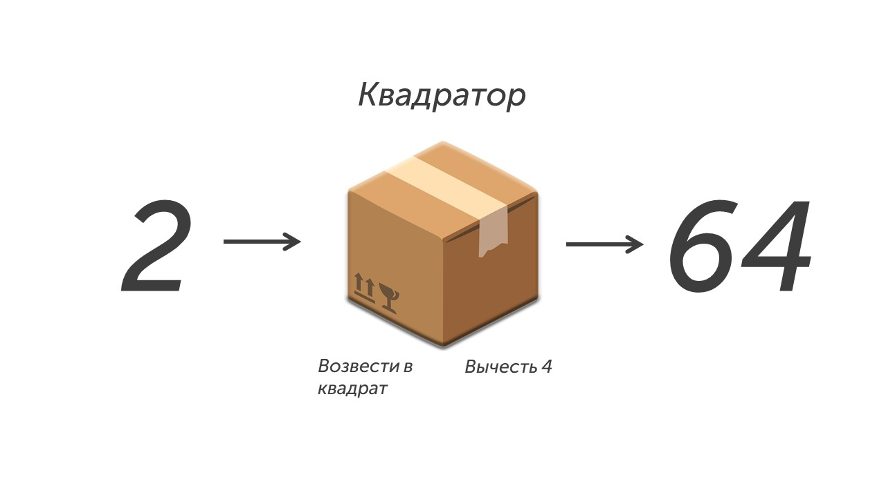

Начнем разбираться с алгоритмами, давай прочитаем задачу:

> [!note] Задача
> У исполнителя Квадратор две команды, которым присвоены номера:
> 
> **1. возведи в квадрат**
> **2. вычти 4**
> 
> Первая из них возводит число на экране во вторую степень, вторая уменьшает число на 4.
> 
> Исполнитель работает только с натуральными числами.
> 
> Составьте алгоритм получения **из числа 2 числа 64**, содержащий не более пяти  команд. В ответе запишите только номера команд.
> 
> (_Например, 12221 –– это алгоритм:_
_возведи в квадрат_
_вычти 4_
_вычти 4_
_вычти 4_
_возведи в квадрат,_
который преобразует число 5 в число 169.)  
>
>Если таких алгоритмов более одного, то запишите любой из них.

**Шаг 0 - как все работает.** Давай разбирать задачку по деталям. У нас есть исполнитель Квадратор (представь что это просто коробочка), если в эту коробочку положить число, то она может возвести число в квадрат или вычесть из числа 4. После того как коробочка сделала одно из двух действий она выдает тебе результат. 

По условию задачи нам нужно составить алгоритм получения из числа 2 числа 64 (можно использовать не более пяти команд). Давай посмотрим на рисунке как это работает:

Берем цифру 2 и мы должны найти алгоритм из команд 1 (возвести в квадрат) и 2 (вычесть 4), которые превратят 2 в 64. 

**Шаг 1 - определяем как начнем составление алгоритма.**

**Способ 1 - начнем сначала**

В этом способе, мы начинаем применять команды к первому числу (2) и пытаемся превратить его в 64. Давай попробуем:

1. Начинаем с числа 2. Из него можно вычесть 4 или возвести в квадрат, вычитать 4 будет странно (мы хотим получить число 64), поэтому возведем 2 в квадрат: **2^2= 4 (1 команда)**
2. Продолжаем с числом 4. Вычитать 4 не разумно (с нулем ничего не сделаешь), поэтому снова возводим в квадрат: **4^2=16 (1 команда)**
3. Работаем с число 16. Если мы возведем его в квадрат, то получим 256, а это слишком много, поэтому вычитаем 4: **16 - 4 = 12 (2 команда)**
4. Теперь число 12. Возводить его в квадрат не логично (получиться 144), поэтому вычитаем 4: **12-4 = 8 (2 команда)**
5. Финал. Вспоминаем таблицу умножения и возводим 8 в квадрат: **8^2=64 (1 команда)**

Поздравляю мы нашли алгоритм, который преобразует 2 в 64. В ответ нужно записать команды, которые использовались для преобразования: **11221**. Но есть еще один способ решения и чаще всего он гораздо удобнее.

**Способ 2 - начнем с конца**

Тут мы начнем применять команды к последнему числу (64) и попробуем его преобразовать в число 2, а наши команды будут инвертированы. Например:

**Было "вычесть 4", стало "прибавить 4"**

**Было "возвести в квадрат", стало "извлечь корень"**

>[!tip] Совет
>В пятом задании встречается много команд и в большинстве случаев их нужно инвертировать и вот как это делается:
>
>**Сложение -> Вычитание**
>**Умножение -> Деление**
>**Извлечь корень -> Возвести в квадрат**
>**Приписать число справа -> Убрать число справа**
>
>В 90% случаев в 5 задании нужно инвертировать команды, поэтому запомни это.

Команды мы инвертировали, поэтому давай начнем составлять алгоритм:

1. Число 64. Можно и прибавить 4 и извлечь корень, но так как нужно получить число меньше - извлекаем корень: **корень из 64 = 8 (1 команда)**
2. Число 8. Только один вариант, прибавить 4: **8 + 4 = 12 (2 команда)**
3. Число 12. Тоже самое: **12 + 4 = 16 (2 команда)**
4. Число 16. Можно и прибавить 4 и извлечь корень, но так как нужно получить число меньше - извлекаем корень: **корень из 16 = 4 (1 команда)**
5. Число 4. Нам нужно получить число 2, поэтому извлекаем корень: **корень из 4 = 2 (1 команда)**

Так как в этом способе мы шли из конца в начало, то и ответ нужно написать из конца в начало. Сначала запишем команду из 5 шага, потом из 4 и так далее: **11221**

Мои поздравления👏

Ты познакомился с тем как работают алгоритмы, это первый маленький шаг на пути к программированию. Предлагаю отметить это дело, а потом продолжить изучать информатику дальше: [[../../Задание 6/Языки програмирования|Отметил и готов идти дальше🍾]] 

