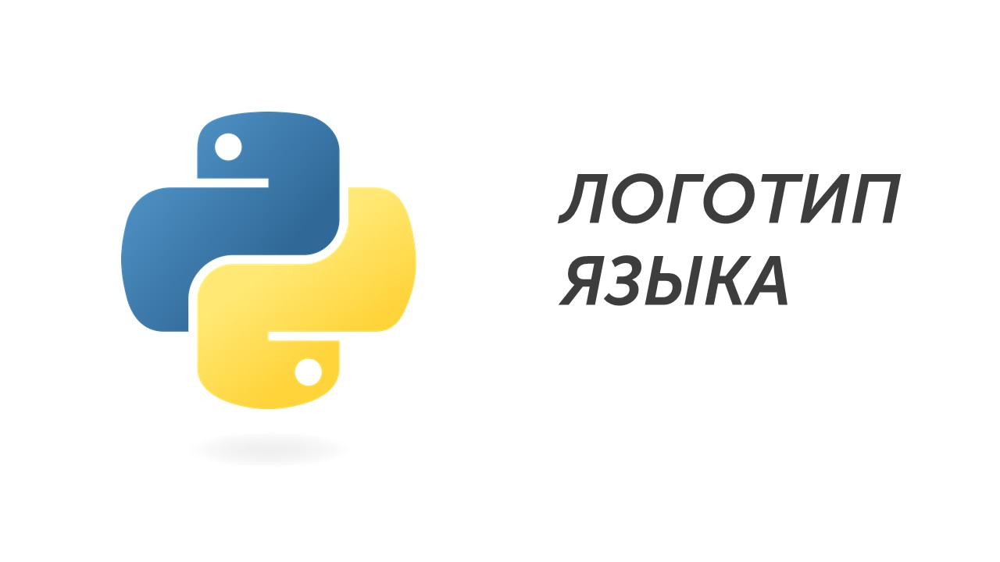

Язык программирования Python разработан в 1991 году ученым Гвидо Ван Россумом:

Этот язык программирования новички выбирают из-за нескольких качеств:

- Простой и читаемый код (легко освоить новичку)

- Активное сообщество и куча обучающих материалов (можно найти ответы на все вопросы)

- Кроссплатформенность - Python работает на различных операционных системах, включая Windows, macOS и Linux

Сейчас нам не нужно глубоко погружаться в тонкости программирования (этим мы займемся в 16 задании), поэтому давай приступим к разбору заданий: [[Разбор заданий/Тип 1 - стандартный YES|Давай разберемся🔥]]

