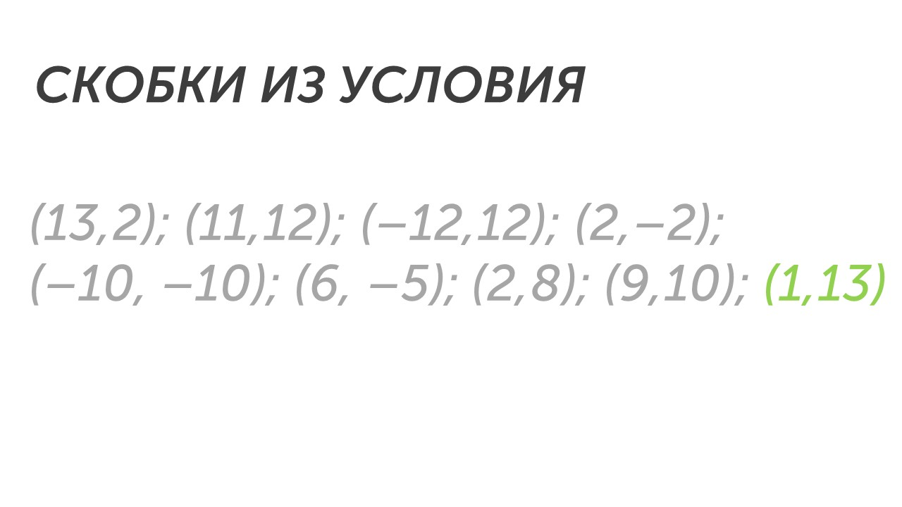
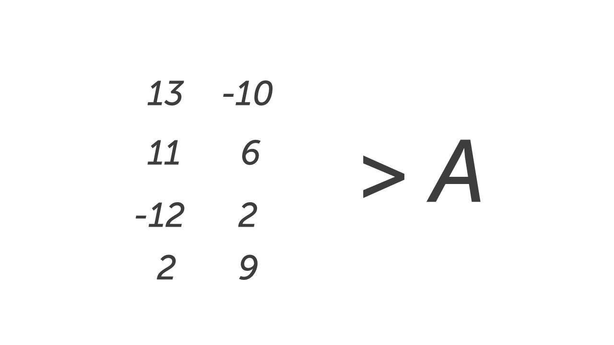
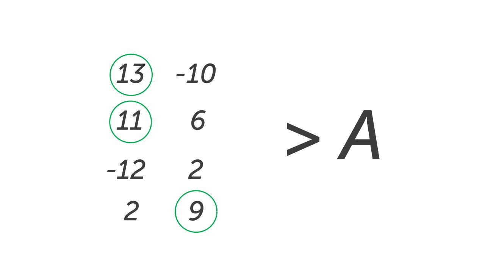
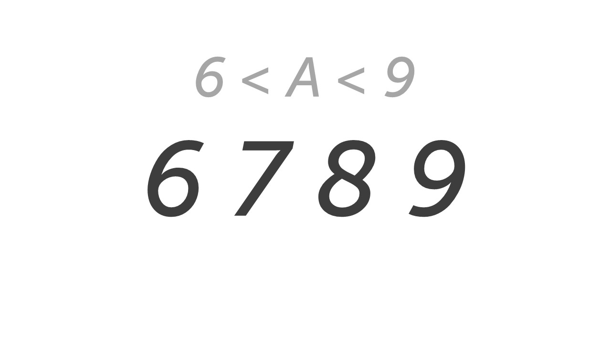
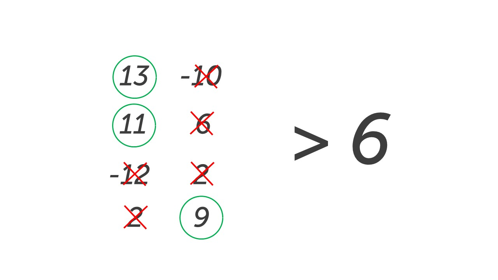
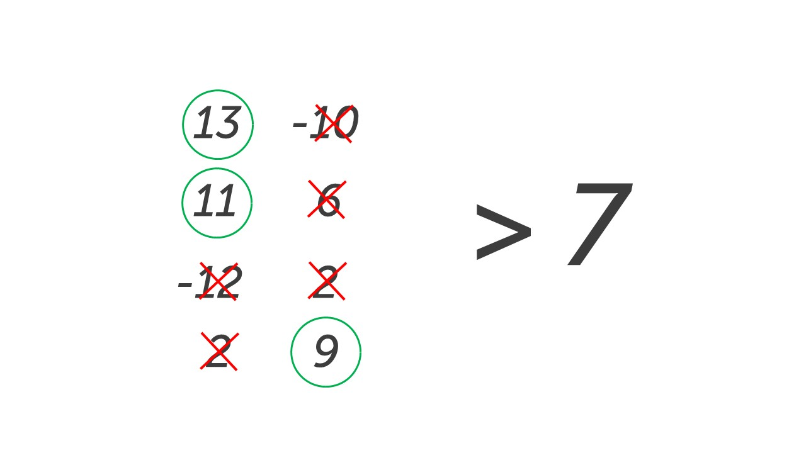
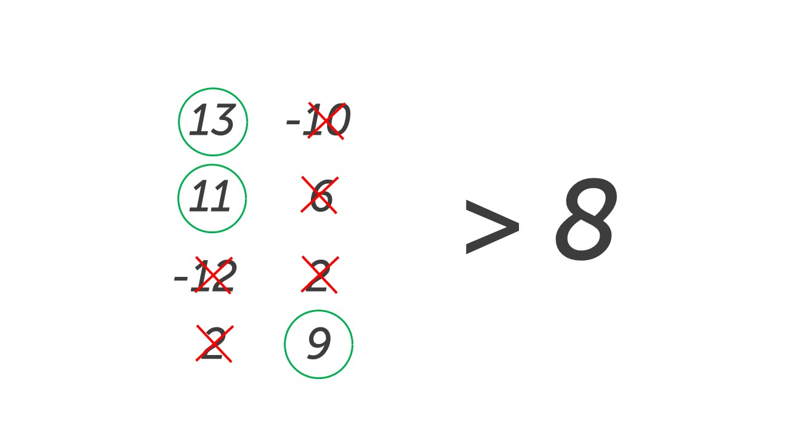
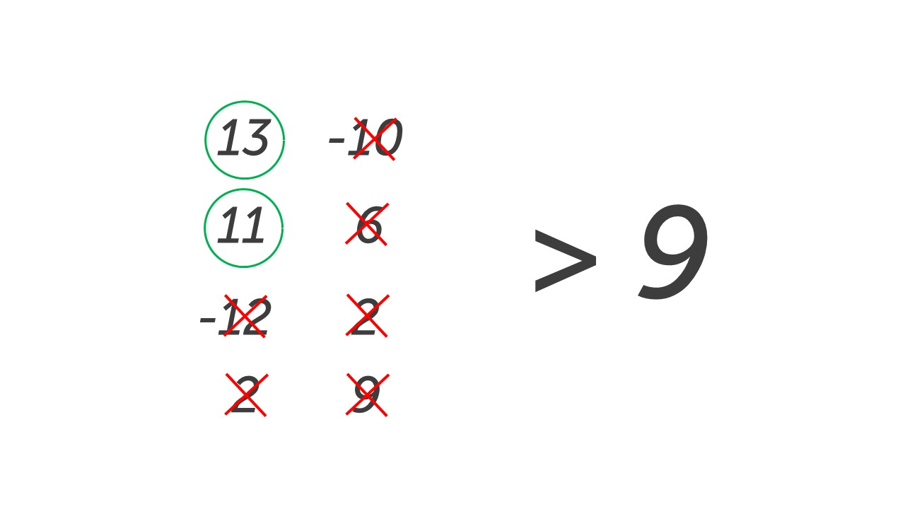

Вот мы и перешли к новому типу шестого задания. 

Это задание считается одним из самых сложных в первой части, но бояться его не нужно, сейчас со всем разберемся. Прочитаем задание📖

> [!note] Задача
> 
> Было проведено 9 запусков программы, при которых в качестве значений переменных s и t вводились следующие пары чисел: 
> 
> **(13, 2); (11, 12); (–12, 12); (2, –2); (–10, –10); (6, –5); (2, 8); (9, 10); (1, 13).** 
> 
> Укажите количество целых значение параметра A, при котором для указанных входных данных программа напечатает «YES» четыре раза.

```python
s = int(input()) 
t = int(input()) 
A = int(input()) 
if (s > A) or (t > 12): 
	print("YES") 
else: 
	print("NO")
```

**Шаг 0 - осознание.** Эта задача отличается тем, что мы точно не знаем какое условие нужно проверять на скобках. Сейчас условие выглядит так:

```python
if (s > A) or (t > 12)
```

Вместо одного из чисел стоит параметр А (это как Х в задаче) и нам его нужно найти, можно сделать это подбором, но лучше воспользоваться алгоритмом. Давай изучим его🔍

**Шаг 1 - определяем что выведет программа.** По условию задачи видим, что программа напечатает «YES» четыре раза. 

**Шаг 2 - выписываем условие.** Так как программа должна вывести «YES» переписываем условие без изменений: (s > A) or (t > 12).

**Шаг 3 - ищем скобку где есть цифра или число.** В условие  (s > A) or (t > 12), во второй скобке есть цифра (t > 12).

**Шаг 4 - подчеркиваем скобки, которые подходят по условию в найденной скобке.**  Так как во второй скобке условие (t > 12), мы должны подчеркнуть из исходных скобок те в которых второе число больше 12. Есть только одна такая скобка:



**Шаг 5 – смотрим на знак между скобками в условии .** Если знак and, мы работаем с парами чисел, которые выделили. Если знак or то работаем с парами чисел, которые не выделяли. 

```python
if (s > A) or (t > 12)
```

У нас знак or, поэтому работаем с парами чисел, которые не выделили.

**Шаг 6 - смотрим в какой скобке параметр.**  Параметр A в первой скобке: (s > A)

**Шаг 7 - выписываем первые числа из пар чисел (так как параметр в первой скобке).** Числа выписываем в столбик, если числа повторяются, то пишем из повторно. Справа от чисел пишем знак из скобки с параметром (s > A) 



**Шаг 8 - анализируем сколько цифр нужно подчеркнуть.** По условию «YES» вывелось четыре раза. В шаге 4 мы уже подчеркнули одну скобку (одно «YES» есть). Всего нужно 4, одну мы подчеркнули, осталось 3. Значит всего нужно подчеркнуть 3 цифры.

**Шаг 9 - подчеркиваем цифры.** Так как у нас стоит знак больше (>), то подчеркиваем цифры от самой большой в порядке убывания. Если бы у нас стоял знак < или <= мы бы подчеркивали цифры от самой маленькой в порядке возрастания. Из шага 8 помним, что нужно только 3 цифры:



Три самые большие цифры - это 13, 11 и 9.

**Шаг 10 - запишем уравнение.** Для нахождения параметра А нужно составить уравнение. Оно выглядит следующим образом:

**наименьшее из больших > A > наибольшее из маленьких**

Давайте заполним его:

9 > A > 6

Большие : 13, 11, 9

Меньшие: -12, -10, 2, 2, 6

**Шаг 11 - подбираем возможные значения параметра А.**  Исходя из уравнения, параметр А может принимать такие значения:



Подставим каждое это значение вместо А и посмотрим, сколько чисел будет подходить. Заменим А на 6:



Только 3 числа подходят (13, 11 и 9 строго больше 6), поэтому параметр А может быть со значением 6. Проверяем следующее значение:



Также только 3 числа подходят. Значения параметра А - 6, 7. Проверяем дальше: 



Все те же 3 числа. Значения параметра А - 6, 7, 8. Последняя проверка:



Оп. Вот теперь подходят только два числа (13 и 11), число 9 не подходит, так как 9 > 9 не правда: 9 = 9. Значения параметра А остаются прежними:  6, 7, 8.

**Шаг 12 - запишем ответ.** По условию задачи в ответ нужно записать количество целых значений параметра А. Их у нас три - 6, 7, 8. Пишем в ответ число 3. 

ФУХ😮‍💨

Это довольно сложное задание, алгоритм большой и не самый простой. Но пугаться не нужно. Если решишь 20-30 заданий этого типа, то сможешь щелкать эти задания как  орешки. Давай посмотрим еще один тип шестого задания и перейдем к практике: [[Тип 4 - параметр с NO|Новый тип🆕]]
