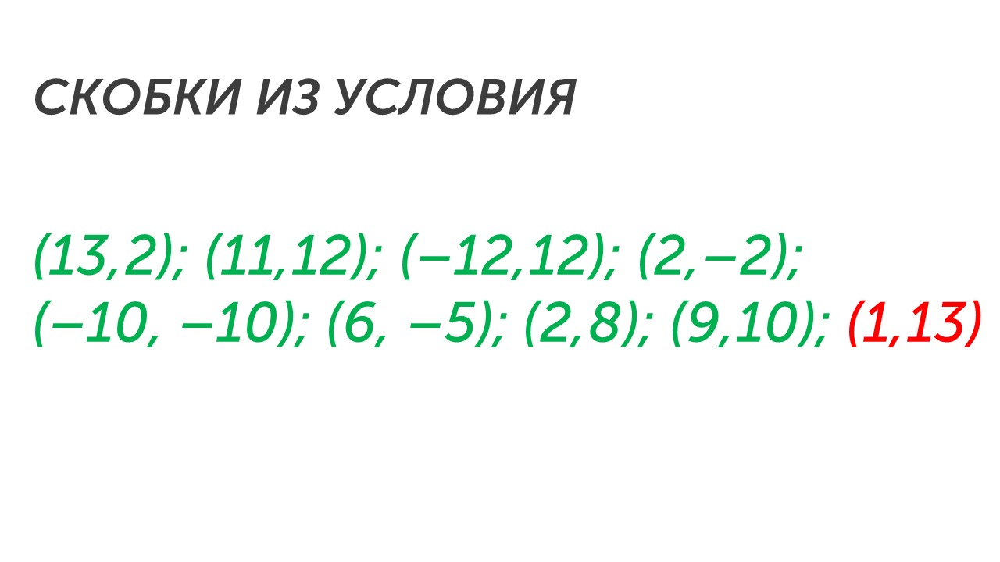
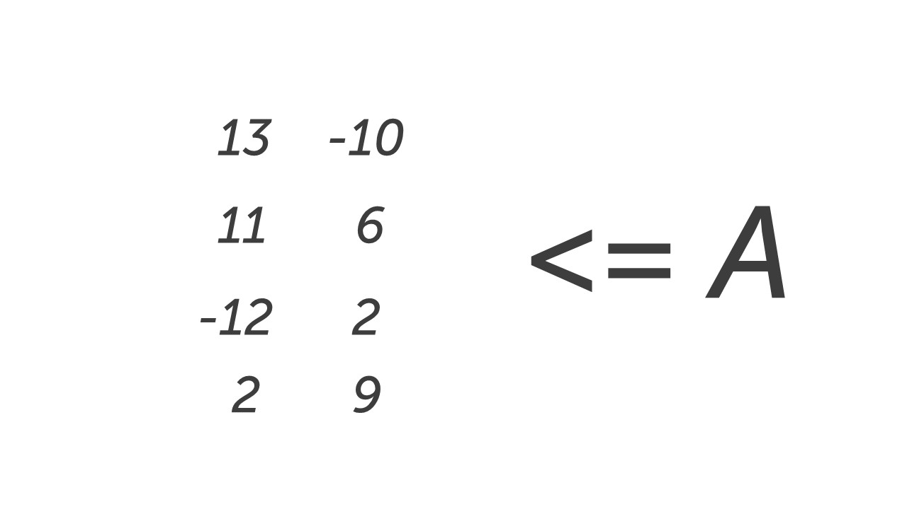
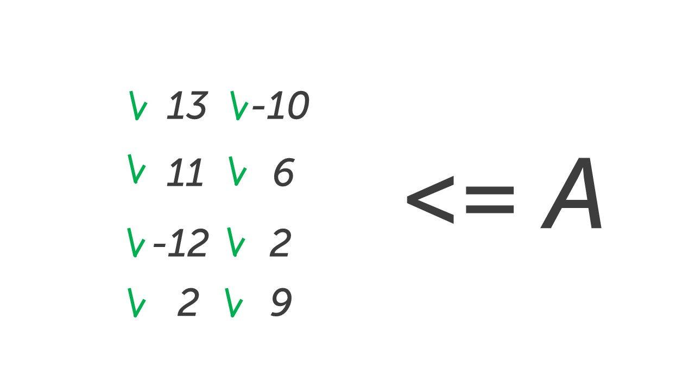
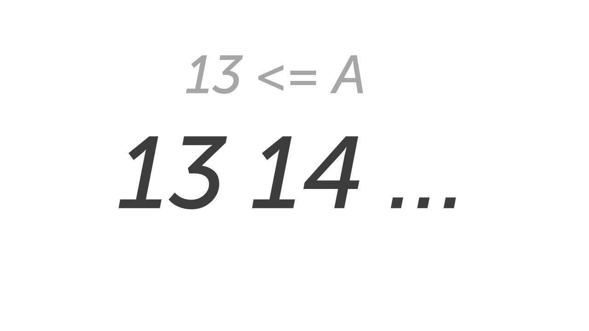

Давай прочитаем задание📒

> [!note] Задача
> 
> Было проведено 9 запусков программы, при которых в качестве значений переменных s и t вводились следующие пары чисел: 
> 
> (13, 2); (11, 12); (–12, 12); (2, –2); (–10, –10); (6, –5); (2, 8); (9, 10); (1, 13).
> 
 Укажите наименьшее целое значение параметра A, при котором для указанных входных данных программа напечатает «NO» восемь раз.

```python
s = int(input()) 
t = int(input()) 
A = int(input()) 
if (s > A) or (t > 12): 
	print("YES") 
else: 
	print("NO")
```

**Шаг 1 – определяем что выведет программа.** По условию задачи видим, что программа напечатает «NO» восемь раз.

**Шаг 2 – инвертируем условие.** Это значит, что мы должны наложить на все условие НЕ, как мы это делали в 3 задании:

**Исходное условие:** (s > A) or (t > 12)

**Ставим перед ним НЕ:** НЕ((s > A) or (t > 12))

**Новое условие:** (s <= A) and (t <= 12)

**Шаг 3 - ищем скобку где есть цифра или число.** В условии (s <= A) and (t <= 12), скобка с цифрой вторая (t <= 12)

**Шаг 4 – отбираем из пар чисел те, которые подходят по условию скобки с цифрой.** Так как у нас с цифрой втора скобка, то мы анализируем пары чисел по 2 цифре (если бы в 1 скобке была цифра, то анализировали по 1 цифре):



**Шаг 5 – смотрим на знак между скобками.** Если знак and – мы работаем с парами чисел, которые выделили. Если знак or – то работаем с парами чисел, которые не выделяли. У нас знак and, поэтому работаем со скобками зеленого цвета. 

**Шаг 6 - смотрим в какой скобке параметр.**  Параметр A в первой скобке: (s <= A)

**Шаг 7 - выписываем первые числа из пар чисел (так как параметр в первой скобке).** Числа выписываем в столбик, если числа повторяются, то пишем из повторно. Справа от чисел пишем знак из скобки с параметром (s <= A) :



**Шаг 8 - анализируем сколько цифр нужно подчеркнуть.** По условию «NO» вывелось восемь раз. В шаге 4 мы подчеркнули 8 скобок, но так как в условии стоит знак and, то нам нужно подчеркнуть те же 8 цифр.

**Шаг 9 - подчеркиваем цифры.** Так как у нас стоит знак больше (<=), то подчеркиваем цифры от самой маленькой в порядке возрастания. Если бы у нас стоял знак > или >= мы бы подчеркивали цифры от самой большой в порядке убывания. Из шага 8 помним, что нужно 8 цифр:



**Шаг 10 - запишем уравнение.** Для нахождения параметра А нужно составить уравнение. Оно выглядит следующим образом:

**наименьшее из больших > A > наибольшее из маленьких**

Так как у нас только наименьшие значения, уравнение будет выглядеть следующим образом:

**A => наибольшее из маленьких**

Заполним уравнение:

**A => 13**

**Шаг 11 - подбираем возможные значения параметра А.**  Исходя из уравнения, параметр А может принимать такие значения:



По условию задачи нужно вывести наименьшее возможное значение параметра А. Параметр А может быть либо 13 либо больше. 

**Шаг 12 - запишем ответ.** По условию задачи в ответ нужно записать наименьшее возможное значение параметра А. Это 13, запишем это в бланк ответов.

Победа🥇

Мы с тобой изучили самое сложное задание из первой части. Чтобы его легко решать нужно потренироваться и нарешать минимум 20-30 заданий. Тогда ты отточишь алгоритм решения и будешь легко решать. 

Теперь давай отдохнем и порешаем задание попроще: [[../../Задание 7/Адрес файла в интернете|Идем решать🤗]]
