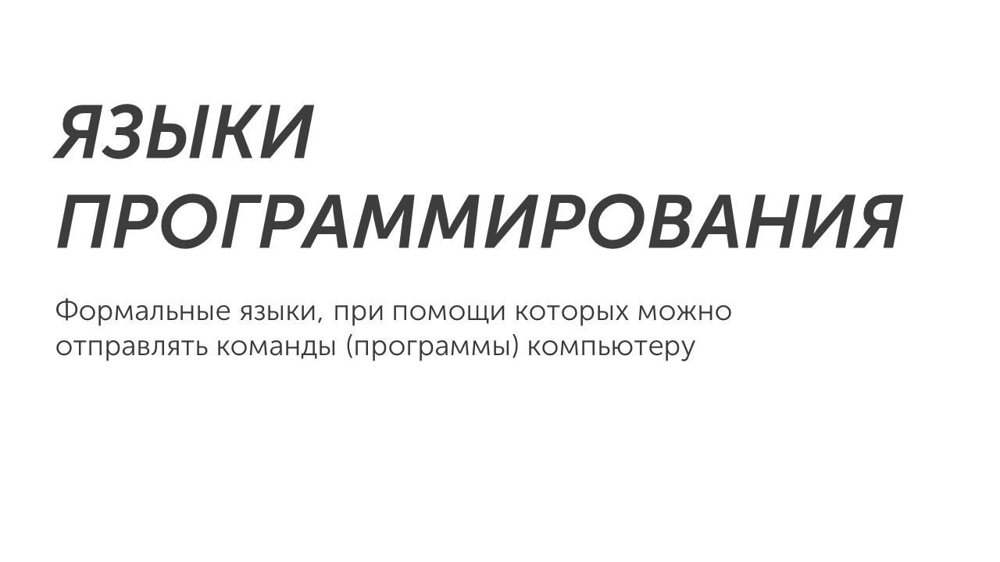

Вот мы и добрались до языков программирования

Давай сначала разберемся что это такое:

Существует множество языков программирования (больше 250), но на ОГЭ используется всего 5 языков: Бейсик, Python, Паскаль, Алгоритмический язык и C++. Мы с тобой будем изучать язык программирования Python, потому что это один из самых популярных и простых в освоении языков: [[Python|Начнем изучение🐍]]
