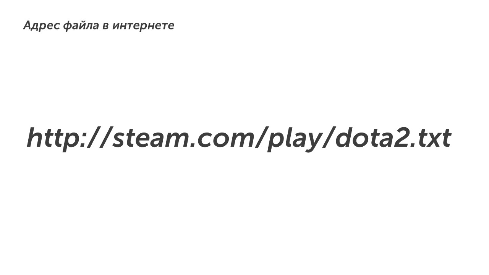

И снова привет😎

Сегодня мы изучим задание под номером семь - это одно из самых легких заданий. Оно посвящено составлению адреса файла в интернете. Каждый раз, когда заходишь в браузер, ты можешь увидеть адрес сайта на который зашел. В ОГЭ адрес сайты выглядит так:

Давай разберемся в структуре адреса:

**Протокол🔏**. Всегда в начале адреса идет протокол - это способ передачи данных пользователю. Есть разные типы протокол, но обычно используются ftp, http или https. После протокола обязательно идет **://** - этот знак ставить обязательно, чтобы отделять протокол от остального адреса.

**Сервер🌐.** Это уникальное название сайта. Оно состоит из самого названия и расширения, в нашем примере это **steam.com** (название и расширение разделяются точкой).  После сервера обязательно идет слеш **/**, он нужен для разделения сервера и файла.

**Файл📁.** Это простой файл: картинка, видео, текст или что-нибудь еще. У файла также есть название и расширение, в нашем примере это **dota2.txt**

Есть еще один тип адресации:

В этом типе все также, сначала идет протокол, сервер, но после сервера идет каталог. Каталог это как коробочка с файлами. В нашем примере каталог **play**, а в нем могут храниться разные игры: **cs2.txt, rust.txt, dota.txt.**

>[!tip] Совет
>Запомни как составлять адрес файла и легко забирай 1 балл:
>
>**протокол://сервер/файл**
>
>**протокол://сервер/каталог/файл**

Молодец, тема пройдена🫡

А теперь пойдем разберем как решать задания: [[Разбор заданий/Тип 1 - стандартный|Пойдем]]

