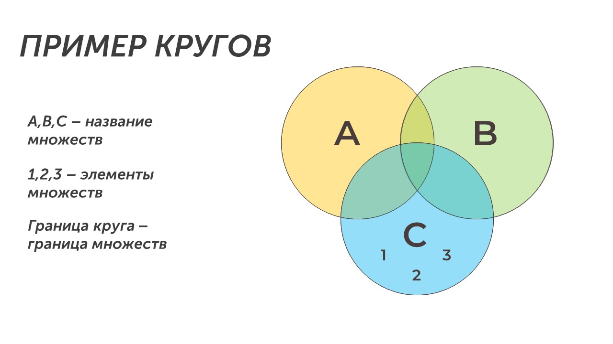
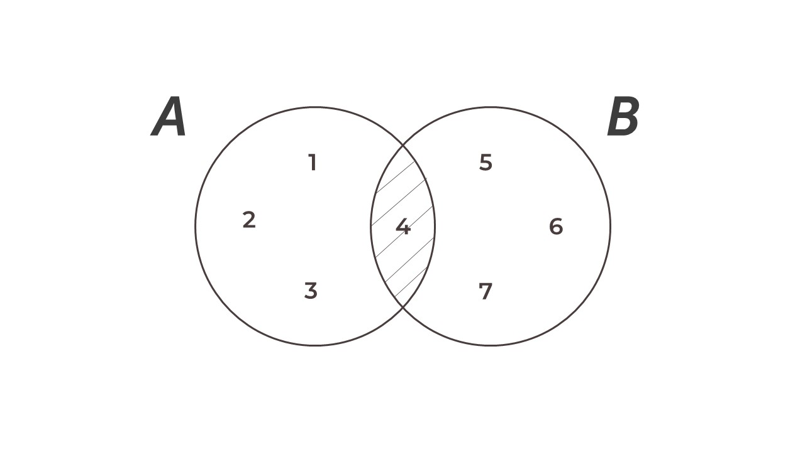
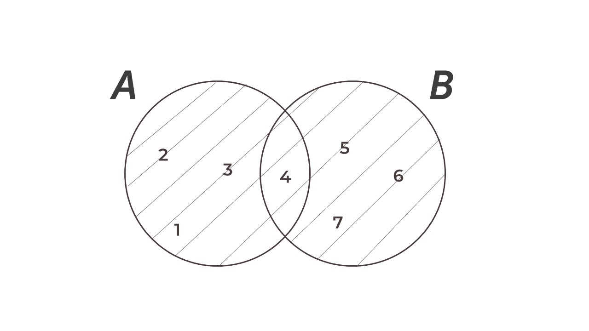

Круги Эйлера-Венна - это графическое представление множеств с помощью кругов. Круг образно показывает все элементы множества:

Круги Эйлера состоят из пересекающихся окружностей, каждая из которых представляет одно множество. Область пересечения двух окружностей показывает элементы, принадлежащие обоим множествам. Если присутствует более двух окружностей, то пересечение трёх окружностей показывает элементы, принадлежащие всем трём множествам и т. д.

Теперь давай разберем операции, которые можно проводить с множествами.

### Операция пересечения

>[!success] Определение
>
>**Пересечением двух множеств называется множество, которому принадлежат те элементы, которые одновременно принадлежат двум данным множествам**

К примеру у нас есть множество А, состоящие из цифр 1, 2, 3, 4 и множество В, состоящее из цифр 4, 5, 6, 7. Представим это при помощи кругов Эйлера-Венна:

Множества А и В показаны кругами с цифрами внутри (в круге А цифры: 1, 2, 3, 4 в круге В: 4, 5, 6, 7). В обоих множествах есть цифра 4 - это и будет пересечением этих множеств (заштрихованная область на рисунке). 

Данная операция обозначается несколькими способами: A∩B, А&B. В ОГЭ применяется второй вариант. 

### Операция объединения

>[!success] Определение
>
>**Объединением двух множеств А и В называется множество, которое состоит из элементов, принадлежащих хотя бы одному из множеств А или В**

К примеру есть у нас множество А, состоящие из цифр 1, 2, 3, 4 и множество В, состоящее из цифр 4, 5, 6, 7. Объединением этих множеств будет множество состоящее из цифр: 1, 2, 3, 4, 5, 6, 7:

Объединение показано заштрихованной областью на рисунке. Данная операция обозначается несколькими способами: A∪B, А|B. В ОГЭ применяется второй вариант. 

Теперь мы знаем с тобой об основных операциях с кругами Эйлера-Венна. Пора попрактиковаться в решении задач: [[Разбор заданий/Тип 1 - два множества|Начнем практику🪖]]
