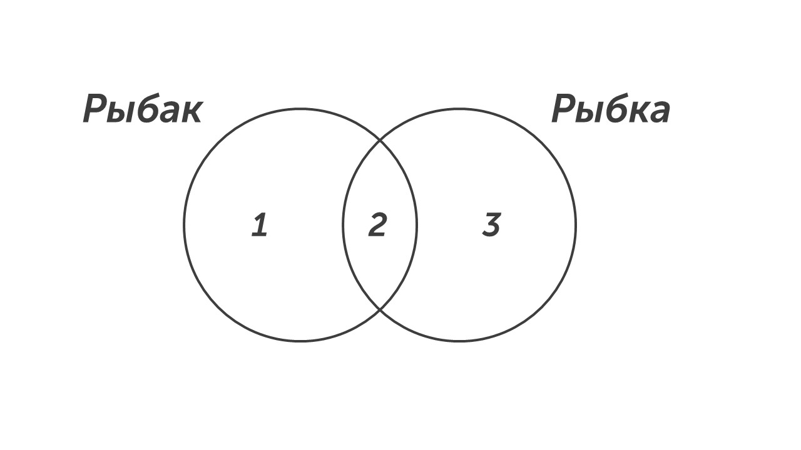
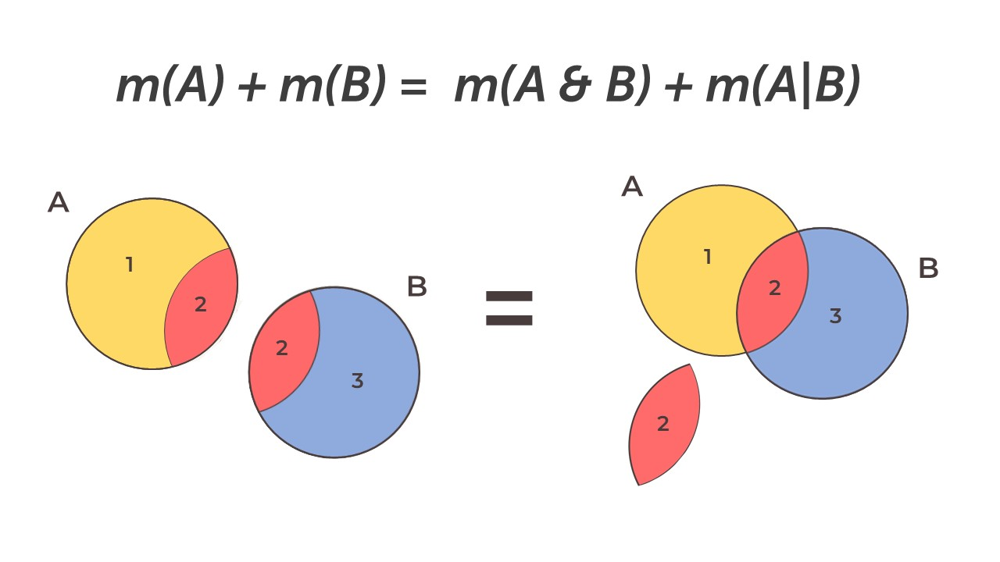

Давай прочитаем задачку: 

> [!note] Задача
> 
> В языке запросов поискового сервера для обозначения логической операции «ИЛИ» используется символ «|», а для обозначения логической операции «И»  — символ «&».
> 
   В таблице приведены запросы и количество найденных по ним страниц некоторого сегмента сети Интернет.

|     Запрос     | Найдено страниц(в тысячах) |
| :------------: | :------------------------: |
| Рыбак \| Рыбка |            780             |
|     Рыбак      |            260             |
| Рыбак & Рыбка  |             50             |

> [!note] Продолжение задачи
> 
> Какое количество страниц (в тысячах) будет найдено по запросу
> 
>**Рыбка?**
>
   Считается, что все запросы выполнялись практически одновременно, так что набор страниц, содержащих все искомые слова, не изменялся за время выполнения запросов.

### Способ №1 - круги

**Шаг 0 - осознание.** В задаче есть два множества Рыбак и Рыбка. Эти множества показывают сколько результатов вывелось при определенном запросе. При запросе Рыбак | Рыбка (Рыбак или Рыбка) вывелось 780 запросов (в тысячах), при запросе Рыбка вывелось 260 страниц, при запросе Рыбак & Рыбка (Рыбка и Рыбка) вывелось 50 запросов. И нам нужно найти сколько результатов выведется при запросе Рыбка.

**Шаг 1 - рисуем круги.** Для начала рисуем 2 пересекающихся круга, подписываем их и отмечаем зоны:

Цифры на рисунке означают зоны множеств, давай разберем какие цифры, что обозначают:

**Зоны 1 + 2**: Множество Рыбак = 260 

**Зона 2**: Это пересечение множеств Рыбак и Рыбка (Рыбак & Рыбка = 50)

**Зоны 2 + 3**: Множество Рыбка = ?

**Зоны 1 + 2 + 3**: Это объединение множеств Рыбак или Рыбка (Рыбак | Рыбка = 780)

**Шаг 2 - ищем нужную область.** По условию задачи нужно найти множество Рыбка (области 2 + 3). Область 2 мы знаем, осталось найти третью область. Сделать это очень просто. Мы знаем чему равны области 1 + 2 + 3 = 780, вычтем из них области 1 + 2 = 260:

**Рыбак | Рыбка - Рыбак = 780 - 260 = 520 (область 3)**

Теперь мы знаем чему равна вторая и третья область, найдем ответ:

**Рыбка = область 2 + область 3 = 50 + 520 = 570**

**Шаг 3 - запишем ответ.** В бланк ответов запишем число 570. 

Вот такой первый способ решения восьмого задания. С его помощью можно любое множество, но есть способ гораздо быстрее.

### Способ №2 - формула

Прочитаем формулу:

>[!success] Подсказка
>
>**Сумма двух множеств равна сумме их пересечения и объединения. А - первое множество, B - второе множество.**
>
>**m(A) + m(B) = m(A&B) + m(A|B)**
>
>P.S буква m обозначает множество

На рисунке ниже объяснение формулы на картинках:

Решим задачу при помощи формулы:

**m(A) + m(B) = m(A&B) + m(A|B)**

Подставим наши множества в формулы:

**Рыбак + Рыбка = Рыбак & Рыбка + Рыбак | Рыбка**

Подставляем числовые значения в формулу:

**260 + X = 50 + 780**

Найдем X и запишем ответ:

**X = 830 - 260 = 570**

Победа🥳

Ты умеешь решать первый тип восьмой задачи, теперь давай отдохнем и перейдем ко второму типу, который встречается на ОГЭ в 70% вариантов: [[Тип 2 - три множества|Погнали🎯]]
