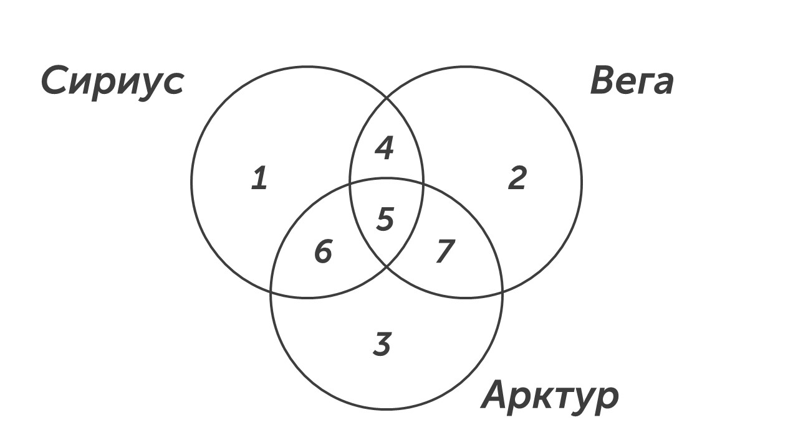

Этот тип задания встречается чаще всего на экзамене, давай научимся решать его. Прочитаем задачу🔍

> [!note] Задача
> 
> В языке запросов поискового сервера для обозначения логической операции «ИЛИ» используется символ «|», а для логической операции «И»  — символ «&».
> 
>В таблице приведены запросы и количество найденных по ним страниц некоторого сегмента сети Интернет.

|          Запрос           | Найдено страниц(в тысячах) |
| :-----------------------: | :------------------------: |
|       Сириус & Вега       |            260             |
| Вега & (Сириус \| Арктур) |            467             |
|  Сириус & Вега & Арктур   |            119             |

> [!note] Продолжение задачи
> 
> Какое количество страниц (в тысячах) будет найдено по запросу **Вега & Арктур** ? Считается, что все запросы выполнялись практически одновременно, так что набор страниц, содержащих все искомые слова, не изменялся за время выполнения запросов.

### Способ №1 - круги

**Шаг 1 - рисуем круги**. В задаче есть три множества: Сириус, Вега, Арктур, поэтому рисуем три пересекающихся круга и нумеруем все области: 

**Шаг 2 - определим области.** 

**Область 4 + 5:** это пересечение Сириус & Вега = 260

**Область 5:** это пересечение Сириус & Вега & Арктур = 119

**Область 4 + 5 + 7:** Это объединение Сириус & Арктур и пересечение с множеством Вега = 467 

**Область 5 + 7:** пересечение Вега & Арктур = ?

**Шаг 3 - найдем нужную область.** По условию задачи нужно найти пересечение Вега & Арктур - это области 5 и 7. Область 5 мы знаем, Сириус & Вега & Арктур = 119, нам осталось найти только область 7. Вычтем из Сириус & Арктур область Сириус & Вега:

**Сириус & Арктур - Сириус & Вега = области 4 + 5 + 7 - области 4 + 5 = 467 - 260 = 207 (область 7)**

Сложим области 5 и 7 и получим ответ:

**Область 5 + Область 7 = 119 + 207 = 326**

В бланк ответов запишем число 326.

### Способ №2 - формула

Мы будем применять эту формулу: **m(A) + m(B) = m(A&B) + m(A|B)**, но для ее применения нужно использовать это правило: 

>[!success] Подсказка
>
>**Применить формулу m(A) + m(B) = m(A&B) + m(A|B) для трех множеств можно, если убрать повторяющиеся множество из запросов.**

У нас есть запросы и вопрос:

|          Запрос           | Найдено страниц(в тысячах) |
| :-----------------------: | :------------------------: |
|       Сириус & Вега       |            260             |
| Вега & (Сириус \| Арктур) |            467             |
|  Сириус & Вега & Арктур   |            119             |

Вопрос Вега & Арктур - ?

Теперь для применения формулы нужно убрать множество, которое есть в запросах и вопросе. В нашем примере - это множество Вега:

|            Запрос             | Найдено страниц(в тысячах) |
| :---------------------------: | :------------------------: |
|       Сириус ~~& Вега~~       |            260             |
| ~~Вега &~~ (Сириус \| Арктур) |            467             |
|  Сириус & ~~Вега &~~ Арктур   |            119             |

Вопрос ~~Вега &~~ Арктур - ?

После зачеркивания повторяющегося множества запросы и вопрос примут следующий вид:

|      Запрос      | Найдено страниц(в тысячах) |
| :--------------: | :------------------------: |
|      Сириус      |            260             |
| Сириус \| Арктур |            467             |
| Сириус & Арктур  |            119             |

Вопрос Арктур - ?

Нам осталось применить формулы и узнать ответ:

**Формула:** m(A) + m(B) = m(A&B) + m(A|B)

**Подставим наши множества:** Сириус + Арктур = Сириус & Арктур + Сириус | Арктур

**Подставим значения:** 260 + Арктур = 119 + 467

**Найдем ответ:** Арктур = 119 + 467 - 260 = 586 - 260 = 326

Супер👍

Еще один тип задания позади. Теперь пора перейти к последнему типу восьмого задания: [[Тип 3 - Ауди|Поехали🛞]]

