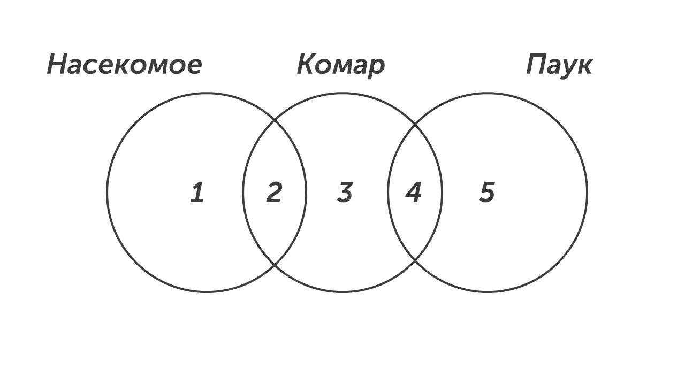

Да, название этого типа задания довольно странное, но оно вполне оправданно. Давай прочтем задачку📖

>[!note] Задача
>
>В языке запросов поискового сервера для обозначения логической операции «ИЛИ» используется символ «|», а для обозначения логической операции «И» –– символ «&». В таблице приведены запросы и количество найденных по ним страниц некоторого сегмента сети Интернет.

|          **Запрос**          | Найдено страниц (в сотнях тысяч) |
| :--------------------------: | :------------------------------: |
|           _Комар_            |                76                |
|         _Насекомое_          |                43                |
|            _Паук_            |                70                |
| _Комар \| Паук \| Насекомое_ |               150                |
|        _Комар & Паук_        |                24                |
|      _Насекомое & Паук_      |                0                 |

> [!note] Продолжение задачи
> 
> Какое количество страниц (в сотнях тысяч) будет найдено по запросу:
> 
> **Комар & Насекомое?**
> 
> Считается, что все запросы выполнялись практически одновременно, так что набор страниц, содержащих все искомые слова, не изменялся за время выполнения запросов.

**Шаг 1 - рисуем круги.** Есть три множества: Комар, Насекомое, Паук. В данном типе задания нужно определить, какие два множества не пересекаются, в нашем случаем это множества Насекомое и Паук (*Насекомое & Паук = 0*) и на рисунке они должны не пересекаться:

**Дано:**

Насекомое = «1» + «2» = 43

Комар = «2» + «3» + «4» = 76

Паук = «4» + «5» = 70

Комар | Паук | Насекомое = «1» + «2» + «3» + «4» + «5» = 150

Комар & Паук = «4» = 24

**Найти:**

Комар & Насекомое = «2» = ?

**Шаг 2 - ищем нужную область.** Этот тип заданий решается при помощи пошагового поиска всех областей. Мы знаем чему равна область «4» = 24 и сможем найти область «5»:

«4» + «5» = 70

24 + «5» = 70

«5»  = 46

Найдем область «1». Мы знаем чему равны все области «1» + «2» + «3» + «4» + «5» = 150, чему равны области «2» + «3» + «4» = 76 и чему равна область «5» = 46:

«1» + «2» + «3» + «4» + «5» = 150

«1» + 76 + 46 = 150

«1» = 28

Зная область «1» легко сможем область «2» и получить ответ: 

«1» + «2» = 43

28 + «2» = 43

«2» = 15

Запишем в бланк ответов число 15.

Вот и все, восьмое задание позади🤟

Теперь нужно потренироваться и решить побольше задачек, чтобы закрепить навык. Как порешаешь переходи к девятому заданию, оно довольно простое: [[../../Задание 9/Снова графы|девятое задание]]
