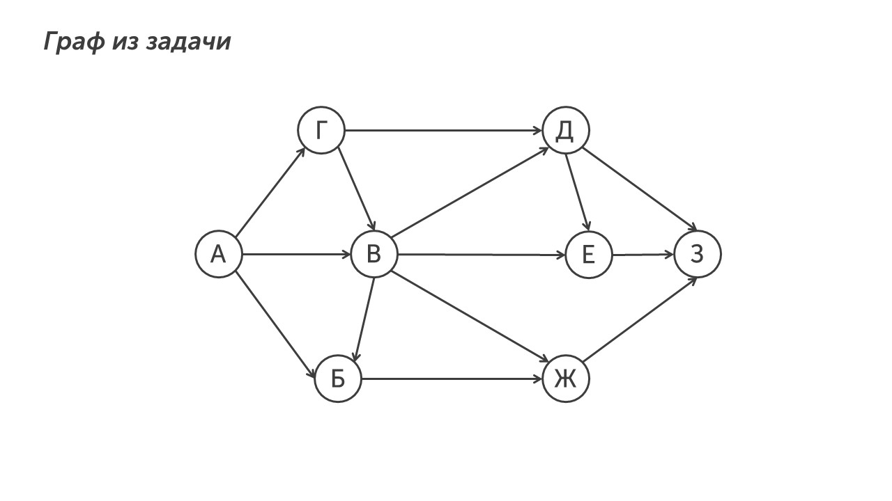
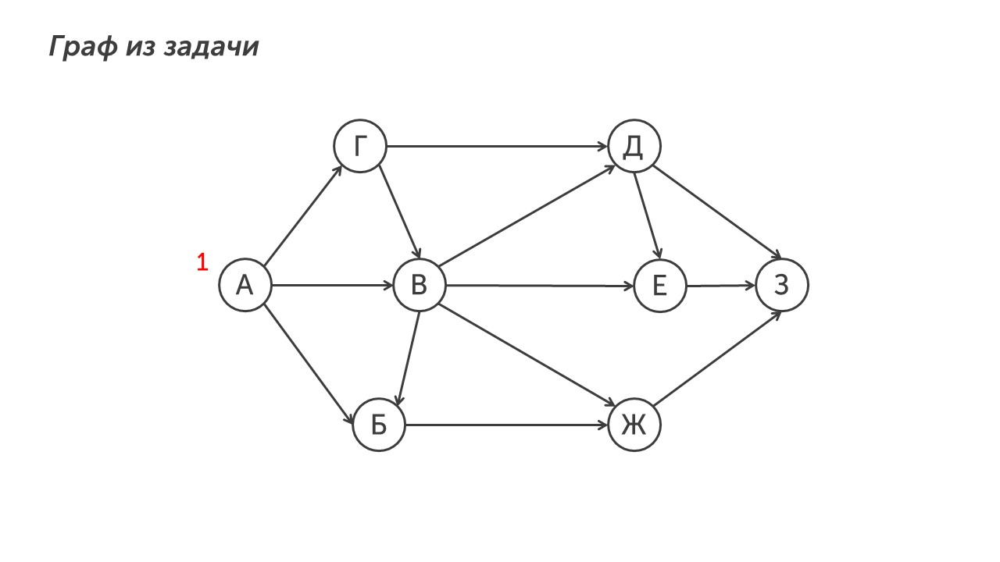
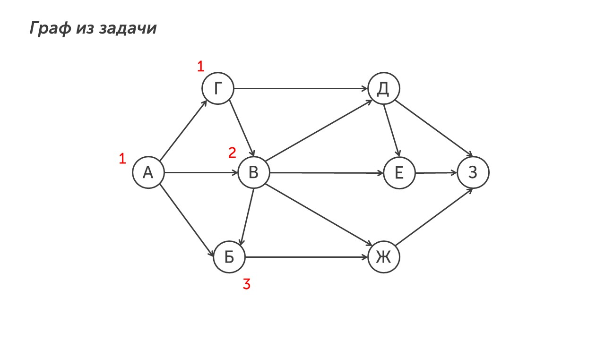
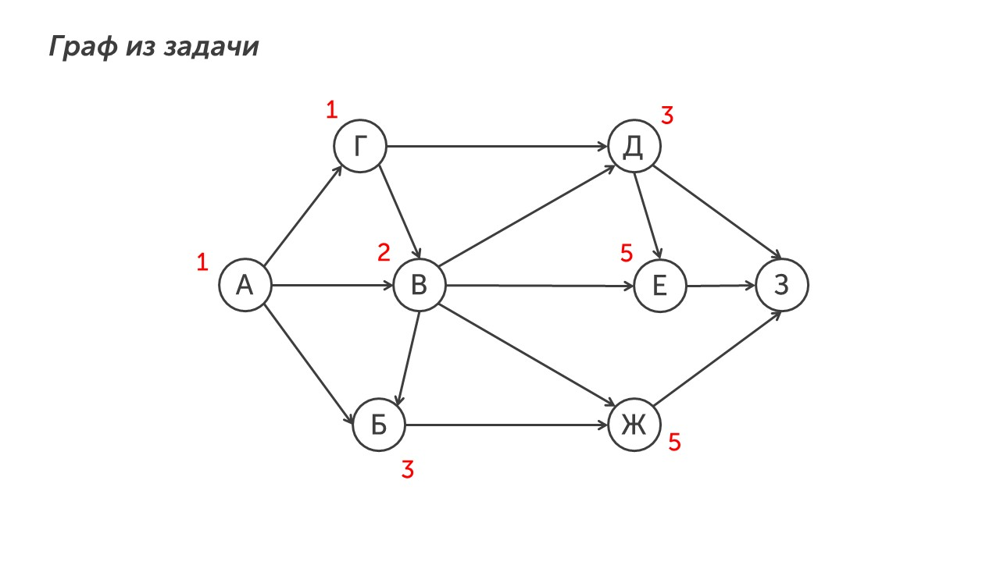
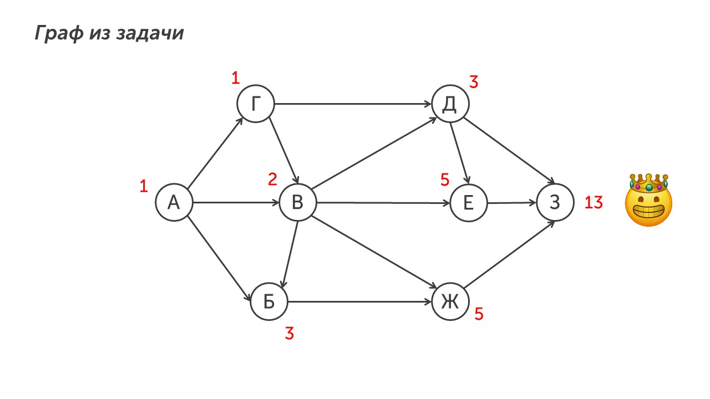

В девятом задании есть три типа условий. Начнем с первого типа. В нем нужно найти количество путей из одного города в другой. Прочитаем задание:

> [!note] Задача
> 
> На рисунке – схема дорог, связывающих города А, Б, В, Г, Д, Е, Ж, З. По каждой дороге можно двигаться только в одном направлении, указанном стрелкой. Сколько существует различных путей из города А в город З?

**Шаг 1 - прочитаем условие**. По условию нам нужно найти количество путей из города А в город З. Давай сделаем это 💪

**Шаг 2 - ищем количество путей.** Начинам с города А в него всегда ведет только 1 путь. Отметим это на рисунке:

Теперь отметим количество путей в ближайшие города. В город Г ведет один путь (АГ), значит Г = 1. В город В ведет два пути (АВ и АГВ), А = 1, Г = 1, значит В = 2. В город Б ведет две стрелки из А = 1 и В = 2, значит Б = 3. Давай отметим на рисунке: 

Работаем дальше, в город Д ведут стрелки из Г = 1 и В = 2, значит Д = 3. В город Е ведут стрелки из В = 2 и Д = 3, значит Е = 5 и город Ж ведет две стрелки из городов В = 2 и Б = 3, значит Ж = 5. Не забываем все занести на граф:

И наконец отметим количество путей в город З, в него ведут дороги из Д = 3, Е = 5 и Ж = 5, значит в город З ведет 13 путей:

Вот и вся задача😮‍💨

Тут нужно быть просто внимательным и не торопиться. Давай отдохнем 5 минут и пойдем изучать новый тип 9-ого задания, он будет интереснее: [[Тип 2 - проходящий через определенный пункт|Я готов😎]]
