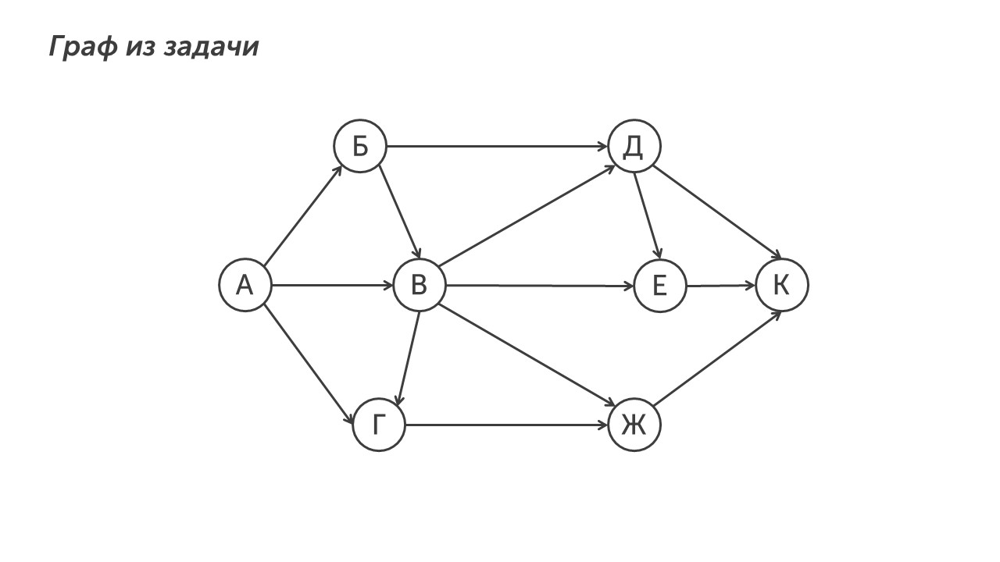
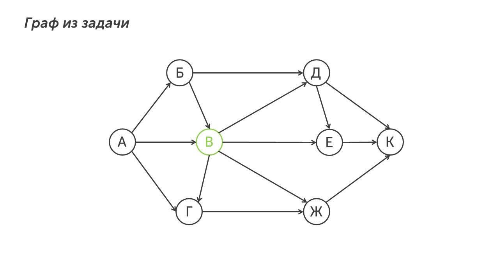
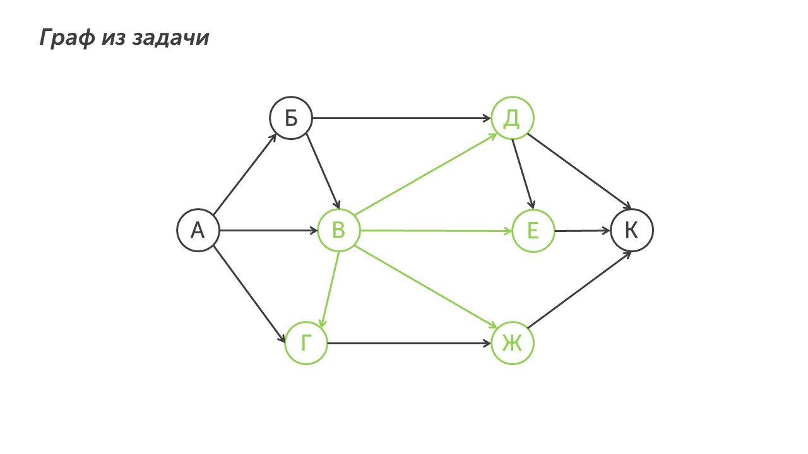
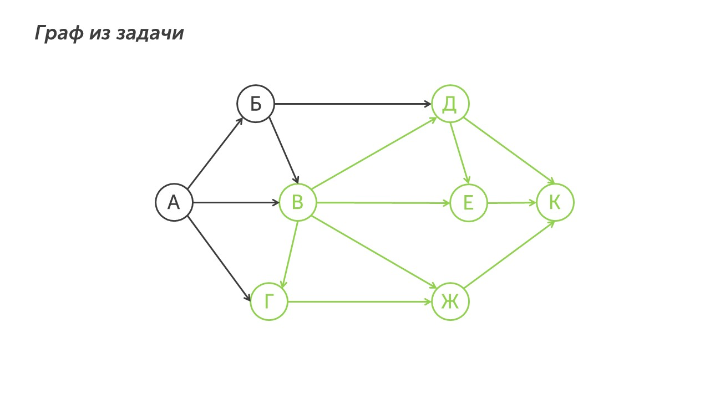
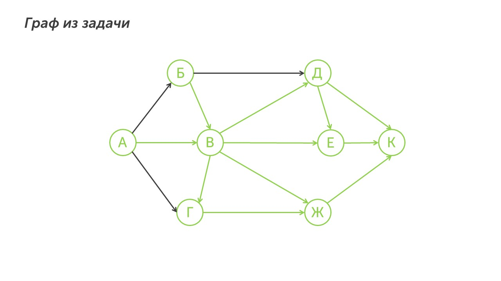
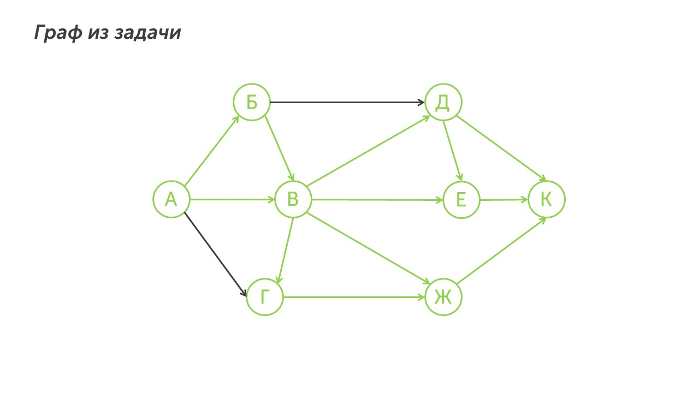
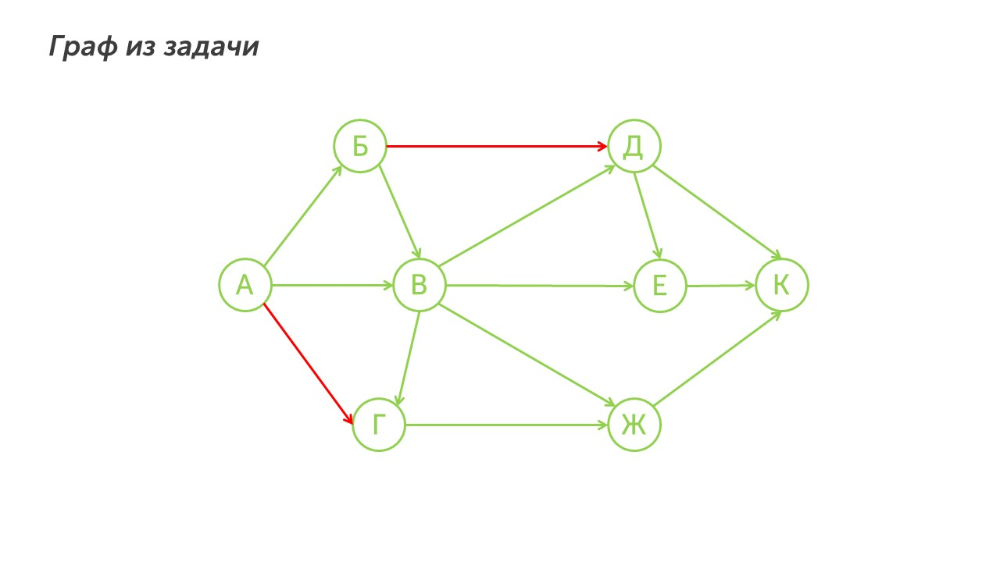
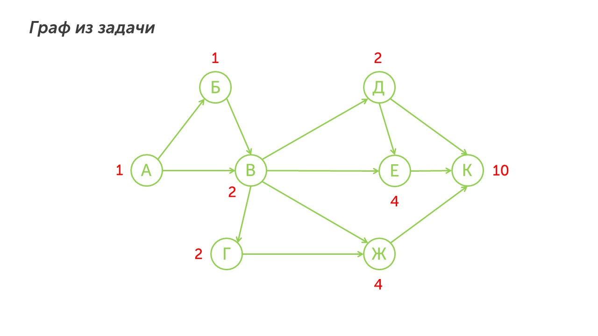

Давай для начала прочитаем задачу:

> [!note] Задача
> 
> На рисунке  — схема дорог, связывающих города А, Б, В, Г, Д, Е, Ж и К. По каждой дороге можно двигаться только в одном направлении, указанном стрелкой. Сколько существует различных путей из города А в город К, проходящих через город В?

**Шаг 1 - прочитаем задание.** Из условия становится понятно, что нам нужно найти количество путей из города А в город К, обязательно проходящих через город. С условием понятно. Теперь давай расскажу как без ошибок решить это задание.

**Шаг 2 - ищем количество путей.** Для начала давай отметим город, через который обязательно должны проходить все пути. По условию задачи - это город В:

Теперь подчеркиваем ближайшие стрелки, которые выходят из города В (ВД, ВЕ, ВЖ, ВГ) и города в которые эти стрелки ведут:

Теперь подчеркиваем стрелки, которые выходят из только что подчеркнутых города (вот эти города: Д, Е, Ж, Г):

Вот мы и дошли до города К. Теперь нам нужно подчеркнуть пути входящие в город через которые нужно обязательно пройти. В город В входит два пути: из городов А и Б (а кто остался на трубе🤔):

Теперь также отмечаем пути, которые входят в отмеченные города (А и Б). В город А ничего не входит, а в город Б ведет дорога из А, ее и подчеркнем:

Всё, дороги проходящие через город В подчеркнуты, но осталось две не подчеркнутые дороги АГ и БД. Их мы забываем и зачеркиваем, потому что, если проходить через них, то невозможно посетить город В:

Остался последний шаг. Найдем количество путей из города А в город К, проходящие через В. Для удобства уберем не нужные пути (подчеркнутые красным):

**Шаг 3 - запишем ответ.** В бланк ответов запишем число 10. Задача решена.

>[!success] Подсказка
>
>**№1** Не решай задание наугад, а отмечай все пути ведущие из города через который необходимо пойти и пути, которые входят в этот город
>
>**№2** Зачеркивай пути, которые не ведут через город и не учитывай их при подсчете количества путей

Погнали разберемся с последним типом 9-ого задания, оно гораздо проще этого типа, но редко встречается на экзамене: [[Тип 3 - не проходящие через определенный пункт|Гоу решать третий тип🤙]]

 

