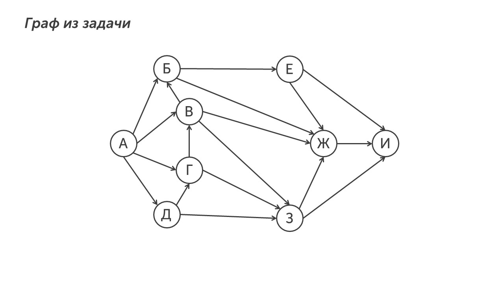
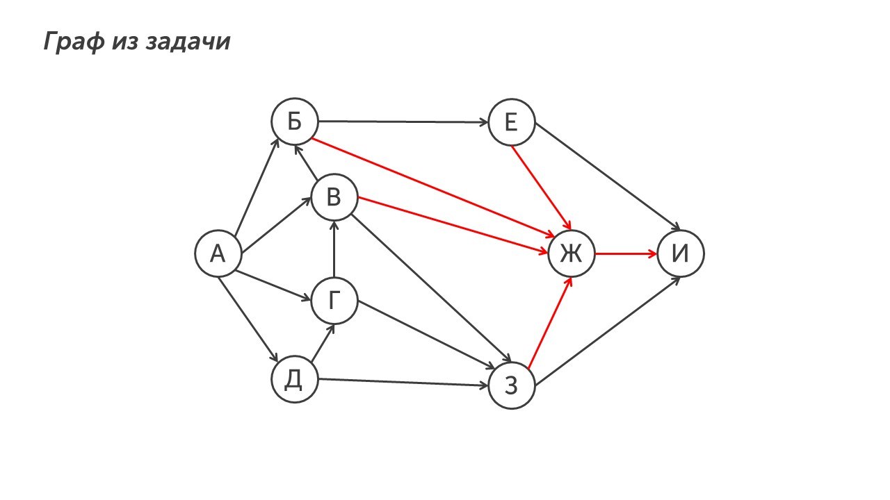
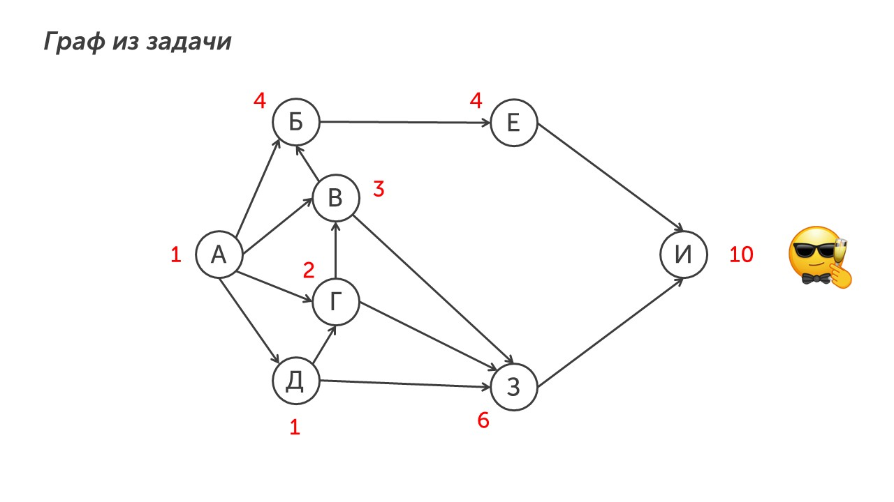

안녕👋🏻 - это на корейском значит *привет*

Этот тип задания довольно простой и для его решения нужно знать два этапа решения. Прочитаем задачу:

> [!note] Задача
> 
> На рисунке  — схема дорог, связывающих города А, Б, В, Г, Д, Е, Ж, З, И. По каждой дороге можно двигаться только в одном направлении, указанном стрелкой. Сколько существует различных путей из города А в город И, не проходящих через город Ж?

**Шаг 1 - осознаем условие.** Нам нужно найти количество путей из города А в город И, не проходящих через город Ж. Давай разберем как это решать.

>[!success] Подсказка
>
>Чтобы решить задачу такого типа, необходимо зачеркнуть **ближайшие** стрелки, которые входят и выходят из города, через который нельзя проходить

**Шаг 2 - ищем количество путей.** Для начала зачеркнем ближайшие пути входящие и выходящие из города Ж (ЕЖ, БЖ, ВЖ, ЗЖ, ЖИ):

Для удобства уберем эти пути с рисунка и посчитаем путей из города А в город И:

**Шаг 3 - запишем ответ.** В бланк ответов запишем число 10. Задача решена.

Ну вот и все🫡

Теперь ты умеешь решать девятое задание. Пора перейти к финальному заданию первой части - задание №10: [[../../Задание 10/Системы счисления|Полетели🚀]]

