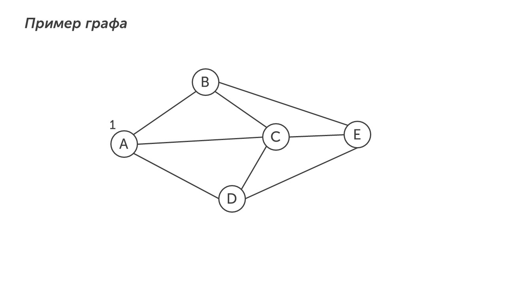
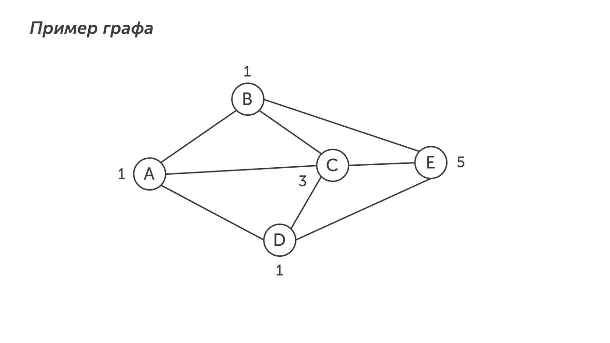

Привет🤚

Сегодня начнем изучать 9-ую тему экзамена. Она связана с графами, давай вспомним, что такое граф.

>[!quote] Напоминалка
>**Граф - геометрическая фигура, состоящая из точек (вершин графа) и линий соединяющих их (ребра графа)**

С помощью графа в девятом задании показывают населенные пункты и дороги между ними. Но в отличии от четвертого задания нужно найти не расстояния между городами, а количество путей из одного города в другой. Допустим, у нас есть граф:

Нам нужно найти количество путей, которые ведут из города A в город C. 

>[!success] Подсказка
>
>Чтобы найти количество путей из одного города в другой нужно посчитать сумму путей в каждый город. Начальный город имеет только один путь. 

Так как начальный путь имеет только 1 путь, отметим это на графе:

Теперь ищем города в которые ведет стрелка из города А: города B, C и D. В город B ведет только один путь из А (АВ), в город D ведет также один путь (AD), а город C ведет три пути (AC, ABC и ADC). Поэтому подписываем количество путей в города B и D:

Теперь посчитаем количество путей в город C. В этот город ведут пути из городов A, B и D (AC, ABC и ADC). Смотрим какие цифры стоят возле этих городов и складываем их, таким образом мы получим количество путей в город C: 1 + 1 +1 = 3. Отметим это на графе:

Осталось посчитать сколько городов ведет в город E. В него ведут стрелки из городов B, C и D (ABE, ABCE, ACE, ADCE, ADE). Смотрим какие цифры стоят возле этих городов и складываем их, таким образом мы получим количество путей в город E: 1 + 3 + 1 = 5. Отметим это на графе:

Таким образом из города A в город E ведет 5 путей. 

>[!warning] Важно
>
>Чтобы решить это задание правильно, необходимо быть внимательным и правильно отмечать количество путей в каждом городе

Победа🏆

Теперь пора потренироваться решать разные типы 9-ого задания. Летс гоу тренироваться: [[Разбор заданий/Тип 1 - станадртный|Вперед ▶️]]
