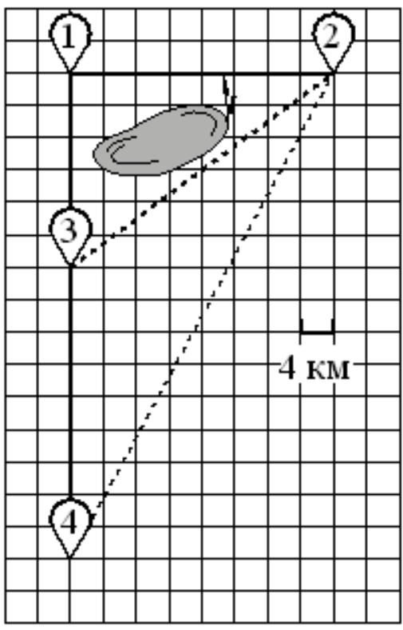
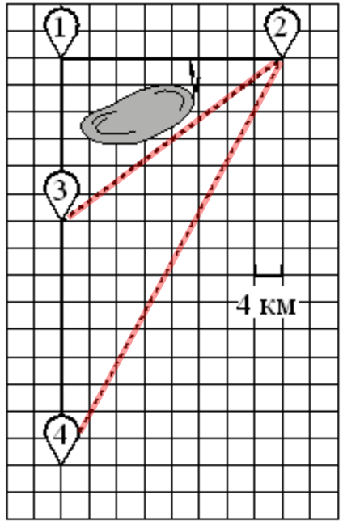
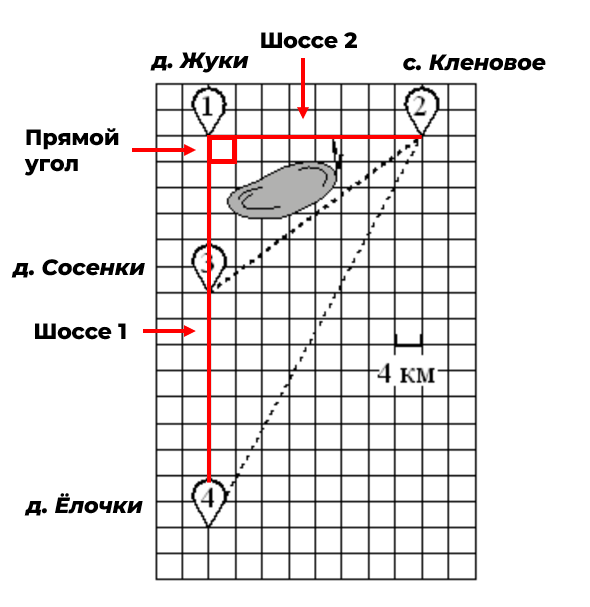
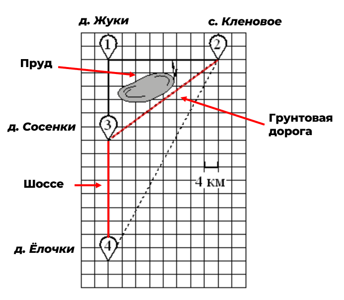

Начнем разбирать первый тип заданий про деревни🏡

> [!note] Условие
> Володя летом отдыхает у дедушки в деревне Ёлочки. В воскресенье они собираются съездить на машине в село Кленовое. Из деревни Ёлочки в село Кленовое можно проехать по прямой грунтовой дороге. Есть более длинный путь: по прямолинейному шоссе через деревню Сосенки до деревни Жуки, где нужно повернуть под прямым углом направо на другое шоссе, ведущее в село Кленовое. Есть и третий маршрут: в деревне Сосенки можно свернуть на прямую грунтовую дорогу в село Кленовое, которая идёт мимо пруда. Шоссе и грунтовые дороги образуют прямоугольные треугольники. По шоссе Володя с дедушкой едут со скоростью 80 км/ч, а по грунтовой дороге — со скоростью 40 км/ч. На плане изображено взаимное расположение населённых пунктов, длина стороны каждой клетки равна 4 км.

К условию прикреплена картинка🖼

### Задание 1

Пользуясь описанием, определите, какими цифрами на плане обозначены населённые пункты. Заполните таблицу, в бланк ответов перенесите последовательность трёх цифр без пробелов, запятых и других дополнительных символов.

| Насел. пункты | д. Ёлочки | с. Кленовое | д. Жуки |
| ------------- | --------- | ----------- | ------- |
| Цифры         |           |             |         |

В этом задании нужно просто определить какими цифрами на плане обозначены населенные пункты. Для этого давай будем работать с условием задачи.

> [!quote] Условие
> Володя летом отдыхает у дедушки в деревне Ёлочки

Значит один из пунктов 1,2,3 или 4 - это деревня Ёлочки

> [!quote] Условие
>  В воскресенье они собираются съездить на машине в село Кленовое

Это означает, что из деревни Ёлочки можно попасть в село Кленовое 

> [!quote] Условие
>  Из деревни Ёлочки в село Кленовое можно проехать по прямой грунтовой дороге.

Значит из деревни Ёлочки в село Кленовое можно проехать по прямой грунтовой дороге (**грунтовая дорога обозначается пунктиром**)

По рисунку делаем вывод, что номера у деревни Ёлочки и села Кленовое могут быть 2, 3 или 4

> [!quote] Условие
> Есть более длинный путь: по прямолинейному шоссе через деревню Сосенки до деревни Жуки, где нужно повернуть под прямым углом направо на другое шоссе, ведущее в село Кленовое.

Это означает, что если ехать по шоссе (**обозначено сплошной линией**), то сначала попадем в деревню Сосенки, потом в деревню Жуки, а потом повернув на 90 градусов вправо, то мы выйдем на другое шоссе, которое ведет в село Кленовое. Такой маршрут есть на плане местности:

Проверим последнее утверждение и запишем ответ

> [!quote] Условие
> Есть и третий маршрут: в деревне Сосенки можно свернуть на прямую грунтовую дорогу в село Кленовое, которая идёт мимо пруда

Проверим этот маршрут и действительно, он есть на плане.

Теперь мы можем заполнить таблицу с данными

| Насел. пункты | д. Ёлочки | с. Кленовое | д. Жуки |
| ------------- | --------- | ----------- | ------- |
| Цифры         | 4         | 2           | 1       |

В бланк ответов записываем последовательность цифр без пробелов: **421**

### Задание 2

Найдите расстояние от деревни Ёлочки до села Кленовое по прямой. Ответ дайте в километрах.

Давай начнем разбираться. Посмотрим на построенный нами план🔍

![[img5.png]]

Красной линией обозначен путь по прямой из деревни Ёлочки до села Кленовое. Нам нужно найти длину этой линии. Для начала посмотрим на план и увидим, что **длина одной клетки 4 км**. Запомним это.

Эта задача решается при помощи теоремы Пифагора, ведь проселочные дороги и шоссе представляют из себя прямоугольный треугольник

![[img6.png]]

Вспомним теорему Пифагора

> [!example] Теорема
> **В прямоугольном треугольнике квадрат длины гипотенузы равен сумме квадратов длин катетов**.

Проселочная дорога между деревней Ёлочки и селом Кленовое - это гипотенуза, шоссе между деревней Ёлочки и деревней Жуки, деревней Жуки и селом Кленовое - это катеты. Найдем длину катетов, посчитав клеточки и умножив их на 4 (так как одна клетка = 4 км)

Катет Ёлочки - Жуки 15 клеточек = 15 * 4 = 60 км

Катет Жуки - Кленовое 8 клеточек = 8 * 4 = 32 км

Запишем теорему Пифагора
$$
с^2 = a^2 + b^2
$$
или
$$
с = \sqrt{a^2 + b^2}
$$
В этих формулах с - длина гипотенузы, a и b - длины катетов. Подставим длины катетов в формулу и найдем ответ

$$
с = \sqrt{60^2 + 32^2} = \sqrt{3600 + 1024} = \sqrt{4624} = 68
$$
Быстро считать квадраты чисел можно при помощи таблицы квадратов: [[../../Полезности/Таблица степеней - как пользоваться|Таблица степеней - как пользоваться]]

В ответ запишем число **68**

### Задание 3

Сколько километров проедут Володя с дедушкой от деревни Сосенки до села Кленовое, если они поедут по шоссе через деревню Жуки?

Сначала отметим этот путь на плане

![[img7.png]]

Теперь посчитаем количество клеточек между деревней Сосенки и деревней Жуки и между деревней Жуки и деревней Кленовое

Расстояние между деревней Сосенки и Жуки - 6 клеточек (6 * 4 = 24 км)

Расстояние между деревней Жуки и селом Кленовое - 8 клеточек (8 * 4 = 32 км)

Посчитаем общее расстояние

$$
Расстояние = 24 + 32 = 56
$$

В ответ запишем число **56**

### Задание 4

Сколько минут затратят на дорогу из деревни Ёлочки в село Кленовое Володя с дедушкой, если они поедут сначала по шоссе, а затем свернут в деревне Сосенки на грунтовую дорогу, которая проходит мимо пруда?

Нарисуем путь на плане

![[img8.png]]
Следующим шагом посчитаем расстояния между населенными пунктами

Расстояние между деревней Ёлочки и Сосенки - 9 клеточек (9 * 4 = 36 км)

Расстояние между деревней Сосенки и селом Кленовое считаем по теореме Пифагора

Катет Сосенки - Жуки 6 клеточек = 6 * 4 = 24 км

Катет Жуки - Кленовое 8 клеточек = 8 * 4 = 32 км

Запишем теорему Пифагора
$$
с = \sqrt{a^2 + b^2}
$$
И подставим значения

$$
с = \sqrt{24^2 + 32^2} = \sqrt{576 + 1024} = \sqrt{1600} = 40
$$

Теперь мы знаем, что по шоссе Володя двигался 36 км, а по грунтовой дороге 40 км. Обратимся к условию

> [!quote] Условие
> По шоссе Володя с дедушкой едут со скоростью 80 км/ч

Это значит, что за час движения по шоссе Володя с дедушкой проехжают 80 км

> [!quote] Условие
> По грунтовой дороге — со скоростью 40 км/ч

Это значит, что за час движения по грунтовой дороге Володя с дедушкой проезжают 40 км

Так как по грунтовой дороге Володя с дедушкой проехали 40 км, значит они ехали ровно 1 час, то есть **60 минут**. Часть ответа уже есть.

По шоссе Володя с дедушкой проехали 36 км, а скорость их движения равна 80 км/ч. Найдем сколько времени они были в пути при помощи пропорции

![[img9.png]]

Теперь перемножим части пропорции крест - накрест и решим получившееся уравнение

![[img10.png]]

Мы все нашли!

Время движения по грунтовой дороге - 60 минут

Время движения по шоссе - 27 минут

Сложим их и получим ответ
$$
Время = 60 + 27 = 87
$$

В ответ напишем число **87**

### Задание 5

В таблице указана стоимость (в рублях) некоторых продуктов в четырёх магазинах, расположенных в деревне Ёлочки, селе Кленовое, деревне Сосенки и деревне Жуки.

| Наименование продукта   | д. Ёлочки | с. Кленовое | д. Сосенки | д. Жуки |
| ----------------------- | --------- | ----------- | ---------- | ------- |
| Молоко (1 л)            | 42        | 45          | 38         | 43      |
| Хлеб (1 батон)          | 22        | 25          | 23         | 27      |
| Сыр «Российский» (1 кг) | 320       | 290         | 270        | 280     |
| Говядина (1 кг)         | 410       | 420         | 450        | 430     |
| Картофель (1 кг)        | 26        | 18          | 24         | 16      |
Володя с дедушкой хотят купить 5 л молока, 3 кг сыра «Российский» и 4 кг картофеля. В каком магазине такой набор продуктов будет стоить дешевле всего? В ответ запишите стоимость данного набора в этом магазине.

Для решения этой задачи нужно просто посчитать стоимость продуктов в каждом населенном пункте

$$
Ёлочки = 5 * 42 + 3 *320 + 4*26 = 210 + 960 + 104 = 1274
$$
$$
Кленовое = 5 * 45 + 3 * 290 + 4*18 = 225 + 870 + 72 = 1167
$$
$$
Сосенки = 5 * 38 + 3 *270 + 4*24 = 190 + 810 + 96 = 1096
$$
$$
Жуки = 5 * 43 + 3 *280 + 4*16 = 215 + 840 + 64 = 1119
$$

Самый дешевый набор продуктов можно купить в деревне Сосенки, за 1096 рублей.

В ответ пишем число **1096**

Поздравляю🎉

Ты научился решать первые пять заданий, теперь давай перейдем к следующему типу заданий: [[Тип 2]]
