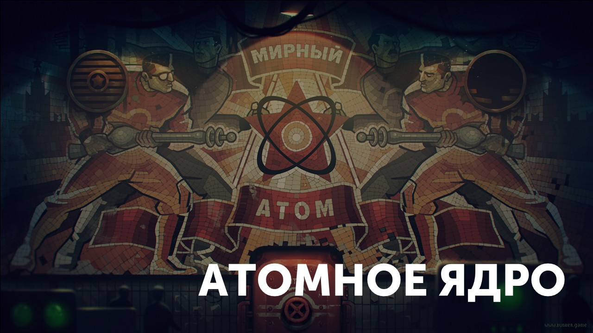
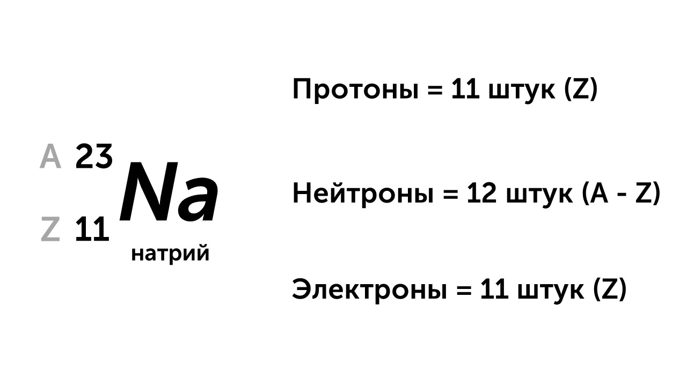
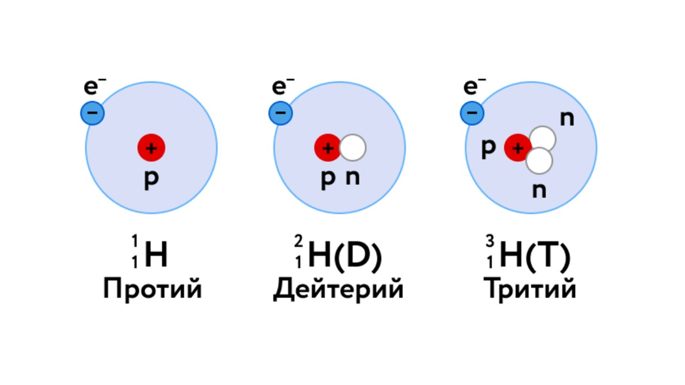

**Атомное ядро** находящееся в центре атома, в 10 000 раз меньше самого атома и сосредотачивает 99,9% массы атома. В состав ядра входят протоны и нейтроны. По современным представлениям, протон и нейтрон являются двумя разными состояниями одной и той же частицы - нуклона

#### Заряд ядра

**Z - зарядовое число**, число протонов и электронов в ядре, соответствует номеру элемента в таблице Менделеева

#### Массовое число ядра

A - массовое число, равно сумме масс протонов и нейтронов в ядре: A = Z + N; N - число нейтронов в ядре:  N = A - Z. Каждый элемент таблицы Менделеева записывается в виде: $^{A}_{Z}X$ 

#### Изотопы

> [!info] Определение
> 
> **Изотопы - атомы одного и того же химического элемента, имеющие одинаковое число протонов в ядре (зарядовое число Z) и разное число N нейтронов**

Вот пример изотопов водорода

**Протий** - в ядре нет нейтронов

**Дейтерий** - в ядре 1 нейтрон

**Тритий** - в ядре 2 нейтрона

Атомное ядро мы разобрали, пора узнать про радиоактивность: [[2. Радиоактивность. Альфа-, бета-, гамма-излучения. Реакции альфа- и бета-распада|⏩вперед]]
