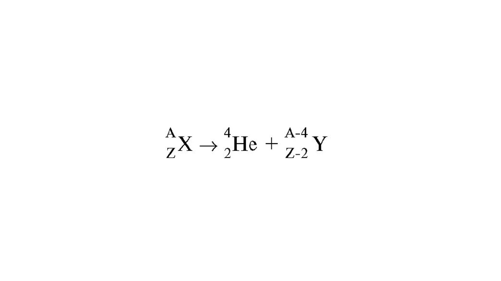
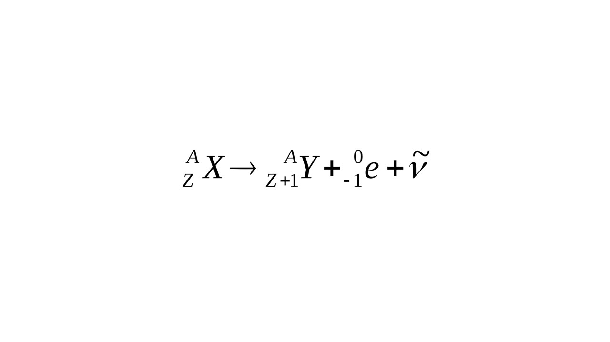
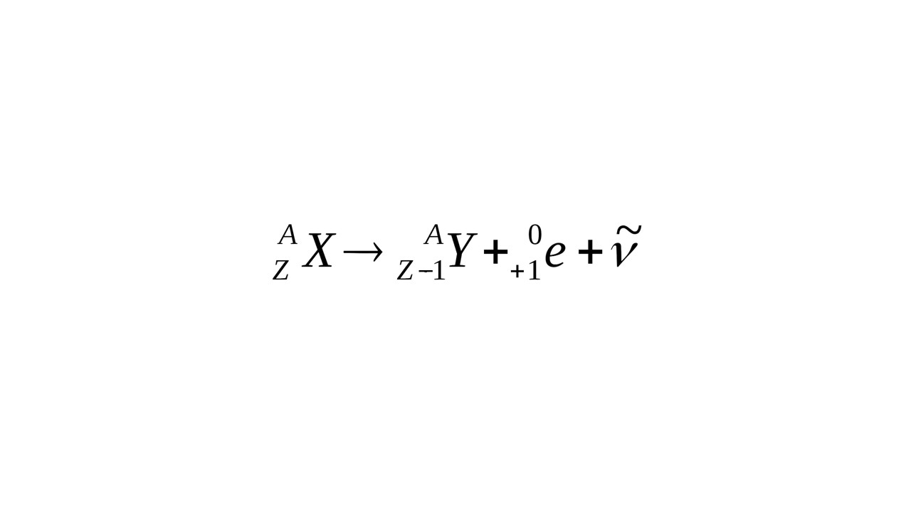
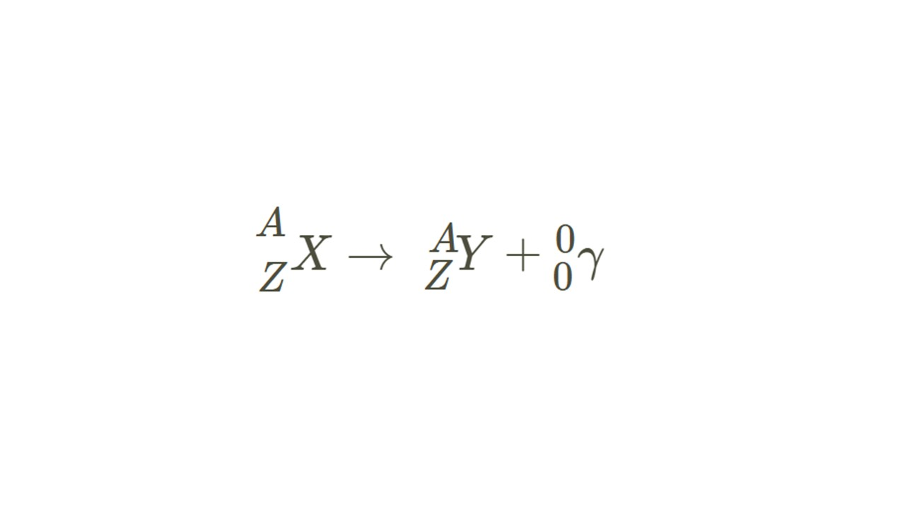

**Радиоактивностью** называют явление самопроизвольного излучения некоторых химических элементов, а вид этого излучения называют радиоактивным излучением. 

Первым радиоактивное излучение обнаружил Анри Беккерель, который, проводя эксперименты с солями урана, по почернению фотопластинки установил, что они самопроизвольно испускают невидимое излучение сильной проникающей способности. В дальнейшем было обнаружено, что не только уран, но и такие элементы, как радий и полоний, тоже испускают невидимое излучение.

Существует 3 вида радиоактивных распадов

#### Альфа - распад

> [!info] Определение
> 
> **Альфа - распад - спонтанное превращение радиоактивного ядра в новое ядро с испусканием α - частицы (альфа частицы)**

Уравнение α - распада:

В результате α - распада образуется химический элемент в таблице Менделеева с порядковым номером, уменьшенным на 2 единицы, и массовым числом - на 4 единицы.

#### Бета - распад

> [!info] Определение
> 
> **Бета - распад - спонтанное превращение радиоактивного ядра в новое ядро с испусканием электрона или позитрона**

##### Бета минус - распад (электронный распад)

**Бета минус - распад** - спонтанное превращение радиоактивного ядра в новое ядро с электрона и антинейтрино

Уравнение электронного β - распада

В результате β - распада образуется химический элемент с порядковым номером, увеличенным на одну единицу, и с тем же массовым числом 

##### Бета плюс - распад (позитронный распад)

**Бета плюс - распад** - спонтанное превращение радиоактивного ядра в новое ядро с позитрона и нейтрино

Уравнение позитронного β - распада

В результате β - распада образуется химический элемент с порядковым номером, уменьшенным на одну единицу, и с тем же массовым числом, при этом один из нейтронов превращается в протон

#### Гамма - излучение

**Гамма излучение** - электромагнитное излучение, возникающее при переходе ядра из возбужденного в более низкое энергетическое состояние; γ - излучение не сопровождается изменением заряда; масса ядра меняется ничтожно мало

Уравнение γ - распада:

Гамма - излучение часто сопровождает явления альфа- или бета-распада

С излучениями мы разобрались, поговорим про опыты над альфа - частицами: [[3. Опыты Резерфорда по рассеянию альфа-частиц. Планетарная модель атома|⏩вперед]]

