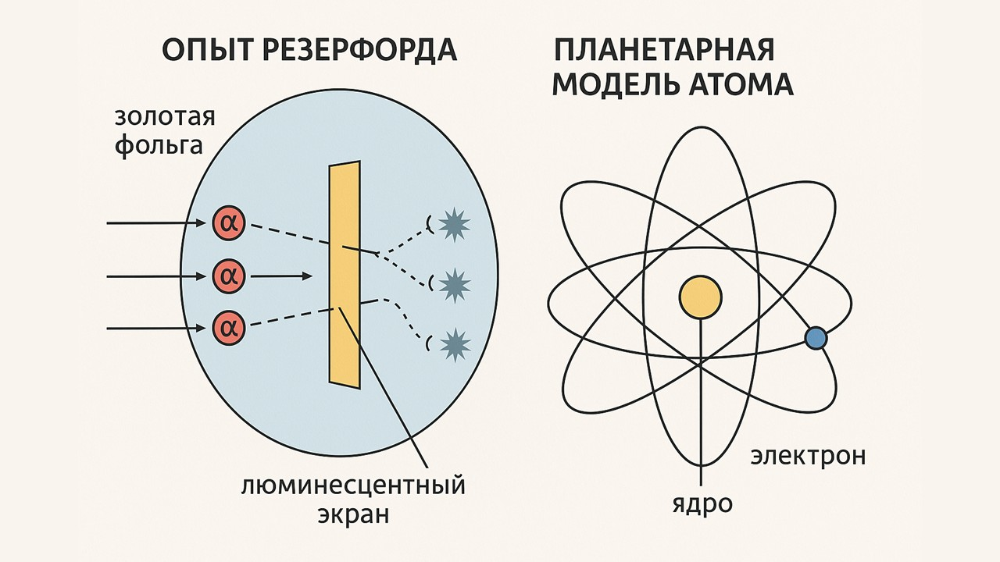

Планетарная модель атома была предложена в 1911 г. английским физиком Эрнестом Резерфордом

Он проводил эксперимент, облучал золотую фольгу α-частицами (ядрами гелия). Вокруг фольги стоял люминесцентный экран, который фиксировал отклонения частиц.

Резерфорд считал, что α-частицы должны были проходить почти без отклонений, так как заряд и масса атома считались распределёнными равномерно. Но результаты были совершенно другими

| Результаты эксперимента                                   | Выводы (следствие эксперимента)                                                                                                 |
| --------------------------------------------------------- | ------------------------------------------------------------------------------------------------------------------------------- |
| Частицы проходили с минимальным или вообще без отклонения | Большую часть атома занимает пустота                                                                                            |
| Частицы отскакивали назад                                 | α-частицы сталкивается с тяжелым положительным ядром массой, соизмеримой с массой α-частицы. Размер ядра - 0,01% размера атома. |
| Частицы отклонились на угол 30 - 90 градусов              | α-частицы столкнулись с очень легкими частицами - электронами, рассеянным по всему объема атома                                 |

Теперь давай поговорим о периоде полураспада атомных ядер: [[4.Период полураспада атомных ядер|⏩вперед]]
