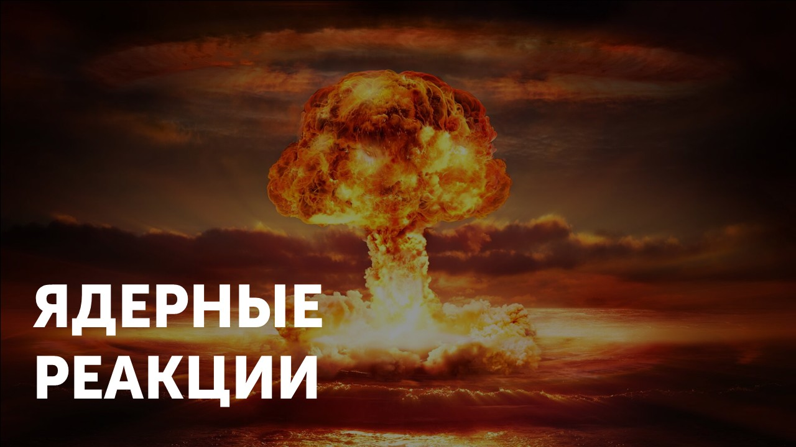

**Ядерные реакции** — это процессы, в которых атомные ядра взаимодействуют с другими ядрами или частицами, приводя к их превращению. В таких реакциях выполняются фундаментальные законы сохранения, включая:

#### Закон сохранения зарядового числа (Z)

> [!info] Определение
> 
> **Сумма зарядовых чисел до реакции = сумма зарядовых чисел после реакции**

Зарядовое число (Z) равно количеству протонов в ядре и определяет химический элемент. Давай рассмотрим реакцию деления урана-235 под действием нейтрона:

$^{235}_{92}U$ + $^{1}_{0}n$ → $^{141}_{56}Ba$ + $^{92}_{36}Kr$ + $3$ $^{1}_{0}n$

Проверим сумму зарядовых чисел, до и после реакции

$92+0=56+36+(3×0)⇒92=92$

#### Закон сохранения массового числа (A)

> [!info] Определение
> 
> **Сумма массовых чисел до реакции = сумма массовых чисел после реакции.**

Массовое число (A) равно сумме протонов и нейтронов в ядре. Посмотрим пример термоядерной реакции синтеза дейтерия и трития:

$^{2}_{1}Н$ + $^{3}_{1}Н$ → $^{4}_{2}Нe$ + $^{1}_{0}n$

Проверим сумму массовых чисел, до и после реакции

$2+3=4+1⇒5=5$

Главное запомнить, что в любой ядерной реакции **зарядовое (Z) и массовое (A) числа должны сохраняться**. Эти законы позволяют предсказывать продукты реакций и проверять их корректность.

