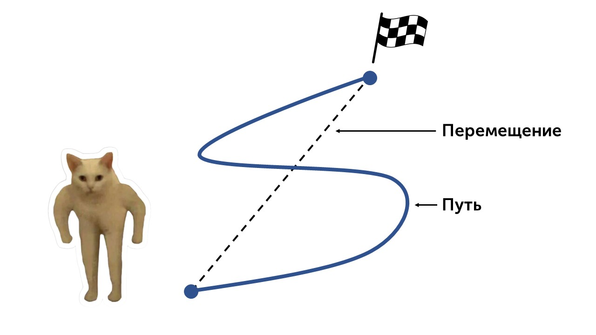
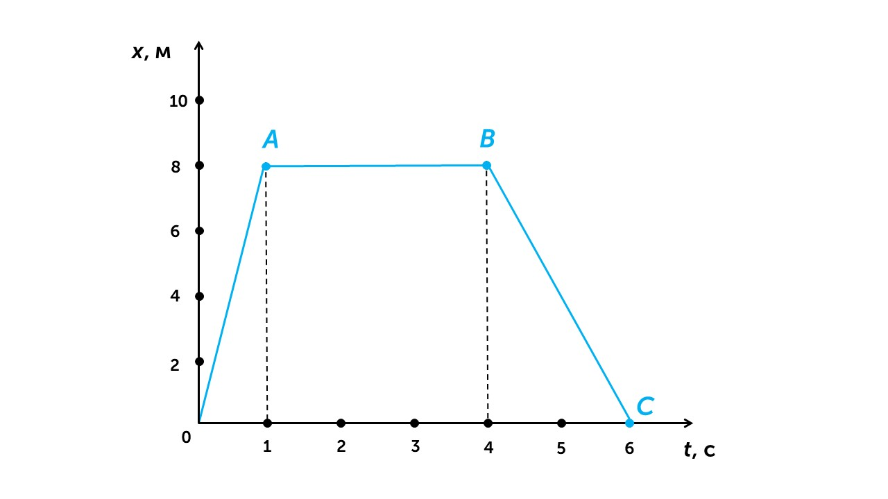

Ну вот мы и начинаем изучение физики⚛️

Для начала давай с тобой вспомним что такое движение, ниже будет определение, а потом я объясню его.

> [!info] Определение
> 
> **Движение - это изменение положения тела относительно других тел или точки отсчета**

Представь BMW M5 F90 COMPETITION ее положение при езде по дороге меняется относительно других машин, деревьев и пешеходов это и называется движением. А если мы поставим ее на линию старта (точка отсчета) на гоночной трассе, то ее отдаление относительно линии старта тоже будет называться движением. 

> [!info] Определение
> 
> **Траектория** – это линия, вдоль которой движется тело.
> 
> **Путь** – это длина траектории, L = [м].
> 
> **Перемещение** – это вектор, соединяющий начало и конец траектории, S = [м]

Давай посмотрим на картинку

На ней котик двигается из одной точки в другую. Путь - это общее расстояние, которое прошел котик из одной точки в другую, измеряется в метрах (синяя петляющая линия на рисунке - это траектория). А пунктирной стрелочкой показано перемещение - это кратчайший путь между началом и концом траектории.

> [!warning] Будь внимателен
> 
> Если ты вышел из дома, дошёл до магазина (200 м), а потом вернулся обратно, то **путь** будет 400 м (до магазина 200 и обратно 200), а **перемещение** — 0 (ты вернулся в ту же точку), то есть начальная и конечная точка одна и таже и расстояние между ними 0 метров

Перемещение можно считать по такой формуле

> [!example] Формула
> 
> **S = x - x0**

**x** - это конечное положение тела

 **x0** - это начальное положение тела

Давай попробуем поработать с этой формулой на графике

Это график движения, на нем есть 2 оси:

**Ось x** - ось ординат, она показывает на сколько метров переместилось тело

**Ось t** - ось абсцисс, она показывает сколько времени прошло

Давай определим какое расстояние прошел котик за 4 секунды. Для этого найдем его начальное и конечное положения:

**x0 = 0** (в нулевую секунду котик прошел 0 метров)

**x** = **8** (на 4 секунде по точке В видим, что котик прошел 8 метров)

Подставим данные в формулу:

**S = x - x0** = 8 - 0 = 8 м

За 4 секунды прошел 8 метров. Видишь все просто.

Я упоминал вверху такое слово, как относительно, давай разберем что это значит: [[2. Относительность движения|Давай💪]]
