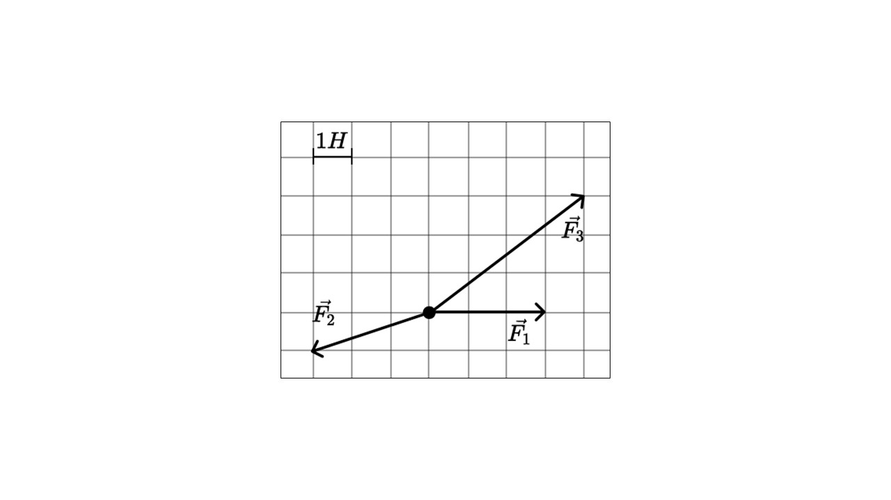
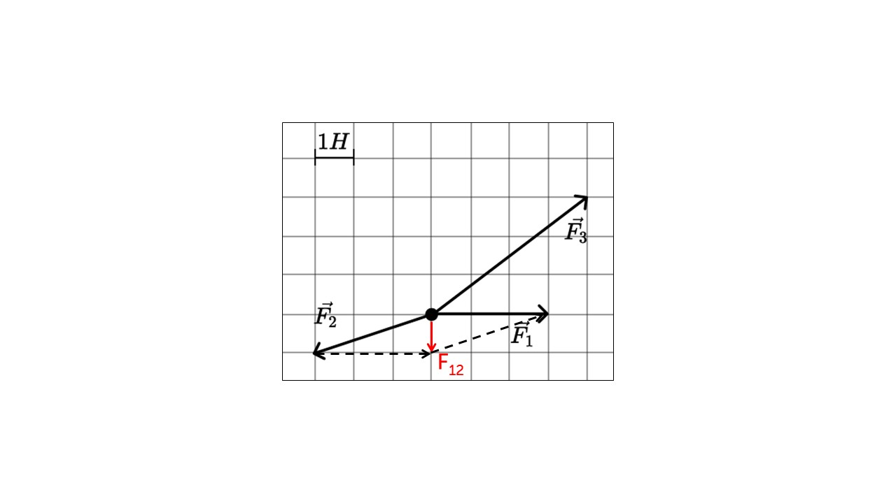
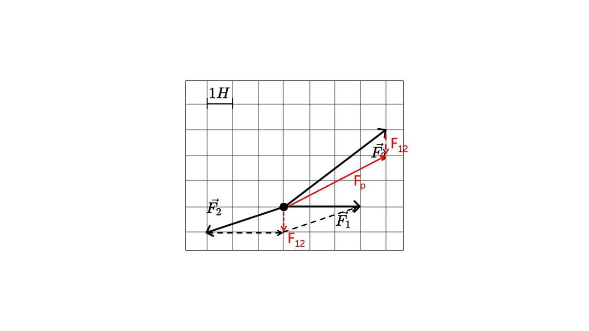
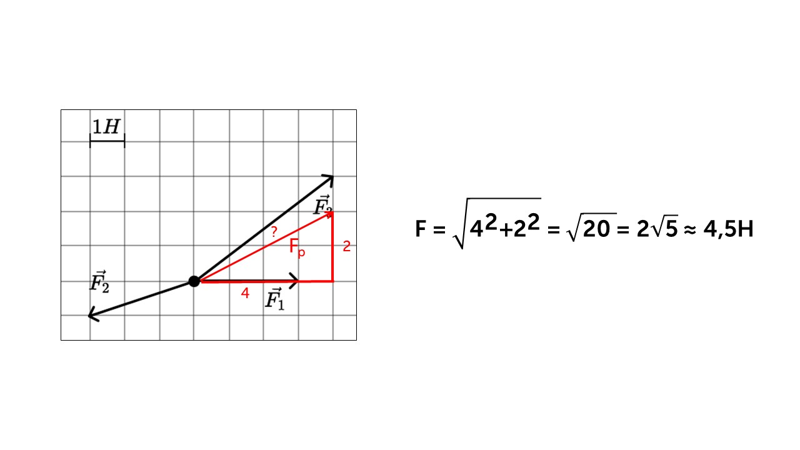

Что такое сила?

> [!info] Определение
> 
> **Сила – это векторная величина, способная изменять состояние движения или форму объекта, F. Сила измеряется в Ньютонах (Н)**

Если мы будем сжимать пластилин, то он изменит свою форму (деформируется), если мы будет толкать тележку с продуктами, она начнет двигаться. Все это применение силы. Существует много видов сил, но их мы рассмотрим позже. Сейчас давай узнаем что такое равнодействующая сила.

> [!info] Определение
> 
> **Равнодействующая сила – это суммарная сила, которая действует на объект и вызывает его движение или изменение состояния равновесия. Она является результатом суммирования всех сил, действующих на объект в определенном направлении. Ускорение тела всегда направлено в ту сторону, в которую направлена равнодействующая сила.**

Говоря проще равнодействующая сила - это просто сумма всех сил действующих на тело. Она считается при помощи векторов.

К примеру у нас есть тело (на рисунке это точка) и на него действуют три силы (F1, F2, F3)

Чтобы нам найти равнодействующую силу нужно найти сумму векторов F1, F2, F3. Для этого воспользуемся правилом параллелограмма.

Нашли сумму векторов F1, F2 и теперь по правилу треугольника найдем сумму вектор  F12 и F3 (равнодействующую силу)

Осталось только посчитать длину Fр и мы найдем равнодействующую силу. Посчитаем длину по теореме Пифагора

Про равнодействующую силу мы все узнали, теперь давай почитаем про инерцию: [[11. Явление инерции. Первый закон Ньютона|Делаем]]

Но главное, помни:

