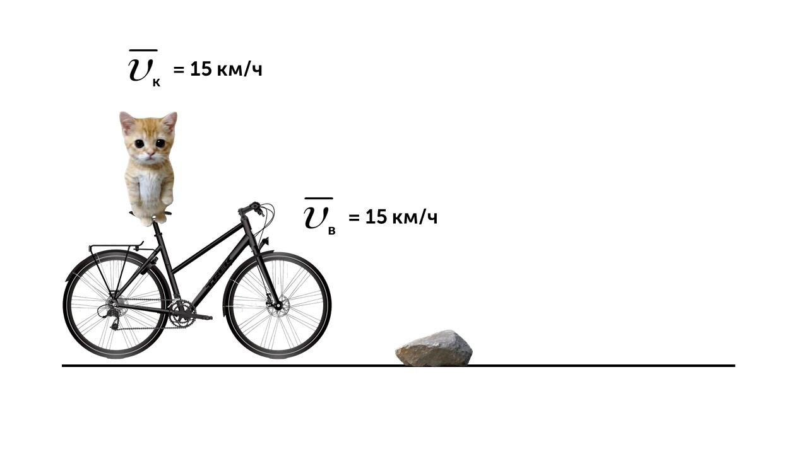
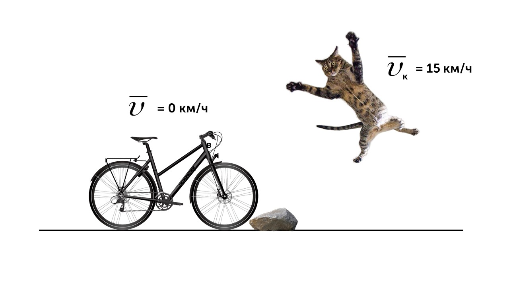
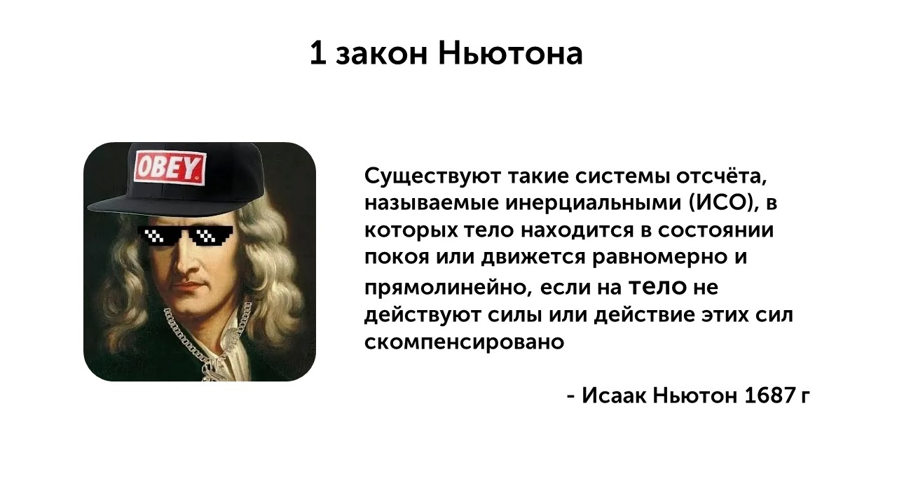

> [!info] Определение
> 
> **Инерция — это свойство тел в системах отсчёта, которые называются инерциальными, сохранять свою скорость. Инерция имеется у тел, которые обладают массой**

Суть инерции в сохранении телом скорости. Давай приведу пару примеров. Ты стоя едешь на маршрутке и вот она подъезжает к остановке и водитель резко тормозит, а ты улетаешь вперед (по направлению движения маршрутки). Это происходит по тому что ты двигался со скоростью маршрутки, а когда она резко тормозит, ты продолжаешь двигаться с предыдущей скоростью и летишь вперед. Давай еще пример с котиком. 

Котик едет на велосипеде со скоростью 15 км/ч (скорость велосипеда 15 км/ч), но котик не видит камень

И тут котик наезжает на камень, велосипед останавливается (его скорость 0 км/ч), а котик летит вперед сохраняю свою скорость

Это и есть инерция. Я упоминал инерциальные системы отсчета, давай расскажу что это

> [!info] Определение
> 
> **Инерциальная система отсчета – это система отсчета, в которой 
 выполняются законы инерции и законы Ньютона. В такой системе 
 отсчета объекты, находящиеся в состоянии покоя или равномерного прямолинейного движения без влияния внешних сил, сохраняют свое состояние движения или покоя.**

Примерами инерциальных систем отсчета (ИСО) может быть Земля В этой системе отсчета объекты, находящиеся в состоянии покоя или движения с постоянной скоростью относительно Земли, будут сохранять свое состояние движения или покоя, если на них не действуют внешние силы (из-за масштабов мы пренебрегаем вращением и движением в рамках рассмотрения маленьких объектов на земле). Также примером ИСО может быть автомобиль. При условии, что автомобиль находится в состоянии покоя или движется с постоянной скоростью и не подвергается значительному воздействию внешних сил, система отсчета, связанная с автомобилем, будет инерциальной. 

> [!info] Определение
> 
> **Неинерциальная система отсчёта в физике — это система, которая движется с ускорением относительно инерциальной.**

А теперь погорим о первом законе Исаака Ньютона

Суть закона заключается в том, что тело сохраняет свою скорость (включая нулевую - состояние покоя), если на него не действуют силы или действующие силы скомпенсированы (равнодействующая сила равна нулю)

Вот пару примеров проявление первого закона Ньютона

📌 **Книга лежит на столе  (покой)**

Состояние покоя сохраняется, т.к. сила тяжести уравновешена силой реакции опоры

🚗 **Пассажир в равномерно движущемся автомобиле  (движение)**

При резком торможении тело продолжает движение вперёд (проявление инерции)

С первым законом понятно перейдем к следующему: [[12. Второй закон Ньютона|Газ]]
