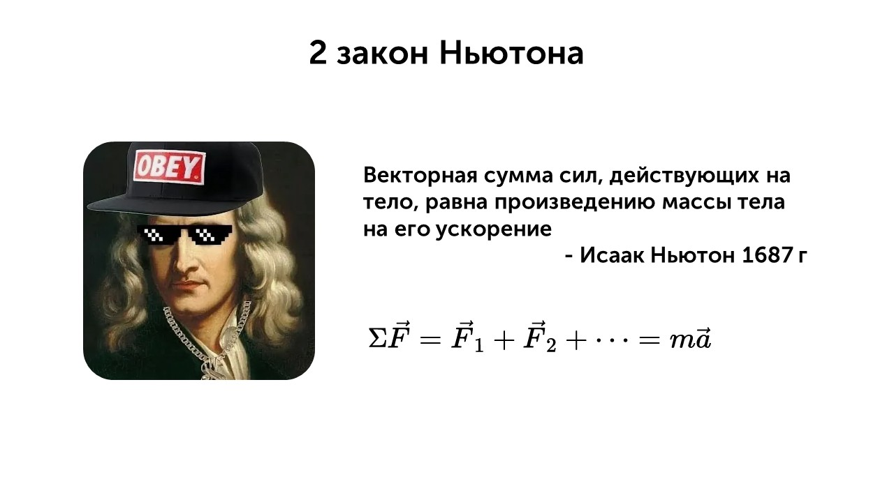
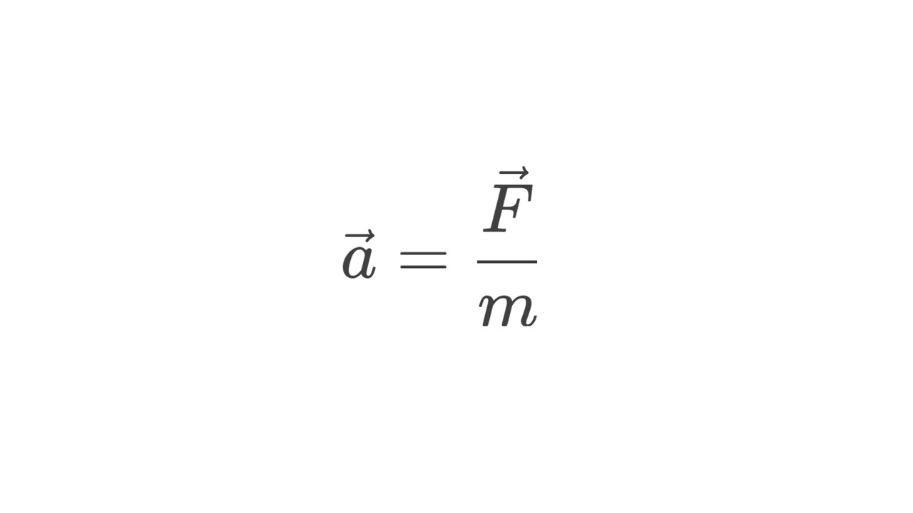

Этот закон можно записать и по другому

> [!info] 2 закон Ньютона
> 
> **В ИСО ускорение, с которым движется тело, прямо пропорционально равнодействующей всех сил и обратно пропорционально массе этого тела.** 

Представим разгона электропоезда под действием равнодействующей силы. Согласно 2-му закону Ньютона, чем больше равнодействующая сила, тем большее ускорение приобретет поезд. Под действием той же силы более легкий поезд будет двигаться с бóльшим ускорением. 

Например равнодействующая сила равна 1000 Н, а масса поезда 500 кг, тогда ускорение будет равно

**a = F / m = 1000 / 500 = 2 м/с²**

А если масса поезда будет меньше (250 кг), то ускорение станет больше

**a = F / m = 1000 / 250 = 4 м/с²**

Давай попробуем решить задачку

> [!question] Задача 1
> 
> **На мячик массой 500 г действует сила 0,6 Н. Чему равно ускорение мячика?**

Все просто, выразим ускорение из второго закона Ньютона и подставим значения

**m = 500 г = 0,5 кг**

**F = 0,6 Н**

**a = F / m = 0,6 / 0,5 = 1,2 м/с²**

Вот такой второй закон Ньютона, стоит еще запомнить как решать задачи с его помощью

> [!warning] Важно помнить
> 
>  **1. Выделите тело, движение которого рассматриваете**  
>    
>**2. Найдите ВСЕ действующие силы (тяжести, трения, упругости и др.)**  
>
>**3. Определите равнодействующую (геометрическая сумма сил)**  
>
>**4. Подставьте в формулу F=ma**
>
>**5. Найдите искомую величину (ускорение, силу или массу)**

А теперь давай перейдем к следующему закону: [[13. Взаимодействие тел. Третий закон Ньютона|Перейти]]
