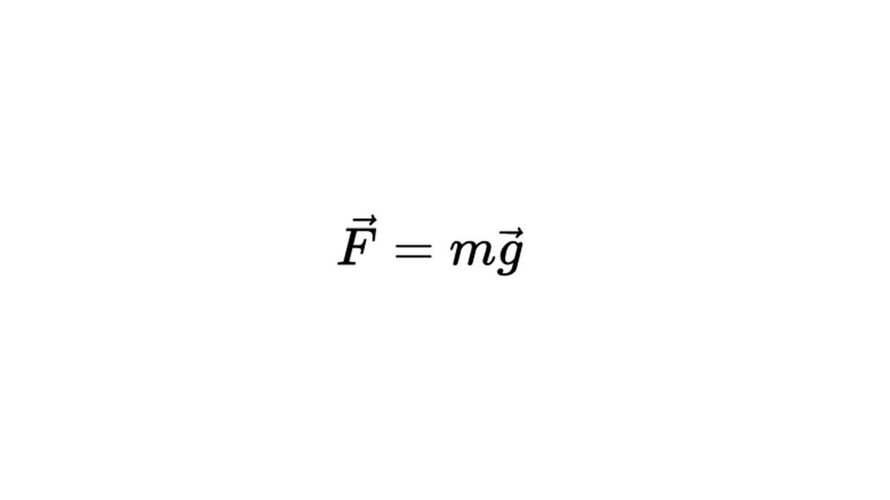
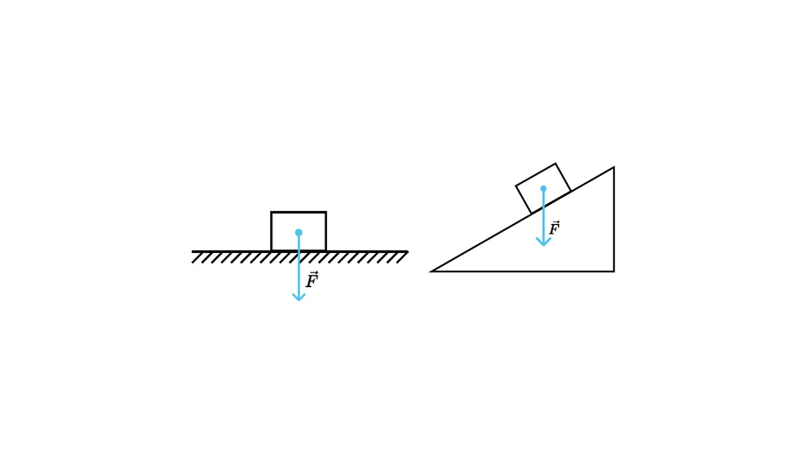

Давай погорим про самую известную силу - силу тяжести

> [!info] Определение
> 
> **Сила тяжести — это сила, с которой Земля или другое небесное тело притягивает к себе массу других объектов. Она всегда направлена к центру тела**

> [!example] Формула

**F** - сила тяжести измеряется в Ньютонах (Н)

**m** - масса тела (кг)

**g** - ускорение свободного падения (10 м/с²)

Так как сила тяжести направлена к центру тела, на рисунках ее нужно показывать так

Сила тяжести на всех планетах разная. Самая большая на экзопланете **Kepler-1318b**, потому что ускорение свободного падения на ней в 14.6 раз больше земного (~143 м/с²). Котики на такой планете выглядели бы вот так

Они были бы похожи на лепешку

Давай решим задачку

> [!question] Задача 1
> 
> **Под углом 60° к горизонту мальчик бросает с поверхности земли яблоко массой 200 г. Определите модуль силы тяжести, действующей на фрукт в верхней точке траектории, если его начальная скорость равна 10 м/с**

Помни, что сила тяжести зависит только от массы тела и от ускорения свободного падения. Поэтому, независимо от начальной скорости, угла и положения, сила тяжести равна

**F = mg = 0,2 * 10 = 2 Н**

На нас постоянно действует сила тяжести, но почему мы не проваливаемся под пол? Давай разбираться [[15. Сила реакции опоры. Вес тела|Время разобраться]]
